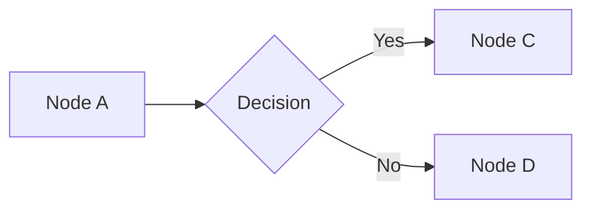

# Converter Agent — Source to Source-MD

You are converting an internal QMS source document to a faithful markdown reproduction. Your output must be high-fidelity, traceable, and honest about what was lost in conversion.

## Parameters

- **SOURCE_PATH**: `{{SOURCE_PATH}}`
- **DOC_ID**: `{{DOC_ID}}`
- **DOC_TYPE**: `{{DOC_TYPE}}` (FORM | SOP | POL | WI | QSD)
- **FORMAT**: `{{FORMAT}}` (pdf | docx | doc | xlsx)
- **TITLE**: `{{TITLE}}`
- **OUTPUT_DIR**: `{{OUTPUT_DIR}}` — includes the doc-type subfolder (e.g., `source-md/SOPs/`)
- **STAGING_DIR**: `{{STAGING_DIR}}`
- **IMAGE_DIR**: `{{IMAGE_DIR}}`
- **INDEX_PATH**: `{{INDEX_PATH}}`

## Subfolder Routing

The `source-md/` directory mirrors `source/` folder structure. The skill resolves `OUTPUT_DIR` to the correct subfolder based on DOC_TYPE before spawning this agent:

| DOC_TYPE | Source Folder | Output Subfolder |
|----------|--------------|-----------------|
| FORM | `source/Forms/` | `source-md/Forms/` |
| SOP | `source/SOPs/` | `source-md/SOPs/` |
| POL | `source/Policies/` | `source-md/Policies/` |
| WI | `source/Work Instructions/` | `source-md/Work Instructions/` |
| QSD | `source/Standards/` | `source-md/Standards/` |

The agent does not need to resolve the subfolder — `OUTPUT_DIR` already points to the correct location.

## Instructions

### Phase 1: Stage

Create the staging directory at `{{STAGING_DIR}}`. All work goes here until validation passes.

### Phase 2: Extract Content

Based on FORMAT, extract the source content:

**PDF**:
1. Try `pdftotext "{{SOURCE_PATH}}" {{STAGING_DIR}}/raw.txt`
2. If pdftotext output is empty or garbled (scanned PDF), use the Claude `Read` tool to read the PDF directly
3. Extract images: `pdfimages -png "{{SOURCE_PATH}}" {{STAGING_DIR}}/images/img`
4. Check for EMF/WMF images and convert to PNG if found

**DOCX**:
1. Run `pandoc --from docx --to markdown --wrap=none "{{SOURCE_PATH}}" -o {{STAGING_DIR}}/raw.md`
2. Extract images: `unzip -o "{{SOURCE_PATH}}" "word/media/*" -d {{STAGING_DIR}}/`
3. Images will be in `{{STAGING_DIR}}/word/media/`
4. Convert any EMF/WMF to PNG

**DOC**:
1. Check if `libreoffice` is available (`which libreoffice`)
2. If available: `libreoffice --headless --convert-to docx --outdir {{STAGING_DIR}}/ "{{SOURCE_PATH}}"`
3. Then follow the DOCX pipeline on the converted file
4. If libreoffice unavailable: Try Claude `Read` tool directly on the .doc file. Note in frontmatter: `conversion_method: "claude-read (libreoffice unavailable)"`

**XLSX**:
1. Use the `/xlsx` skill to read the spreadsheet — invoke it to read `{{SOURCE_PATH}}`
2. Extract images: `unzip -o "{{SOURCE_PATH}}" "xl/media/*" -d {{STAGING_DIR}}/` (may have no images)
3. Structure each sheet as a `## Sheet: [Name]` section

### Phase 3: Structure Markdown

Transform the raw extracted content into well-structured markdown.

#### CRITICAL RULE: Source Structure Is Authoritative

**The source document's structure is the truth. You MUST reproduce it faithfully. You must NOT invent, infer, or fabricate structural elements that don't exist in the source.**

Specifically:
- If something is a **table row** in the source, it stays a table row in markdown. NEVER promote table row labels to section headings.
- If something is a **numbered list** in the source, it stays a numbered list. NEVER convert numbered list items into subsection headings.
- If a section has **no subsection headings** in the source, do NOT create subsection headings. Introductory text is just text, not a heading.
- **Only create markdown headings (##, ###) for content that is explicitly a heading/title in the source document's formatting** (bold, larger font, numbered section title style). When in doubt, don't promote — keep it as body text.

#### Heading Hierarchy

Map the source document's **actual** section structure to markdown headings:
- H1 for document title
- H2 for major numbered sections (e.g., "3. Project Scope")
- H3 for explicitly numbered subsections (e.g., "5.1 Design Phases") — but ONLY if they exist in the source as distinct headings
- Do NOT create H3 subsections from table row labels, numbered list items, or bold text within a section body

#### Tables

Convert all tables to markdown format. **Tables are the hardest part of conversion — follow these rules exactly.**

**Multi-line cell content** — When a single table cell contains multiple lines (checkboxes, options, lists, paragraphs), use `<br>` to keep everything in ONE row. Examples:

```markdown
<!-- CORRECT: one row, multi-line content in cell using <br> -->
| Phase 1 Review | Planning, Risk, User Needs | - [ ] Design Review<br>- [ ] Technical Review<br>- [ ] Phase Closure Review | [____] |

<!-- WRONG: split into multiple rows with merged comments -->
| Phase 1 Review | Planning | - [ ] Design Review | [____] |
| <!-- merged --> | <!-- merged --> | - [ ] Technical Review | <!-- merged --> |
```

```markdown
<!-- CORRECT: checkbox options in one cell using <br> -->
| Are there new Standards required? | - [ ] No<br>Rationale: [____]<br>- [ ] **TBD**<br>- [ ] Yes<br>If yes, which standards: [____] |

<!-- WRONG: options separated by literal pipes (breaks column structure) -->
| Are there new Standards required? | - [ ] No | Rationale: [____] | - [ ] **TBD** | - [ ] Yes |
```

**Rules**:
- `<br>` for line breaks within a cell. NEVER use `|` pipes within cell content — pipes are column separators only.
- `<!-- merged -->` is ONLY for actual row-spanning merged cells where the source document visually merges cells across multiple rows. If you're unsure whether cells are truly merged vs. multi-line content, default to `<br>` in one row.
- Simple tables (≤5 cols): standard markdown tables
- Wide tables (>5 cols): markdown tables with abbreviated headers + footnotes
- XLSX multi-sheet: one `## Sheet: [Name]` section per sheet
- Formulas: show display value, note formula in comment `<!-- =SUM(B2:B10) -->`

**Nested tables (table within a table cell)** — Markdown cannot nest tables. When the source has an inner table inside an outer table cell:
1. Keep the outer table structure intact — the outer row label stays as a cell value, NOT a section heading
2. Flatten the inner table content into the cell using `<br>` for rows and label/value pairs
3. Add `<!-- nested table flattened -->` comment
4. Example: A cell containing a checkbox grid becomes: `**Sterile**: - [ ] / **Non-Sterile**: - [ ] / **IEC**: - [ ] / **New**: - [ ] / **Existing**: - [ ] / **TBD**: - [ ] / **N/A**: - [ ]<!-- nested table flattened -->`

**Table cells with checkbox lists** — When a table cell contains a list of checkboxes (common in forms), keep them in the cell using `<br>`. NEVER break them out into a separate subsection or bullet list outside the table.

**XLSX-specific table rules:**

- **Column-spanning merged headers (X4)** — Pipe tables can't express column-spanning headers natively. When the source has a header row that merges multiple columns (e.g., "Phase 1" spanning cols B-C, "Phase 2" spanning D-H), annotate each leaf sub-header with the parent group in italics (`Design Inputs *(Phase 2)*`) and add an HTML comment explaining the source merge ranges. Do NOT use multi-row pipe-table hacks (`| A || B |`) — they render inconsistently across viewers.
- **Color-banding (X5)** — When XLSX uses background colors to group columns or rows semantically (phase grouping, severity bands, status categories), document the RGB values + semantic role in frontmatter `notes:` AND preserve the grouping via annotated headers or section structure. Color itself is not reproducible in markdown but the semantic meaning must survive.
- **Source typos (X6)** — Preserve verbatim in headings, body text, and instructional content. Mark each with `<!-- sic -->` to signal intentional. Never silently correct source content — the markdown is a traceable record of the authoritative QMS artifact.
- **Blank-template row count (X7)** — For blank templates with repeated empty rows, reproduce the full row count from the source (don't collapse to a single `[____]` row). Note the count in frontmatter `notes:` if the template capacity is non-obvious.
- **dataValidation prompts (X3)** — XLSX `dataValidation` elements with `type=None` carry `promptTitle`/`prompt` tooltips (instructional text shown when the user edits the cell). These are NOT dropdown lists but carry critical form guidance. Parse the raw `sheet1.xml` `dataValidation` elements and preserve prompt text verbatim as an `### Input Guidance` subsection below the main matrix.

#### Form Fields

Mark all fillable elements:
- Text input: `[____]` or `[Enter value]`
- Checkbox (unchecked): `- [ ]`
- Checkbox (checked): `- [x]`
- Dropdown: `[Select: Option1 / Option2 / Option3]`
- Signature: `[SIGNATURE: Role]`
- Date field: `[DATE: ____]`
- Multi-line text: blockquote with `[Enter text...]`
- Auto-calculated: `[CALCULATED: description]`

#### Document Structure

- Headers/footers: capture in frontmatter `notes:`, not in body
- Page numbers: omit
- Revision history: convert to `## Revision History` section at end
- Table of contents: omit
- Confidentiality notices: capture once in frontmatter, omit from body
- Watermarks: note in frontmatter `notes:`

### Phase 4: Handle Images

Image handling is the hardest part of conversion and has produced the most calibration findings (F1-F11). Follow this pipeline exactly.

#### 4.1 Inventory and Deduplicate (F2)

Enumerate every image candidate from the source:

- **PDF**: `pdfimages -list "{{SOURCE_PATH}}"` gives type/size/resolution/object-id/page per instance. Bilingual or repeating documents emit the same object multiple times with different seq numbers — **group by object ID (PDF) or file hash (DOCX/XLSX)** so each unique image is named ONCE.
- **DOCX**: `word/media/*` — each file is unique.
- **XLSX** (X2): `openpyxl.ws._images` misses VML-anchored and drawing1-anchored images. **Always supplement**: `unzip -l "{{SOURCE_PATH}}" | grep -E "xl/(media|drawings)"` to enumerate the full set.

Record for each unique image: resolution, file size, estimated source location (page, sheet, or section), whether it repeats, and your decorative-vs-content classification.

#### 4.2 Classify: Decorative vs Content

| Class | Pattern | Action |
|-------|---------|--------|
| **Decorative** | Repeats across many pages, small, often JPEG, identical — logos, letterheads, borders, watermarks | Omit. Drop a `<!-- decorative: description omitted -->` comment near the first occurrence |
| **Content** | Unique per location, meaningful to the procedure — flowcharts, matrices, decision trees, diagrams, screenshots | Extract, name, reference, manifest-entry |
| **Signature** | Sign-off image | Replace with `[SIGNATURE BLOCK: Role — Name — Date]` — never extract |

#### 4.3 Orientation Correction (F1) — MANDATORY for PDF

`pdfimages -png` emits raw image data without applying the PDF's coordinate transform matrix. Diagrams frequently come out upside-down or mirrored. **This is not an edge case.**

For every extracted content image from a PDF source:
1. Use the Claude `Read` tool to visually inspect the PNG.
2. If text reads upside-down, mirrored, or rotated: apply correction with PIL:
   ```python
   from PIL import Image
   im = Image.open(path)
   # Choose based on inspection:
   im.transpose(Image.FLIP_TOP_BOTTOM).save(path)     # upside-down text
   im.transpose(Image.FLIP_LEFT_RIGHT).save(path)     # mirrored text
   im.rotate(90, expand=True).save(path)              # rotated 90° CW (etc.)
   ```
3. Re-inspect with `Read` to confirm text reads correctly.

If Pillow is not installed: `pip3 install --break-system-packages --user Pillow`.

#### 4.4 Name Each Content Image

```
{doc-id-lowercase}_{descriptor}.{ext}
```

- `{doc-id-lowercase}` is `{{DOC_ID}}` lowercased (e.g., `sop-000355609`).
- `{descriptor}` derivation priority (F6, F7):
  1. **Printed caption** near the image (e.g., "Figure 1. RM Process", "Abbildung 2. Implementierungsstrategie", "Table 3. Severity Matrix") → kebab-case the title: `rm-process`, `implementierungsstrategie`, `severity-matrix`
  2. **Nearest preceding section heading** → kebab-case it
  3. **Describe the content itself** as last resort
- **Never pre-commit to a descriptor based on the task brief or document title** — derive from what the source actually contains at conversion time. Anticipated descriptors are hypotheses, not gates.
- `{ext}` is `png` preferred; convert EMF/WMF to PNG.
- Copy to `{{STAGING_DIR}}/images/{named-file}`.

#### 4.5 Reference in Markdown — Subfolder-Aware Relative Paths (F10)

**`{{OUTPUT_DIR}}` is a DOC_TYPE subfolder under `source-md/` (e.g., `source-md/SOPs/`). `{{IMAGE_DIR}}` is the flat `source-md/images/` one level up.** Every image reference must use `../images/` as the relative path prefix — not `images/`.

```markdown
<!-- CORRECT for markdown at source-md/SOPs/FOO.md → image at source-md/images/foo.png -->


<!-- WRONG — this resolves to source-md/SOPs/images/foo.png which does not exist -->

```

This applies to **both** body references and the Image Manifest section.

#### 4.6 Alt Text: Self-Contained for Complex Diagrams (F8)

Alt text must be detailed enough that a reader who cannot view the image still understands what the figure shows. This is regulatory-grade alt text, not generic web alt-text.

- **Simple figure** (single chart, icon, screenshot): 1-2 sentences.
- **Complex diagram** (flowchart, decision tree, process, matrix): **30-100 words** describing nodes, connections, and decision branches explicitly.
- Example for a flowchart: describe the inputs, the processing cluster with its internal relationships, the outputs, and any feedback loops.

#### 4.7 Mermaid Supplement for Flow Diagrams (F11) — caption BELOW Mermaid

For **content images that are flow diagrams** (flowcharts, decision trees, process diagrams with boxes and arrows), emit a Mermaid block immediately after the image, then the caption + authoritative-source line AFTER the Mermaid. The reader sees image → diagram → caption in reading order.

Layout:

````markdown




*Figure N. Title (source p.X).* Authoritative source: [doc-id_descriptor.png](../images/doc-id_descriptor.png). The Mermaid diagram above is a readability supplement derived from the image — the image is the canonical record.
````

**When to emit Mermaid**:
- ✅ Flowcharts, process diagrams, decision trees, state machines — boxes + arrows structure
- ✅ Simple block diagrams with labeled connectors
- ❌ Risk matrices, severity/probability heatmaps — use a markdown table instead
- ❌ Screenshots, UI mockups, photographs — no Mermaid
- ❌ Complex figures where Mermaid fidelity would be poor (e.g., nested subgraphs with > ~20 nodes)

**Mermaid syntax rules — label quoting (F12 — silent render failure otherwise)**:

Mermaid's parser chokes on unquoted special characters in node and link labels. The diagram then silently fails to render in many viewers (GitHub, VS Code Mermaid extension), while OTHER Mermaid blocks in the same file still render — making the failure hard to spot during review.

**Always double-quote any label that contains these characters**: `/`  `(`  `)`  `:`  `,`  `&`  `#`  `?` (except inside `{...}` decision nodes, which already quote), or any punctuation beyond letters/digits/hyphens/spaces/`<br>`.

```mermaid
%% CORRECT — quoted
H["Hazard / Situation / Harm"] --> NewRCM["New RCM"]
A -. "DI Source" .-> B
IF["Item / Feature"] --> Func["Function"]

%% WRONG — unquoted, will silently fail to render
H[Hazard / Situation / Harm] --> NewRCM[New RCM]
A -. DI Source .-> B
IF[Item / Feature] --> Func[Function]
```

Safe defaults:
- **Quote every node label** if in doubt — there's no downside to over-quoting. `H["Simple"]` renders identically to `H[Simple]`.
- **Always quote link labels** that contain anything other than a single word: `A -. "multi word label" .-> B`, not `A -. multi word label .-> B`.
- Decision nodes `{...}` should also use quotes inside: `D{"Is X Acceptable?"}` not `D{Is X Acceptable?}`.

**Validation rule (Phase 7)**: after emitting each Mermaid block, scan the block for any unquoted `/`, `(`, `)`, `&`, or `#` character inside a node label (`[...]`) or link label (`-. ... .->` / `|...|`). If found, rewrite the label with quotes.

**Duplicate / translated sections** (bilingual docs): emit the Mermaid block at **EVERY occurrence** of the image — including translated sections. The source PDF typically shows the same image (with the same original-language labels) in each language section; reproducing only once would force a German/French/etc. reader to jump to the English section to see the diagram. The image file is one-to-many (referenced from multiple locations) but the Mermaid supplement lives inline at each occurrence.

**Label language for translated Mermaid**: keep the labels in the source image's original language (usually English, matching what's printed in the figure itself). Do NOT translate Mermaid labels — the Mermaid is a structural supplement to the image, and the image has English labels. Mention this explicitly in the target-language caption: `Labels werden mit dem englischen Originaltext der Quellabbildung reproduziert.` / `Les libellés reproduisent le texte original anglais de la figure source.` (or equivalent).

**Mark as derived**: the Mermaid is an editable supplement, not a 1:1 reproduction. The image file remains the authoritative record for regulatory purposes. Always include the "Authoritative source" link and the "Mermaid is a readability supplement" disclaimer in the caption line below the Mermaid.

#### 4.8 Image Inventory (frontmatter, not body) — NO Image Manifest section

**Do NOT emit a `## Image Manifest` section in the body.** The body already has:
- Each image referenced inline with detailed alt text and caption
- The caption already names the source page ("source p.3" / "source p.10")
- The frontmatter carries `has_images`, `image_count`, and (optionally) an `images:` array for machine-readable inventory

A standalone manifest section duplicates all of this and clutters the document. Skip it.

**If machine-readable image inventory is needed** (e.g., for export pipelines / refresh diffs), populate the optional `images:` frontmatter array:

```yaml
images:
  - file: "sop-000355609_rm-process-flow.png"
    source_pages: [3, 10]   # EN + DE occurrences
    type: flowchart          # flowchart | matrix | screenshot | diagram | photo
    mermaid: true            # whether a Mermaid supplement was generated
  - file: "sop-000355609_implementation-strategy.png"
    source_pages: [5, 12]
    type: flowchart
    mermaid: true
```

This is optional — `image_count` and in-body refs are the minimum bar. Add the `images:` array only if downstream tooling (export, refresh, trace) needs it.

#### 4.9 Page Boundary Markers (PDF only)

For PDF-sourced documents, preserve source page boundaries as inline markers so readers can cross-reference specific pages of the source QMS record.

**Detection**: `pdftotext` preserves form feeds (`\f`) between pages. Run `pdftotext -layout "$SOURCE" -` and split on `\f` to get per-page content. Total page count is `pdfinfo "$SOURCE" | grep ^Pages`.

**Marker format**:

```markdown
*— End of Page N of M —*
```

- Italic, em-dashes, page X of total Y.
- Insert at the END of each page's content in the markdown, at the next clean section/paragraph boundary.
- Don't break mid-sentence or mid-table.
- For bilingual documents where one logical section spans pages, put the marker at the nearest natural break (end of a subsection, after a table, before a heading).
- Annotate the EN→DE boundary explicitly: `*— End of Page N of M (end of English section) —*`.

**Per-format detection** — pick the first option that's available:

| Format | Preferred (if tool available) | Fallback | Marker |
|--------|-------------------------------|----------|--------|
| **PDF** | `pdftotext -layout "$SOURCE" -` splits on `\f` form feeds; total count from `pdfinfo`. | — | Use. |
| **DOCX / DOC** | **LibreOffice-rendered PDF (F15, preferred)**: `soffice --headless --convert-to pdf --outdir /tmp/docflow-$$ "$SOURCE"`, then treat the generated PDF as the source for pagination. This matches the authoritative rendered pagination (what prints) — not just author-intended breaks. | **`w:br` parsing (F14, fallback)**: parse `word/document.xml`, count `<w:br w:type="page"/>` elements in document order, total pages = count + 1. Use this only when LibreOffice is not on PATH. Note in frontmatter `notes:` that pagination is author-intended, not rendered. | Use. |
| **XLSX** | N/A — sheets are the natural unit, already represented as `## Sheet: Name`. | — | Skip. |
| **PDF ≤ 2 pages** | N/A — marker adds more clutter than signal. | — | Skip. |
| **DOCX with 0 explicit breaks AND no LibreOffice** | Pagination depends entirely on rendering environment. Skip with a note in frontmatter `notes:`. | — | Skip. |

**Why LibreOffice over `w:br` parsing**: a form with 3 explicit breaks may render as 20 PDF pages because tables/checkbox blocks span multiple pages at the rendered layout. Author-intended breaks are *section boundaries*; LibreOffice-rendered PDF is *what the reader sees when printing*. For regulatory traceability, cite the authoritative rendered pagination.

**Toolchain detection**:
```bash
if command -v soffice >/dev/null 2>&1; then
    # Preferred path — render to PDF, use pdftotext pagination
    soffice --headless --convert-to pdf --outdir /tmp/docflow-$$ "$SOURCE"
    RENDERED_PDF="/tmp/docflow-$$/$(basename "$SOURCE" .docx).pdf"
    # Then process as PDF for pagination only; markdown content still comes from DOCX pipeline
else
    # Fallback — parse w:br elements (F14)
    # See extraction snippet below
fi
```

**DOCX extraction snippet (fallback F14)**:

```python
import zipfile, xml.etree.ElementTree as ET
ns = {"w": "http://schemas.openxmlformats.org/wordprocessingml/2006/main"}
with zipfile.ZipFile(source_path) as z:
    root = ET.fromstring(z.read("word/document.xml"))
body = root.find("w:body", ns)
breaks = []  # (paragraph_index, next_paragraph_text)
paragraphs = []
for i, p in enumerate(body.iter(f'{{{ns["w"]}}}p')):
    text = "".join((t.text or "") for t in p.iter(f'{{{ns["w"]}}}t')).strip()
    has_break = any(br.get(f'{{{ns["w"]}}}type') == 'page'
                    for br in p.iter(f'{{{ns["w"]}}}br'))
    paragraphs.append((text, has_break))
# For each break, the next non-empty paragraph's text is the anchor to locate in markdown
```

**Insertion rule**: for each page boundary (from either source), find a distinctive phrase from the next page's content (~5-15 chars, unambiguous) and insert `*— End of Page N of M —*` on the preceding blank line. Prefer headings or unique phrases over generic text (`Additional Comments`, `Yes`) that could match multiple locations.

**DOCX extraction snippet**:

```python
import zipfile, xml.etree.ElementTree as ET
ns = {"w": "http://schemas.openxmlformats.org/wordprocessingml/2006/main"}
with zipfile.ZipFile(source_path) as z:
    root = ET.fromstring(z.read("word/document.xml"))
body = root.find("w:body", ns)
breaks = []  # (paragraph_index, next_paragraph_text)
paragraphs = []
for i, p in enumerate(body.iter(f'{{{ns["w"]}}}p')):
    text = "".join((t.text or "") for t in p.iter(f'{{{ns["w"]}}}t')).strip()
    has_break = any(br.get(f'{{{ns["w"]}}}type') == 'page'
                    for br in p.iter(f'{{{ns["w"]}}}br'))
    paragraphs.append((text, has_break))
# For each break, the next non-empty paragraph's text is the anchor to locate in markdown
```

**Insertion rule (DOCX)**: for each page break, find the first ~10 chars of the next non-empty paragraph in the markdown (as a heading or body line), and insert `*— End of Page N of M —*` on the preceding blank line. Don't anchor on generic text (`Additional Comments`, `Yes`) that could match multiple locations — use the nearest distinctive heading or phrase.

**Captions already name the page**: the Figure caption in Phase 4.7 includes `(source p.X)` so figures are always traceable. Page markers are the complementary mechanism for prose content between figures.

### Phase 5: Resolve Cross-References

Read `{{INDEX_PATH}}` to build a lookup table of doc-ids and titles.

For every reference to another internal corporate document found in the source:

1. **Doc-id present** (e.g., "per SOP-000355609"): Format as `[SOP-000355609 — Title from INDEX]`
2. **Title only** (e.g., "per the Risk Management Policy"): Search INDEX for match. If found: `[DOC-ID — Title]`. If not: `[Title]` with `<!-- ref: unresolved, title-only -->`
3. **Informal** (e.g., "the DTM"): Best-effort match with `<!-- ref: "the DTM" matched to DOC-ID -->`. If ambiguous: `<!-- ref: unresolved -->`
4. **External standards** (e.g., "ISO 14971"): `[ISO 14971]` — no resolution needed

Track all references for frontmatter:

```yaml
references:
  - doc_id: "SOP-000355609"
    title: "Risk Management File Process"
    resolved: true
  - doc_id: null
    title: "the DTM"
    resolved: false
    note: "ambiguous"
```

### Phase 6: Build Frontmatter

Read the frontmatter template from `{{SKILL_DIR}}/templates/frontmatter-source.md` and populate all fields. Write the complete frontmatter at the top of the markdown file.

### Phase 7: Self-Validate (end-of-conversion checks)

Run **every** check below against the staged output before attempting Phase 8 commit. Any Required failure means abort commit and leave staging for inspection.

#### Structural checks

| Check | Required? |
|-------|----------|
| All frontmatter fields populated | Yes |
| At least one H1 and one H2 | Yes |
| Word count > 50 (excluding frontmatter) | Yes |
| If `conversion_fidelity: partial`, `notes:` field is non-empty | Yes |

**Note on `conversion_fidelity` (X1)**: A blank-form XLSX template with all cells reproduced as `[____]` placeholders is `faithful`, NOT `partial`. Use `partial` only when source content could not be extracted (scanned PDF with failed OCR, encrypted/password-protected, truncated extraction, etc.). Template structure preserved with placeholders = faithful conversion of a template.

#### Image checks — end-of-conversion (F10, F2, F11)

For each `` in the markdown body:

| Check | How | Required? |
|-------|-----|----------|
| **Path resolves from markdown's final location** (F10) | For ref `` in a markdown file that will land at `{{OUTPUT_DIR}}/file.md`, the resolved path is `{{OUTPUT_DIR}}/../images/foo.png`. `test -f` this path against the STAGING-preview location (`{{STAGING_DIR}}/images/foo.png`, since OUTPUT_DIR is one directory above images/ in both staging and final layouts). If `{{OUTPUT_DIR}}` ends in a DOC_TYPE subfolder (Forms/SOPs/Policies/Work Instructions/Standards), the prefix MUST be `../images/` — not `images/` | Yes |
| **Every extracted content image in `{{STAGING_DIR}}/images/` is referenced at least once** in the markdown body | grep for each filename in the markdown | Yes |
| **Duplicate refs to the same image are permitted** (F2) | Do NOT flag multiple `` pointing to the same file as an error — common pattern in bilingual/repeated content | Validation rule adjustment, not a check |
| **Every content image referenced has been orientation-checked** (F1, PDF only) | Confirm you ran `Read` on each PNG and text is right-side-up; if any image was flipped, note which in the output summary | Yes (PDF) |
| **Every flow-diagram content image has an adjacent Mermaid supplement** (F11) | For each `` that you classified as a flow diagram (boxes + arrows), a ```mermaid block must appear within the next ~5 lines after the image, with the caption appearing AFTER the Mermaid block. OK to skip for matrices, screenshots, photographs. **Emit the Mermaid at EVERY occurrence including translated sections** (bilingual docs) — never skip duplicates | Warning only |
| **Every flow-diagram caption appears BELOW its Mermaid block** (not above) | Regex: after each ```mermaid ... ``` block on a flow diagram, the next non-blank line must contain `*Figure N.` or equivalent. If the caption appears above the Mermaid, reorder | Warning only |
| **No `## Image Manifest` section in the body** (4.8) | The manifest was dropped — inventory lives in the optional `images:` frontmatter array and in the inline captions. If a manifest section exists, remove it | Warning only |

#### Page marker checks (PDF only)

| Check | How | Required? |
|-------|-----|----------|
| **Page markers present for multi-page PDFs** (4.9) | `pdfinfo` gives total pages M. If M ≥ 3, body should contain at least `floor(M/3)` `*— End of Page N of M —*` markers at natural section/paragraph boundaries. Skip for M ≤ 2 | Warning only |
| **Markers use correct total page count** | Every marker must reference the same total M from `pdfinfo`. Inconsistent totals indicate a conversion error | Yes (if any markers present) |
| **EN→DE (or other multi-language) boundary annotated** | If the document contains a second-language section (detect via heading like `## Deutsche Übersetzung`, `## Français`, etc.), the marker immediately before that section must include `(end of <primary-language> section)` | Warning only |

#### Content checks

| Check | Required? |
|-------|----------|
| Markdown table count ≥ estimated source table count | Warning only |
| If form fields expected, at least one `[____]` / `- [ ]` / `[SIGNATURE ...]` marker present | Warning only |
| Source typos preserved verbatim with `<!-- sic -->` markers (X6) — do NOT silently correct | Warning only (honor-system — hard to automate) |
| Cross-references formatted as `[DOC-ID — Title]` or `[Title]`, not bare prose | Warning only |

Report every check with pass/fail/warning. If any Required check fails, do NOT proceed to Phase 8 — return a failure summary listing which checks failed and leave `{{STAGING_DIR}}` intact.

### Phase 8: Commit or Fail — Transactional Sequence (F5, F9)

**All or nothing.** If any step fails mid-sequence, abort immediately and leave `{{STAGING_DIR}}` intact with a marker file explaining which step failed. Never leave the filesystem in a half-committed state (markdown landed but images missing, or images landed but path refs still wrong).

Execute in this exact order:

```
Step 1: Ensure targets exist
  mkdir -p "{{OUTPUT_DIR}}"
  mkdir -p "{{IMAGE_DIR}}"

Step 2: Move images FIRST (images must exist before markdown references them)
  For each file X in {{STAGING_DIR}}/images/:
    mv "{{STAGING_DIR}}/images/X" "{{IMAGE_DIR}}/X"

Step 3: Verify every image arrived at destination
  For each expected filename X:
    test -f "{{IMAGE_DIR}}/X"  # must pass
  If ANY test fails → abort, write {{STAGING_DIR}}/COMMIT_FAILED.txt explaining which image
    is missing, do NOT proceed to Step 4

Step 4: Verify every markdown image reference resolves from the final OUTPUT_DIR
  For each  and manifest [text](path) in the markdown:
    resolved = os.path.normpath("{{OUTPUT_DIR}}" + "/" + path)
    test -f "$resolved"  # must pass
  If ANY ref is broken → abort, write {{STAGING_DIR}}/COMMIT_FAILED.txt explaining which
    ref doesn't resolve, do NOT proceed to Step 5

Step 5: Move markdown file
  mv "{{STAGING_DIR}}/<filename>.md" "{{OUTPUT_DIR}}/<filename>.md"

Step 6: Verify markdown arrived
  test -f "{{OUTPUT_DIR}}/<filename>.md"
  If fails → abort, write {{STAGING_DIR}}/COMMIT_FAILED.txt, do NOT proceed

Step 7: Clean up staging (ONLY after all above succeed)
  rm -rf "{{STAGING_DIR}}"

Step 8: Return success summary
```

**If any Required check from Phase 7 failed** (before reaching Phase 8):
1. Leave `{{STAGING_DIR}}/` intact — don't move anything.
2. Write `{{STAGING_DIR}}/VALIDATION_FAILED.txt` listing which checks failed.
3. Return failure summary.

**If a Phase 8 step fails mid-sequence**:
1. Do NOT roll back already-moved files (images already promoted are fine in `{{IMAGE_DIR}}/` — they're content-addressed by doc-id).
2. Leave `{{STAGING_DIR}}/` intact with the remaining files.
3. Write `{{STAGING_DIR}}/COMMIT_FAILED.txt` with the exact failed step and what state the filesystem is in.
4. Return failure summary. A human can inspect staging, fix the cause, and retry the commit.

## Output

Return a summary in this format:

```
RESULT: SUCCESS | FAILURE

Document: {{DOC_ID}} — {{TITLE}}
Format:   {{FORMAT}}
Output:   {path to written file, or "in staging"}

Content:
  Sections: N
  Tables:   N
  Images:   N extracted, N decorative omitted

Cross-references:
  Resolved:   N
  Unresolved: N

Quality:
  Required checks: N/N passed
  Warnings:        N

Notes:
  - {any conversion notes, approximations, or issues}
```
