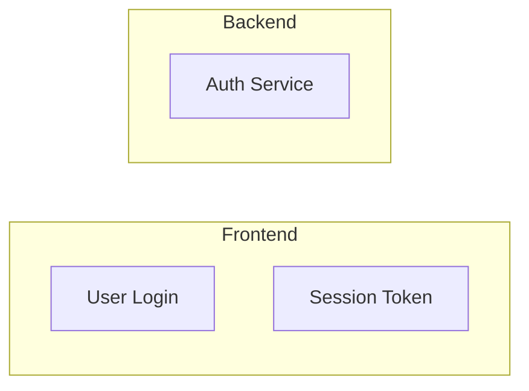

# shared-fidelity

Rules that apply to **every** Mermaid emission regardless of diagram type. Loaded
together with the type-specific pack by `agents/interpret_image.md`. Extracted
verbatim from `agents/converter.md` Phase 4.7 (F11b, F11d, F11h, F11i, F12, F13).

## F11b — Faithfulness absolute rule (CRITICAL)

**Never invent connectors, labels, edge semantics, or relationships not visible
in the source.**

If the source doesn't show how two boxes relate — whether box A talks to box B
via HTTP, via shared memory, via a library call, or not at all — the Mermaid
must not show that either. The image is the canonical record; the Mermaid
supplement reproduces **structure**, not **semantics**.

Violations to avoid:
- Source shows "Auth Guard" and "OKTA Auth" as separate boxes with no arrow
  between them → Mermaid emits `AuthGuard --> OktaAuth` with label "auth check".
  **Wrong.** The source doesn't show HOW they relate.
- Source shows service boxes inside a "Backend" rectangle → Mermaid emits
  arrows `ServiceA --> ServiceB` based on your mental model. **Wrong.** Boxes
  inside a group show containment, not flow.
- Source shows a network topology with dashed and solid lines distinguishing
  logical vs physical links → Mermaid flattens to a single `-->`. **Wrong.**
  Preserve the distinction (`-.->` dashed, `-->` solid) or drop the connector.

If you find yourself writing an edge with a label the source doesn't show,
delete the edge. If you find yourself writing an edge for a relationship the
source only implies via proximity, delete the edge.

## F11d — Containment fidelity (swim lanes, groupings, subgraph nesting)

If the source uses swim lanes, grouped regions, or labeled subsystem boundaries,
reproduce them as Mermaid `subgraph` blocks with the source's lane/group labels
verbatim:



Preserve source lane ordering (left-to-right or top-to-bottom as in source).

**Containment is structural truth — observation before declaration.**

If the source shows box A visually inside region B (nested rectangles, labeled
enclosure, swim lane), the Mermaid subgraph nesting MUST mirror this exactly.
A is declared inside B's `subgraph` block. Containment is not cosmetic — it
communicates architectural boundaries (what's inside VPC, what's outside;
what's in the secure enclave, what isn't). Getting containment wrong changes
the meaning.

**Protocol**: before writing any Mermaid subgraph blocks, enumerate the source
image's region boundaries. For each content element, record which region(s)
contain it. Build the nested structure from these observations, not from what
"seems natural" or "how architectures usually look."

**Common failure mode**: placing service boxes (Resolvers, API Gateway, Lambda
handlers) at the top level when the source shows them inside a VPC or
private-network boundary. This flattens a security/deployment boundary that the
source specifically communicates.

**Nested subgraphs are allowed and often required**: `subgraph VPC` containing
`subgraph Management`, `subgraph Integrations`, etc. Depth follows source
depth — don't flatten. Don't add nesting levels that aren't in the source.

## F11h — Layout fidelity (spatial arrangement matches source)

Mermaid's dagre layout degrades when given few or no edges — it produces
arrangements unrelated to the source. The diagram may be structurally correct
(right boxes, right containment, right edges) but visually inverted or
rearranged, which misleads readers who pattern-match the source image.

**Protocol**:

1. **Direction from dominant source flow**:
   - `flowchart TB` — source stacks elements top-to-bottom (layered
     architectures, vertical flows)
   - `flowchart LR` — source flows left-to-right (pipelines, request/response
     sequences)
   - Default LR; switch to TB when source visibly stacks rather than chains

2. **Subgraph declaration order matches source reading order**: top-to-bottom,
   then left-to-right. Dagre uses declaration order when no other signal is
   present.

3. **For logical diagrams and sparse component diagrams**: add **invisible
   layout hints** using `~~~` between subgraphs to force source-accurate
   arrangement. Invisible edges do NOT render — they only constrain dagre's
   positioning.

   ```mermaid
   flowchart TB
       subgraph UI["UI Layer"]
         ...
       end
       subgraph Logic["Logic"]
         ...
       end
       subgraph Data["Data Layer"]
         ...
       end

       %% Layout hints (invisible, no semantics — source shows
       %% UI-Logic-Data stacked vertically)
       UI ~~~ Logic
       Logic ~~~ Data
   ```

   Always precede layout hints with `%% Layout hints` comment so reviewers
   don't mistake them for semantic edges.

4. **Document layout in the caption**: "Layout reproduces source's
   [top-to-bottom layered / left-to-right pipeline / central-hub radial]
   arrangement."

5. **When dagre can't reproduce source layout** (complex non-orthogonal
   arrangements, overlapping regions, 3D-projected diagrams): note in caption:
   "Mermaid layout is approximate; consult source image for exact spatial
   arrangement."

## F11i — Edge-routing fidelity (wire the edges that exist correctly)

F11b covered NOT inventing edges. F11i covers: once you've decided an edge
exists, route it to the correct source and target nodes.

Flowchart transcription is error-prone at decision nodes. The agent may
correctly identify all nodes, their labels, AND recognize an edge exists, but
route it to the wrong target — common when:

- Multiple edges emerge from a decision diamond
- YES/NO branches go to nodes on opposite sides of the diagram
- One branch short-circuits a chain and merges back downstream
- Decision branches cross swim lanes or regions

**Mandatory enumerate-before-emit protocol** for every flow diagram:

1. Before writing any `A --> B` lines, enumerate EVERY edge in the source as a
   triple: `(source-node, branch-label, target-node)`. Record all triples in a
   scratch list.

2. For decision nodes specifically: walk each branch visually in the source.
   Trace the line FROM the diamond TO its termination point. Don't infer from
   position; follow the actual drawn line. Decision nodes can have 2, 3, or
   more branches — enumerate them all.

3. Verify each triple independently: for every entry, re-confirm by looking at
   the source image that there is a line from source-node to target-node with
   the stated label. If unsure, flag the edge with a `%% VERIFY: <description>`
   comment rather than guessing.

4. Only then write the edges block in Mermaid.

**Common regressions to self-check**:
- **Self-loops** (`A --> A`): legitimate only when source explicitly shows a
  self-loop arrow. Otherwise, the target was mis-transcribed.
- **Missing branches**: decision nodes with fewer branches emitted than drawn.
- **Swapped YES/NO**: the "Yes" branch going to the error path or vice versa.
- **Lane-crossing errors**: a branch that crosses swim lanes in the source may
  lose its target during transcription. Re-trace across lane boundaries.

**When a decision branch terminates without forward flow**: some source
diagrams have decision branches that terminate (implicit "return"/"stop").
Emit `D -- "branch-label" --> Stop((" "))` with a hollow terminator — do NOT
loop back to the decision node or another arbitrary node to fill the gap.

## F12 — Label quoting (silent render failure otherwise)

Mermaid's parser chokes on unquoted special characters in node and link labels.
The diagram then silently fails to render in many viewers (GitHub, VS Code
Mermaid extension), while OTHER Mermaid blocks in the same file still render —
making the failure hard to spot during review.

**Always double-quote any label that contains these characters**: `/`  `(`  `)`
`:`  `,`  `&`  `#`  `?` (except inside `{...}` decision nodes, which already
quote), or any punctuation beyond letters/digits/hyphens/spaces/`<br>`.

```mermaid
%% CORRECT — quoted
H["Hazard / Situation / Harm"] --> NewRCM["New RCM"]
A -. "DI Source" .-> B
IF["Item / Feature"] --> Func["Function"]

%% WRONG — unquoted, will silently fail to render
H[Hazard / Situation / Harm] --> NewRCM[New RCM]
A -. DI Source .-> B
IF[Item / Feature] --> Func[Function]
```

Safe defaults:
- **Quote every node label** if in doubt — there's no downside to over-quoting.
  `H["Simple"]` renders identically to `H[Simple]`.
- **Always quote link labels** containing anything other than a single word:
  `A -. "multi word label" .-> B`, not `A -. multi word label .-> B`.
- Decision nodes `{...}` should also use quotes inside: `D{"Is X Acceptable?"}`
  not `D{Is X Acceptable?}`.

**Validation rule**: after emitting each Mermaid block, scan the block for any
unquoted `/`, `(`, `)`, `&`, or `#` character inside a node label (`[...]`) or
link label (`-. ... .->` / `|...|`). If found, rewrite the label with quotes.

## F13 — Multi-occurrence emission (bilingual / duplicate images)

**Duplicate / translated sections**: emit the Mermaid block at **EVERY
occurrence** of the image — including translated sections. The source PDF
typically shows the same image (with the same original-language labels) in each
language section; reproducing only once would force a non-English reader to
jump to the English section to see the diagram. The image file is one-to-many
(referenced from multiple locations) but the Mermaid supplement lives inline at
each occurrence.

**Label language for translated Mermaid**: keep the labels in the source
image's original language (usually English, matching what's printed in the
figure itself). Do NOT translate Mermaid labels — the Mermaid is a structural
supplement to the image, and the image has English labels. Mention this
explicitly in the target-language caption:
`Labels werden mit dem englischen Originaltext der Quellabbildung reproduziert.` /
`Les libellés reproduisent le texte original anglais de la figure source.`
(or equivalent).

**Mark as derived**: the Mermaid is an editable supplement, not a 1:1
reproduction. The image file remains the authoritative record for regulatory
purposes. Always include the "Authoritative source" link and the "Mermaid is a
readability supplement" disclaimer in the caption line below the Mermaid.

## F11e — Size as a quality gate

Prior guidance capped Mermaid at "~20 nodes". That was a flat-graph heuristic;
dropped in favor of quality gates.

**Proceed with Mermaid** (any size, including 40+ nodes) if:
- The source has natural subgroups (visually grouped, lane-separated, or
  region-labeled) → use `subgraph` blocks; navigation is cluster-by-cluster
  and scales well
- The rendered Mermaid conveys structural navigation value a reader couldn't
  get from reading prose alone
- You can quote every label cleanly (per F12) without truncation

**Skip Mermaid** (just image + caption) if:
- The diagram is flat (no groupings) AND has > ~20 nodes — auto-layout will
  produce a crossing-heavy mess
- Labels would need heavy abbreviation to fit
- The diagram's meaning depends on visual hierarchy (font sizes, colors,
  shapes) that Mermaid can't reproduce

**Mid-complexity option — cluster-level Mermaid**: when a source diagram has
25+ nodes but natural subgroups, emit Mermaid at the **cluster level** (one
node per subgroup, labels listing contents) rather than enumerating every leaf
node. Example: an AWS topology with 6 service clusters × 5 services each →
emit 6 subgraph-nodes rather than 30 flat nodes.

## Changelog

- 2026-04-21: Stub created during task ben/089 Phase A scaffolding.
- 2026-04-21 (session 2): Populated from `agents/converter.md` Phase 4.7
  (F11b / F11d / F11e / F11h / F11i / F12 / F13). Loaded by `interpret_image.md`
  alongside one or more type-specific packs.
