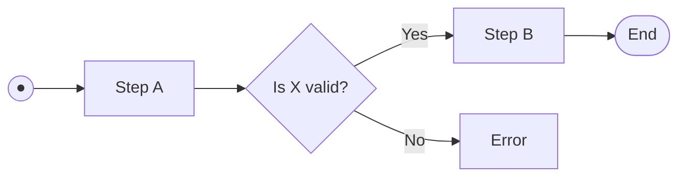
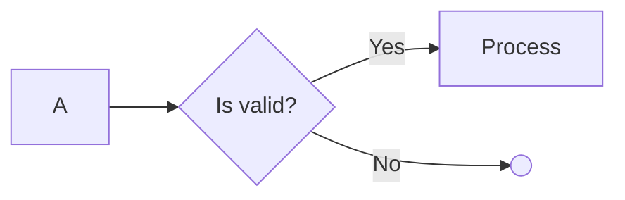

# type-a-flow

Rules for emitting a **flow diagram** in Mermaid. Loaded by
`agents/interpret_image.md` together with `shared-fidelity.md` when the source
image has boxes + explicit directed arrows + optional decision diamonds +
optional start/end terminators.

Extracted from `agents/converter.md` Phase 4.7 (F11a-a, F11c).

## Source characteristics that pick this pack

- Boxes connected by directed arrows (`→`, `⟶`)
- Decision diamonds with labeled branches (Yes/No, success/failure)
- Start/end terminators (filled dot, rounded rectangle, labeled circle)
- Optionally, swim lanes or grouped regions (see `shared-fidelity.md` F11d)

**NOT this pack** if the source has boxes grouped without arrows → use
`type-b-logical.md`. If lines are present but undirected (no arrowheads) → use
`type-c-component.md`.

## Emit shape



- Use `flowchart LR` for left-to-right sequences (most common) or `flowchart TB`
  for vertically stacked flows (see `shared-fidelity.md` F11h).
- Use `subgraph` blocks for swim lanes or grouped regions (see
  `shared-fidelity.md` F11d).

## F11c — Start/end shape preservation

| Source shape | Mermaid syntax |
|--------------|----------------|
| Filled black dot (●) as start | `A((●))` or `A((Start))` |
| Rounded rectangle as start/end | `A([Start])` / `Z([End])` |
| Labeled circle start node | `A((Begin))` (literal label) |
| Unlabeled hollow terminator | `Z(( ))` |

If the source lacks an explicit start/end shape (common in architectural
diagrams), don't fabricate one. Flow diagrams with no visible terminators just
start at the leftmost/topmost node.

## Decision-branch discipline

Every decision diamond gets the **enumerate-before-emit** treatment from
`shared-fidelity.md` F11i:

1. List every branch as `(source, label, target)` triples before writing edges.
2. Walk each branch visually in the source — don't infer target from position.
3. Verify every triple against the image. Flag uncertain edges with `%% VERIFY:`
   rather than guessing.

**Decision-node syntax**: `D{"Is X valid?"}` (curly braces + quoted text).
Quote even single-word decisions if they contain punctuation.

**Branch labels must be quoted** if they contain spaces: `D -- "No, retry" --> A`.

## Terminators for dead-end branches

When a decision branch terminates without forward flow (implicit "return" or
"stop"), emit a hollow terminator — do NOT loop back to the decision node or
to an arbitrary downstream node.



## Start/terminator direction hint

If the source visibly starts at the top (vertical flows), default to
`flowchart TB`. If the source visibly starts at the left (horizontal flows),
default to `flowchart LR`. Declaration order influences dagre layout — declare
upstream nodes first.

## Nested iteration / loops

If the source shows a labeled "repeat N times" or "for each X" region around a
subgraph, see `type-a-flow-nested.md` for the dashed-boundary convention. This
pack covers only non-iterated flows.

## Caption template

```markdown
*Figure N. <title> (source p.<N>).* Authoritative source: [<descriptor>.png](<ref>). The Mermaid diagram above is a readability supplement derived from the image — the image is the canonical record. <Optional layout note>
```

## Changelog

- 2026-04-21: Stub created during task ben/089 Phase A scaffolding.
- 2026-04-21 (session 2): Populated from `agents/converter.md` Phase 4.7
  (F11a-a, F11c). Edge-routing rules stay in `shared-fidelity.md` F11i.
