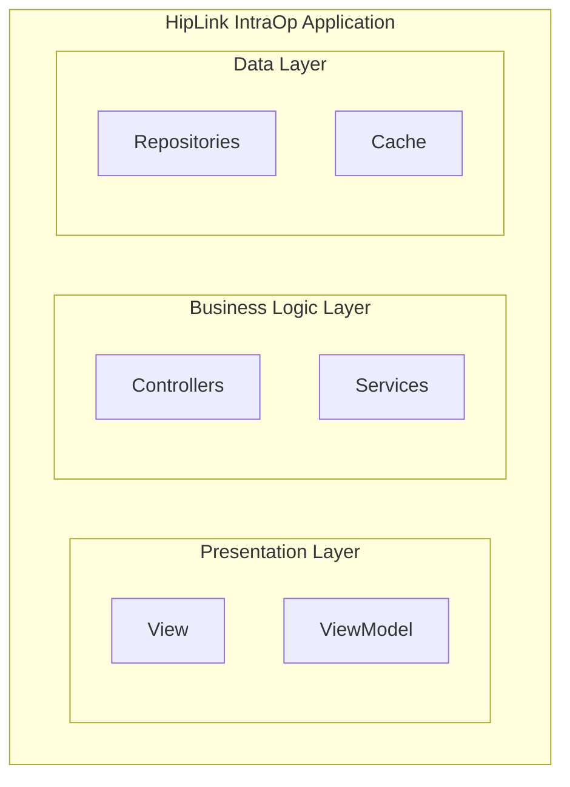
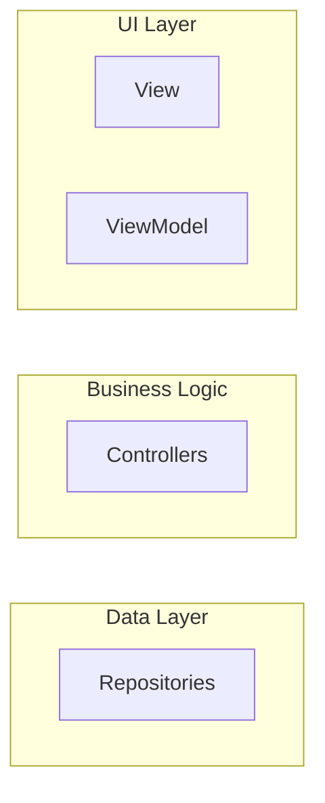

# type-b-logical

Rules for emitting a **logical / architectural diagram** in Mermaid. Loaded by
`agents/interpret_image.md` together with `shared-fidelity.md` when the source
image has boxes + grouping/containment but NO directional arrows between boxes.

Extracted from `agents/converter.md` Phase 4.7 (F11a-b).

## Source characteristics that pick this pack

- Boxes grouped inside nested rectangles or labeled regions
- Swim lanes or subsystem boundaries
- NO arrows between boxes — the diagram communicates **what is inside what**,
  not **how A becomes B**

**Common examples**: Frontend-Application component list inside a bounding
rectangle; VPC diagram with service boxes inside the VPC region; layered
architecture showing UI / Logic / Data layers stacked without arrows.

**NOT this pack** if the source shows arrows → `type-a-flow.md`. If lines
exist but without arrowheads → `type-c-component.md`.

## Emit shape — boxes + subgraphs ONLY, NO edges



**NEVER emit edges in a type-b Mermaid block.** The source doesn't show them.
This rule is a hard gate — if you find yourself writing any `-->` / `---` /
`-.->` line in a type-b diagram, stop and re-check whether the source actually
shows that line. If it doesn't, delete it.

## Layout hints — the `~~~` invisible-edge technique

Because there are no edges, dagre's layout engine has nothing to arrange. The
result is usually a random-looking grid. Fix this with invisible `~~~` edges
between subgraphs to constrain positioning to match the source:



Always precede the invisible edges with a `%% Layout hints` comment so
reviewers don't mistake them for semantic edges. The `~~~` operator produces
no arrowhead and no rendered line — pure positioning signal.

See `shared-fidelity.md` F11h for the full layout-hint protocol. This pack is
the primary consumer — most `type-b` diagrams need layout hints to read
correctly.

## Containment depth matches source

If the source nests three levels deep (e.g., `App > Layer > Component`), the
Mermaid nests three levels deep. Don't flatten ("App > Component") and don't
add nesting ("App > Section > Layer > Component"). See `shared-fidelity.md`
F11d.

## Label all subgraph titles literally

```mermaid
subgraph Backend["HipLink AWS Backend"]
```

Use the source's exact group label. Don't abbreviate. Don't translate.

## Caption hint

Note the layout strategy in the caption: "Layout reproduces source's
[top-to-bottom layered / central-hub radial / nested-containment] arrangement."

## Changelog

- 2026-04-21: Stub created during task ben/089 Phase A scaffolding.
- 2026-04-21 (session 2): Populated from `agents/converter.md` Phase 4.7
  (F11a-b). Layout-hint details remain in `shared-fidelity.md` F11h.
