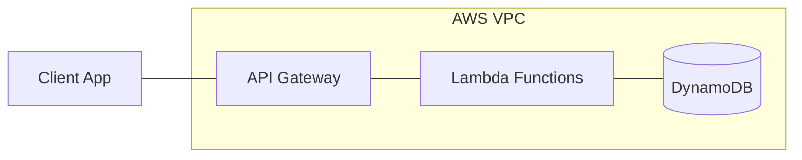
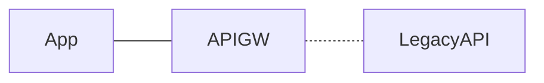
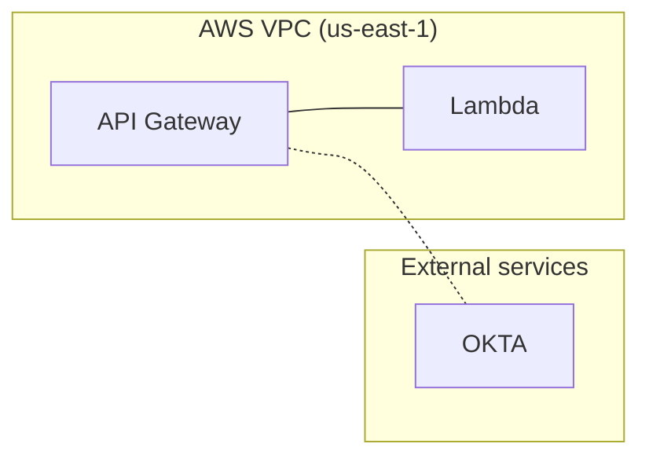

# type-c-component

Rules for emitting a **component / network diagram** in Mermaid. Loaded by
`agents/interpret_image.md` together with `shared-fidelity.md` when the source
image has boxes + **undirected** lines representing adjacency or relationship
(not directed flow).

Extracted from `agents/converter.md` Phase 4.7 (F11a-c).

## Source characteristics that pick this pack

- Boxes connected by lines **without arrowheads** (or with bidirectional
  arrows)
- Lines may be solid, dashed, or dotted — the style distinction is often
  meaningful (solid = physical link, dashed = logical link, dotted = optional)
- Topology is usually a cluster or graph rather than a linear sequence
- Typical examples: AWS service topology, network diagram, deployment topology

**NOT this pack** if lines have arrowheads (directed flow) → `type-a-flow.md`.
If no lines at all (just containment) → `type-b-logical.md`.

## Emit shape — undirected `---` lines

**The `---` operator produces an undirected edge with no arrowhead.** Use it
for every connection the source shows with a plain line. Do NOT upgrade `---`
to `-->` just because Mermaid's directed arrows "look more complete." The
source doesn't show direction; the Mermaid mustn't either.

## Preserve dashed/solid/dotted line distinctions

If the source distinguishes link types by style, preserve the distinction:

| Source style | Mermaid syntax |
|--------------|----------------|
| Solid line | `---` |
| Dashed line | `-.-` |
| Dotted line (rare; treat as dashed) | `-.-` |
| Thick line (for highlighting) | `===` |

If you flatten dashed-and-solid into a single line style, you lose a distinction
the diagram's author explicitly drew. If the distinction's meaning is unclear,
preserve the distinction and note "source distinguishes dashed vs solid lines;
semantics not documented" in the caption.

## Containment is separate from edges

Subgraph containment (see `shared-fidelity.md` F11d) still applies:

The edges connecting across subgraph boundaries ARE valid (and match the source).
The containment shows which service is inside/outside the VPC — critical for
security-boundary communication.

## Nodes with identity shapes

Network / topology diagrams often use shape to communicate role:

| Role | Mermaid shape |
|------|---------------|
| Database | `DB[(Database)]` — cylinder |
| Service / API | `S[Service]` — rectangle (default) |
| External / trusted boundary | `E[["External"]]` — subroutine shape |
| User / actor | `U((User))` — circle |
| Edge / gateway | `G{{Gateway}}` — hexagon |

Use the source's shapes if they are distinctly drawn. If the source is all
rectangles, keep everything rectangles.

## Cluster-level emission for dense topologies

Per `shared-fidelity.md` F11e, if the source has 25+ nodes arranged in
service clusters (e.g., "6 AWS clusters × 5 services each"), emit Mermaid at
the cluster level — one node per cluster, with the cluster label listing
contents — rather than enumerating every leaf service.

## Layout defaults

Default to `flowchart LR`. Switch to `flowchart TB` only if the source clearly
stacks the topology vertically (e.g., N-tier layered architecture where
"layer" is the dominant axis).

See `shared-fidelity.md` F11h for layout hints via `~~~` invisible edges.
Component diagrams usually have enough real edges that dagre produces
reasonable layouts without hints.

## Changelog

- 2026-04-21: Stub created during task ben/089 Phase A scaffolding.
- 2026-04-21 (session 2): Populated from `agents/converter.md` Phase 4.7
  (F11a-c). Shape table added for topology-specific role markers.
