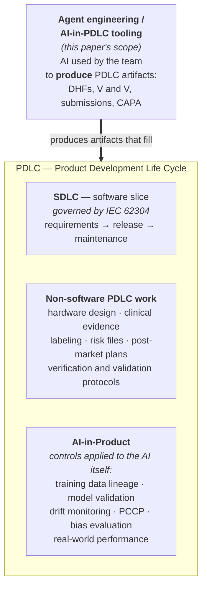
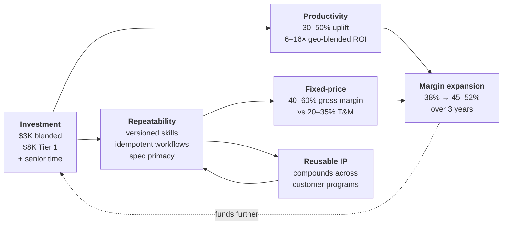
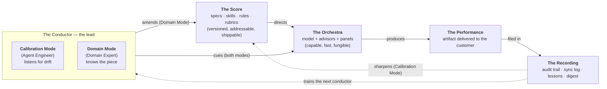
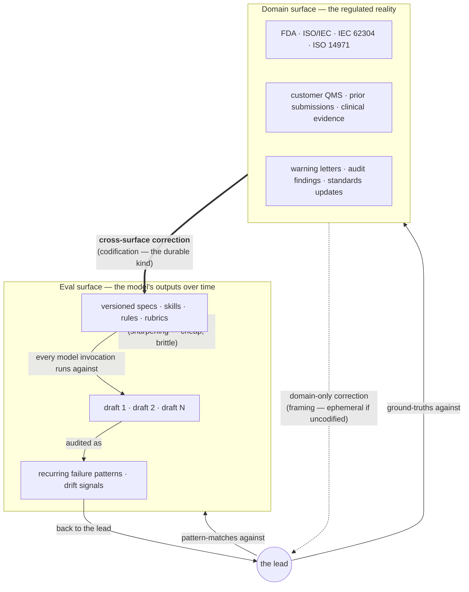

# Agent Engineering: The Next Logical Evolution of the Product Development Life Cycle

**A short whitepaper for Go-To-Market and Pre-Sales Engineering audiences in Healthcare & Life Sciences**

_Last updated: 2026-04-27_

> **Scope note.** Throughout this paper, "PDLC" means **Product Development Life Cycle** as practiced in Healthcare & Life Sciences (HCLS) — the full span from input analysis and design controls through verification and validation, regulatory submission, design transfer, manufacturing, and post-market surveillance. The same agentic thinking applies to **all** artifacts that life cycle produces: source code, design history files (DHFs), test protocols, regulatory submissions, complaint records, periodic safety reports, and the corrective-action loop back into design. We use "SDLC" only when we specifically mean the software-engineering subset.

---

## Intents — the rubric this paper holds itself to

Before reading, here is what we are trying to accomplish. After reading, the reader should be able to grade us against these intents. If any intent isn't met, we owe a revision.

This paper has four audiences. Each intent below names which audience it primarily serves so a reader can find their slice fast. The order of the audience-specific intents (1 → 4) follows the deal flow: market story → offer definition → engagement scoping → execution.

| # | Intent | Primary audience | Pass criterion |
|---|---|---|---|
| **1** | **A GTM leader can tell the *agentic-first company* story.** They can name where the market is going, name the four buckets and which one we sit in, and explain why the *agentic project shape* — not the labor that uses it — is what we sell. They can defend the story against Copilot / chatbot-bolt-on / vendor-locked-platform comparisons in a discovery call without notes. | **GTM Sales leaders** | Read Exec Summary, §3, §5.1–§5.4. Try the 90-second pitch out loud — it should cover *direction*, *posture*, and *defense*. If a reader can do all three, intent 1 is met. |
| **2** | **A Product Strategy lead can frame the agentic offer in product and capability terms, and identify where in a customer's upstream PDLC the agentic project shape is the lever.** They can take a customer ask — for example, *"derive user needs and requirements from market research, voice of customer, KOL feedback, and competitive intelligence via an agentic system"* — and map it to a concrete agentic-shape engagement: which agents and panels, which skills and rubrics, what scaffolding is required, what the customer's deliverable actually looks like (a product capability? a versioned offer? an internal AI-PDLC process?), and how the value is quantified. They understand that the offer is not "AI inside the PDLC" generically but a specific *capability* a customer's product team can adopt, audit, and extend — and that the same approach applies whether the deliverable is a regulated product (e.g., a medical device) or a regulated *process* (e.g., the customer's own user-needs synthesis pipeline). | **Product Strategy** | Read Exec Summary, §3, §5.3 (opportunities), §6 (engagement model), §C.7 (spec primacy), §C.8 (one-shot vs. scale). Pick a real upstream-PDLC use case — for example, user-needs synthesis from VOC + KOL + competitive intel — and write a one-paragraph offer description with the deliverable, the agents/skills involved, and the value drivers named. If the description is concrete enough that a Pre-Sales engineer could scope it from there, intent 2 is met. |
| **3** | **A Pre-Sales engineer can scope a real engagement from this paper.** They can name the accelerators we bring on day one, the skill profile of the delivery team, the rough cost shape, and the discovery questions that qualify a customer. They can explain why we lead with *quality* before harvesting productivity, and why the engagement is two-phase. | **Pre-Sales Engineering** | Read §6 in full. Sketch a one-page engagement plan for a hypothetical regulated customer using nothing but this paper. If the plan names accelerators, roles, cost components, and discovery questions, intent 3 is met. |
| **4** | **A delivery engineer whose only AI experience is Cursor / Copilot / Codex walks away with a corrected mental model.** They understand that agent engineering is *Calibration Mode + Domain Mode* operating against a versioned spec corpus — not autocomplete with extra steps; that specs and scaffolding outrank model choice; that one-shot generation doesn't scale; that guardrails are layered and no single layer is sufficient; and that the durable IP is *cross-surface* corrections, not eval-only sharpenings. They can name a piece of their own past work as one-shot vs. scaffolded and start operating in the right mode. | **Delivery Engineering** | Read §2, §C.3, §C.7, §C.8, §C.9. If a reader can name a piece of their own recent work as Calibration vs. Domain mode, plot a recent correction on the Two-Surfaces diagram, and identify which guardrail layer would catch a regression they've seen, intent 4 is met. |
| **5** | **The paper carries a transferable mental-model bench, not just one analogy.** Each model is explained in plain language *the first time it appears*, with a diagram or table the reader can re-draw. The reader leaves with at least two mental images they would use in their own conversations a week later. | All four (shared) | Read §1, §C.3.1, §C.3.2, §7. If you can explain *bulb-and-optics*, *the Conductor*, OR *the Two Surfaces* on a whiteboard a week later without referring back, intent 5 is met. Two of the three is the high bar. |
| **6** | **Every claim is battle-tested and inspectable.** No fabricated benchmarks. No vendor-glossy language. Every load-bearing claim ties back to either (a) a transferable mental model explained in plain language, (b) an inspectable artifact in one of two real repositories, or (c) a structural fact verified across **two independently-running programs** (~165 task documents, ~98 registry PRs, ~15 versioned skills, all under audit on request). | All four (especially GTM and Product Strategy, who carry the credibility of the pitch) | Read §4 and Appendix C. The proof points are real, anonymized, and offerable for live review. If a reader could ask "show me" and get an actual file in either repository, intent 6 is met. |

> **How to use these intents.** If you are reviewing this paper before it goes out — or if you are a reader judging whether to act on it — score it against these six before anything else. They are the contract between this paper and its reader.

#### Coverage matrix — four audiences × six intents

| Audience | Intent 1 (story) | Intent 2 (offer framing) | Intent 3 (scoping) | Intent 4 (mental-model upgrade) | Intent 5 (model bench) | Intent 6 (battle-tested) |
|---|---|---|---|---|---|---|
| **GTM Sales leaders** | **primary** | secondary | secondary | secondary | shared | **primary** |
| **Product Strategy** | secondary | **primary** | secondary | secondary | shared | **primary** |
| **Pre-Sales Engineering** | secondary | secondary | **primary** | secondary | shared | **primary** |
| **Delivery Engineering** | secondary | secondary | secondary | **primary** | shared | secondary |

---

### Candidates to retire — for review before this draft goes out

The following two intents were in the prior version of this section and have been demoted. Both are still served by the paper; the question is whether either earns one of the five top-of-paper contract slots.

> **Retired candidate A — "Scope honesty: AI-in-PDLC vs. AI-in-product."**
>
> *Prior text.* "The paper is honest about scope. It distinguishes AI used to *produce* PDLC artifacts (this paper) from AI shipped *inside* a product (a different problem with different controls). Pass criterion: read §1.2; the carve-out should be unmissable."
>
> *Why retired.* This is a *guardrail* against confusion, not an educational contract with a reader. The carve-out is still load-bearing in §1.2 and the Executive Summary, where it must remain unmissable; it just doesn't earn one of five contract slots when the alternative (intent 3 — delivery-engineer mental-model upgrade) directly serves an audience this paper otherwise has no contract with.
>
> *Decision needed.* Keep retired (carve-out lives in §1.2 only) — recommended. Or restore as Intent 6 if you want six total. Or restore as Intent 4 and demote one of the educational intents above.

> **Retired candidate B — "Organizational shift: 5 roles + 3 traits."**
>
> *Prior text.* "The paper makes the organizational shift concrete. It names the skillset profile of the team that delivers this work, names what makes a great agent engineer, and gives leaders a basis to plan training, hiring, and role design. Pass criterion: read §6.3; if you can list the five roles and the three traits that make an agent engineer great, intent 3 is met."
>
> *Why retired.* The §6.3 content stays — it is genuinely load-bearing for Pre-Sales scoping and for hiring conversations. But this intent is implicit in new Intent 2 (Pre-Sales must understand the skill profile to scope) and new Intent 3 (Delivery must understand what kind of work this is). Naming "5 roles + 3 traits" as one of the five top contracts under-served the *delivery-engineer* audience, who needs the mental-model upgrade more than they need a role-list to memorize.
>
> *Decision needed.* Keep retired (folded into Intents 2 and 3) — recommended. Or restore as a sixth intent if you want the §6.3 trait list to be one of the things every reader is checked against.

---

---

## Executive Summary

Agent engineering is **the discipline of building reliable systems out of non-deterministic generators** by engineering the *optics* — the skills, rules, agents, hooks, registries, and trace tooling — that focus a generic foundation model onto a specific domain. It is the next logical evolution of how engineering disciplines have always advanced: every time a generation of engineers learned to **describe intent and let a machine produce the lower-level artifact**, the field moved up the stack. Software went through it with compilers. Other disciplines went through the same shift with their own tools — mechanical engineering with CAD, electrical with SPICE, structural with FEA, civil with BIM (each explained in §1.1). Agentic generation across the **HCLS PDLC** — applied to code *and* to DHFs, regulatory submissions, V&V protocols, post-market reports, and the corrective-action loop — is the same kind of shift, this time at the synthesis-of-knowledge-work layer above code.

The market is full of "agentic" claims that are really code-completion vendors rebranded, chatbots bolted onto delivery, or vendor-locked platforms. **Our approach is structurally different. We do not sell labor that uses agents. We sell an _agentic project shape_ — a versioned, audit-trailed, domain-ground operating model that lives in the customer's repository, raises the quality bar before harvesting productivity, and improves itself over time through a registry-mediated feedback loop.**

This paper makes that case in plain language. The first half is the argument and the discipline. The second half is the value prop, market direction, and engagement model — split into a Go-To-Market cut and a Pre-Sales Engineering cut so each audience can read the section that fits their job.

**Key claims, in one breath:**

1. Every new technology that changes input-to-output goes through a normal trust-building arc. CAD, SPICE, FEA, BIM, and compilers all went through it. AI in the **HCLS PDLC** is at that stage today. The discipline is unchanged: generate, inspect, accept, version.
2. **The accepted artifact is deterministic.** Bare LLMs are stochastic at generation time, but once we approve a generated PDLC artifact — code, DHF section, V&V protocol, submission draft, CAPA narrative, post-market report — it is version-controlled and behaves like any other regulated deliverable. (AI *in the product* is a different problem with different controls — explicitly out of scope here, called out so it isn't conflated.)
3. The optics — skills, rules, agents, hooks, registries — make the generation step reliable enough that inspection-and-acceptance stays cheap.
4. Quality first, then productivity. In that order. Every time.
5. The deliverable is the *project shape*, not the labor — reproducible across projects, transferable to the customer, and auditable end-to-end.

---

## 1. The Argument: Agent Engineering as the Next Logical Evolution

### 1.1 The pattern: every engineering discipline has been through this before

A useful way to understand what is happening with AI in the PDLC is to remember that **other engineering fields have already been through the same transition**, and we know how it ends. Here is the short list, each in plain language:

| Field | The "before" world (engineer hand-produces the lower-level artifact) | The "after" tool (engineer describes intent, the tool produces the artifact) | What the tool is called |
|---|---|---|---|
| **Software** | Engineer writes assembly by hand, instruction by instruction. | Engineer writes in a high-level language; the **compiler** produces the assembly. | Compiler |
| **Mechanical engineering** | Drafter draws every part on paper at a drawing board with a T-square. | Engineer describes the part on a screen; the **CAD** system produces the drawings, the bill of materials, and increasingly the manufacturing instructions. | CAD — *Computer-Aided Design* |
| **Electrical engineering** | Engineer breadboards a circuit, takes measurements, iterates physically. | Engineer describes the circuit; **SPICE** simulates how it will behave before any hardware is built. | SPICE — *Simulation Program with Integrated Circuit Emphasis* (a circuit simulator) |
| **Structural / mechanical analysis** | Engineer hand-calculates stresses with simplified textbook formulas. | Engineer describes the geometry and loads; **FEA** computes how the part deforms and where it will fail. | FEA — *Finite Element Analysis* (a stress / deformation simulator) |
| **Civil engineering / architecture** | Architect produces 2D drawings; the team reconciles plumbing, electrical, structural, and HVAC by overlaying transparencies on a light table. | Architect describes the building once in a shared 3D model; **BIM** keeps every discipline coordinated automatically. | BIM — *Building Information Modeling* (a shared 3D coordination model) |
| **Software (the next move)** | Engineer types every line of code, every test, every document by hand. | Engineer describes intent; the **agent + its optics** produce the candidate artifact. The engineer reviews and accepts. | "Agent engineering" |

The pattern is constant across all of them: a higher-level abstraction is **generative** — you describe intent, the system produces the lower-level artifact you used to write by hand. Productivity rises. Trust lags. Tooling co-evolves with trust until line-by-line review becomes unnecessary for routine cases. The job doesn't disappear; it **moves up the stack** — the engineer spends less time on the lower-level artifact and more time on the intent, the constraints, and the verification.

The compiler version of this story is worth pausing on, because it is the closest software-engineering precedent. In the early decades of high-level languages — FORTRAN, COBOL, and the C era that followed — engineers routinely **inspected the compiler's assembly output line by line**. Trust in the compiler was earned one diff at a time. The "old guard" said: *I can write better assembly than the compiler.* Some of them were right, for a while.

Today, engineers prompt large language models to produce code, then read every line of the diff to verify intent. Trust in the model is being earned the same way. The "old guard" says: *I can write better code than the LLM.* Some of them are right, for a while.

The takeaway for an HCLS PDLC audience: **this is not a unique-to-AI story.** Every time a field gained a tool that turned "describe intent → machine produces the artifact" into a real workflow, the early years felt risky and the later years made the prior approach unthinkable. We have receipts on this pattern from five different engineering fields. AI in the PDLC is the sixth.

### 1.2 PDLC vs. SDLC vs. AI-in-Product — three terms, plainly defined

Three terms get used interchangeably in conversations about AI in regulated work, and they should not be. **PDLC**, **SDLC**, and **AI-in-Product** name three different things; this paper is about exactly one of them. Before going further, we settle the vocabulary, give concrete examples of each, and name the cases where the lines actually blur — because the lines do blur, and that is what makes the conversations hard.

#### 1.2.1 The plain-language definitions

| Term | What it is | Where it lives in HCLS work | A concrete example |
|---|---|---|---|
| **PDLC — Product Development Life Cycle** | The full lifecycle of bringing a regulated product to market and sustaining it: *discovery → concept → design controls → V&V → submission → manufacturing → post-market → end-of-life.* | The whole thing, top to bottom. PDLC is the largest container; everything regulated lives inside it. | A medical device company, from the moment a clinical need is identified, through the 510(k) submission, through five years on market under post-market surveillance, until the product is retired. |
| **SDLC — Software Development Life Cycle** | The lifecycle of *software* development specifically: *requirements → architecture → implementation → testing → release → maintenance.* In regulated contexts, governed by IEC 62304. | A *subset* of PDLC. The software inside a medical device runs an SDLC; the device's PDLC contains it. | The firmware of an infusion pump goes through SDLC (SRS → SAD → unit tests → integration tests → release). The pump as a whole device runs the broader PDLC around it. |
| **AI-in-Product** | AI shipped *inside* what the customer or patient ultimately uses. The model executes at runtime, takes user input, and returns a probabilistic answer as part of the product's clinical or operational function. | An AI feature *embedded* in a regulated product. May be the entire product (Software-as-a-Medical-Device) or a feature within a larger system. | An imaging triage tool that flags suspected pneumothorax on chest X-rays. A clinical decision support module that suggests insulin doses. An adaptive alarm threshold in a patient monitor. |

There is also a fourth thing — *AI-in-PDLC tooling*, the discipline this paper is about — that is **not** in the table above because it isn't a layer of the regulated artifact at all. It's the team's working method. We define it next, after the picture lands.

#### 1.2.2 Visualizing the containment



Four points the picture lands at once:

1. **PDLC is the container.** Everything regulated about bringing a product to market lives inside it.
2. **SDLC is one slice of PDLC.** It is the software-engineering slice. SDLC is what you do for the code; PDLC is what you do for the whole device — including the code, the hardware, the clinical evidence, the labeling, the V&V, the risk file, the post-market plan, the manufacturing controls, the labeling translations, the EUDAMED registration, and so on.
3. **AI-in-Product sits *inside* PDLC, alongside SDLC.** When AI is shipped to the user as part of the product, it brings *additional* regulated controls — controls about training data, model validation, drift, transparency, bias, and predetermined change control plans. These controls live alongside, not instead of, the rest of PDLC.
4. **AI-in-PDLC tooling — the agentic project shape — points at the picture from outside.** It is the team's working method, not part of the product. It produces artifacts that fill the boxes inside PDLC. The model, the skills, the hooks, the registries — none of them ship to the patient. They ship the *artifacts* that ship to the regulator.

#### 1.2.3 Phases, artifacts, and agentic tooling — one table

The diagram above shows three containers. This sub-section names what concretely lives inside each one *by phase*, and — importantly — names the agentic tooling and workflows that can be implemented at each phase to author, audit, and maintain those artifacts. PDLC is the container; everything in the table below is by default a PDLC concern. SDLC items (the software slice) are tagged inline. AI-in-Product items (out of scope for this paper but named where relevant) are tagged inline as well.

**Reading legend.**

- Plain text — **PDLC** by default. Every row is a PDLC phase or activity.
- **`[SDLC]`** — also part of the **software slice** (governed by IEC 62304 in HCLS). When you see this tag, the artifact or agent applies to both PDLC and SDLC at once.
- **`[AI-IP]`** — also part of the **AI-in-Product** layer when AI ships inside the device. Out of scope for this paper; tagged so the reader can see where the layer would intrude.
- **`·`** separates list items inside a cell.

| Phase | Layers | Representative artifacts | Agentic tooling / workflows that can be implemented in this phase |
|---|---|---|---|
| **1. Discovery** | PDLC | Voice-of-customer (VOC) synthesis · KOL panel summaries · market research · competitive intelligence · regulatory-landscape scan · clinical evidence review | **User-needs synthesis** (ingest VOC + KOL + competitive intel + market research → structured candidate user needs with citation back to source signals; flag conflicts between voices) · **KOL panel summarizer** (cluster, theme, and counter-balance KOL voices) · **Competitive-intel scraper / synthesizer** · **Regulatory-landscape scan agent** (track recent FDA guidance, MDR shifts, warning letters relevant to the device class) · **Clinical-evidence search & summarization agent** |
| **2. Concept** | PDLC | Intended-use statement · indications for use · contraindications · classification rationale · predicate analysis · pathway determination (510(k) / De Novo / PMA / CE) · claim crafting | **Predicate-search & substantial-equivalence drafting** (search FDA databases, build comparison tables, draft SE under FDA's four-pillar framework) · **IFU / indications-for-use drafting agent** (aligned with classification rationale and predicate scope; flags claim drift; checks against prohibited-claim patterns) · **Classification-rationale agent** · **Pathway-recommendation agent** (510(k) vs. De Novo vs. PMA decision-support with case precedent) · **Claim-validity checker** |
| **3. Design Controls — Inputs** | PDLC + SDLC | User Needs (UNs) · Design Inputs (DIs) · system requirements · risk-management plan · usability-engineering plan · software-development plan · **`[SDLC]`** Software Requirements Specification (SRS) · **`[SDLC]`** non-functional requirements · **`[SDLC]`** security requirements · **`[SDLC]`** interface requirements · **`[SDLC]`** user stories with acceptance criteria | **Requirements derivation** (UN → DI → SRS chains with explicit trace) · **Trace-matrix builder** (UN → DI → DO → V&V → risk linkage; orphan detection; gap reports) · **Risk-management-plan drafter** · **Usability-engineering-plan drafter** · **`[SDLC]`** **Requirements → test generation** (ingest SRS clause / user story / acceptance criterion → unit-test scaffolds, integration scenarios, edge-case probes; link tests back to requirement IDs for coverage tracking) · **`[SDLC]`** **Acceptance-criteria refinement agent** (sharpen testability) · **`[SDLC]`** **Security-requirement extraction** (from threat model + standards) |
| **4. Design Controls — Outputs** | PDLC + SDLC | Software Architecture Document (SAD) · design specifications · hardware drawings · bill of materials (BOM) · firmware images · cloud-service definitions · **`[SDLC]`** source code · **`[SDLC]`** build configuration · **`[SDLC]`** dependency manifests (`package.json`, `requirements.txt`, `pom.xml`, etc.) · **`[SDLC]`** container / Helm manifests · **`[SDLC]`** infrastructure-as-code · **`[SDLC]`** SOUP (Software Of Unknown Provenance) classification under IEC 62304 | **SAD authoring agent** (system → module → interface decomposition with constraint records) · **BOM authoring agent** · **`[SDLC]`** **Code review against customer coding standards** (read PR diff against project-specific style and quality rules; flag deviations; suggest fixes that respect *that customer's* conventions, not generic best practice) · **`[SDLC]`** **Design-constraint / library-enforcement agent** (PR diff vs. approved-library list, allowed framework versions, deprecated-API list, license-policy list; flag violations *before* code lands) · **`[SDLC]`** **Architecture-violation detection** (PR diff vs. SAD's allowed module dependencies and data flows) · **`[SDLC]`** **API-contract verification** (implementation vs. OpenAPI / GraphQL / Protobuf schema) · **`[SDLC]`** **Refactoring under interface / library constraints** · **`[SDLC]`** **SOUP classification (IEC 62304)** (classify each third-party dependency by software safety class; document evaluation; flag re-evaluation triggers) |
| **5. V&V** | PDLC + SDLC + **`[AI-IP]`** | Design-verification protocols and reports · design-validation protocols and reports · IQ/OQ/PQ · usability validation · summative human-factors evaluation · **`[SDLC]`** unit / integration / system test reports · **`[SDLC]`** coverage reports · **`[SDLC]`** performance / load test results · **`[SDLC]`** regression test suites · **`[AI-IP]`** holdout test results · **`[AI-IP]`** performance characterization across demographic / clinical slices · **`[AI-IP]`** robustness / adversarial testing | **Verification protocol drafter** (generate DV protocols traced to design inputs) · **Validation protocol drafter** · **Usability-validation drafter** · **IQ/OQ/PQ scaffolding agent** · **`[SDLC]`** **Test-coverage / gap analysis** (coverage reports + SRS → which requirements lack coverage; propose targeted test additions) · **`[SDLC]`** **Static-analysis result triage** (SAST / SCA → group similar findings, rank by exploitability, suggest fixes, suppress false positives with documented rationale) · **`[SDLC]`** **Test-execution result summarizer** · **`[AI-IP]`** **Eval-suite authoring** (scenario-based batteries, acceptance bands, eval drift tracking across model versions) · **`[AI-IP]`** **Bias / fairness evaluation** |
| **6. Risk management** *(cross-cutting)* | PDLC + SDLC + **`[AI-IP]`** | Hazard analysis · design FMEA · use FMEA · process FMEA · risk-benefit analysis · residual-risk evaluation · risk-control trace · ISO 14971 risk file · **`[SDLC]`** threat model · **`[SDLC]`** cybersecurity risk assessment · **`[AI-IP]`** model risk assessment · **`[AI-IP]`** indication-boundary documentation | **Hazard-identification agent** (system description → hazard candidates against ISO 14971 + clinical literature) · **FMEA scaffolding agent** (design / use / process variants) · **Risk-control-mapping agent** (controls → design inputs → V&V evidence) · **Residual-risk evaluator** · **Risk-benefit narrative drafter** · **`[SDLC]`** **Threat-modeling agent** (STRIDE / LINDDUN candidates against system architecture; map to mitigations; align with FDA pre-market cybersecurity guidance) · **`[AI-IP]`** **Model-risk assessor** (training-data risks, drift risks, indication-boundary risks) |
| **7. Submission** | PDLC + (sometimes **`[AI-IP]`** for SaMD) | 510(k) / De Novo / PMA submission · CE technical file · substantial-equivalence narrative · clinical evaluation report · IFU and labeling · declaration of conformity · EUDAMED records · **`[AI-IP]`** model card (when SaMD) · **`[AI-IP]`** Predetermined Change Control Plan (PCCP) | **Submission narrative drafter** (populate 510(k) / CE technical-file / EUDAMED sections from structured source data; flag missing inputs) · **Clinical evaluation report drafter** (literature search → gap-vs-state-of-the-art → MDR Annex XIV-aligned scaffolding) · **Labeling / IFU drafter** (cross-check against approved-claim list; flag prohibited language) · **Declaration-of-conformity scaffolder** · **Cross-reference validator** (every claim in the submission cites a controlled source) · **`[AI-IP]`** **Model-card generation** · **`[AI-IP]`** **PCCP narrative agent** (align to FDA draft and final guidance; flag changes that fall outside the predetermined envelope) |
| **8. Manufacturing & Release** | PDLC + SDLC | Manufacturing-process validation · supplier qualification records · packaging validation · sterilization validation · device master record (DMR) · device history record (DHR) · **`[SDLC]`** release notes · **`[SDLC]`** version-control tags · **`[SDLC]`** signed release packages · **`[SDLC]`** deployment manifests · **`[SDLC]`** build provenance attestations · **`[SDLC]`** Software Bill of Materials (SBOM) | **Process-validation drafter** · **Supplier-qualification scaffolder** · **Packaging / sterilization-validation drafter** · **DMR / DHR composition agent** · **`[SDLC]`** **Release-notes drafter** (PR / commit history between two release tags → user-facing notes scoped to feature / bugfix / security / breaking-change) · **`[SDLC]`** **SBOM building & maintenance** (parse package manifests across all language ecosystems; emit SPDX or CycloneDX; detect vulnerabilities by CVE match; license compliance check; track delta between releases for FDA cybersecurity submission) · **`[SDLC]`** **Build-pipeline configuration** (CI/CD pipeline scaffolds aligned with the project's quality gates: test → SAST → SCA → SBOM → signed release → provenance attestation) |
| **9. Quality / QMS** *(cross-cutting)* | PDLC | Standard operating procedures (SOPs) · work instructions · training records · change-control records · CAPA records · deviation records · internal-audit reports · management-review minutes | **SOP / WI authoring agent** (drafts grounded in QMS structure and applicable standards; flag deviations from house style) · **CAPA narrative drafter** (root-cause scaffolding; corrective-action proposals; effectiveness-check criteria; trend correlation) · **Audit-readiness agent** (gap report against ISO 13485, 21 CFR 820, 21 CFR Part 11, IEC 62304; missing-document detection; staleness flags) · **Deviation narrative agent** · **Management-review pack assembler** · **Change-control workflow agent** (route a proposed change through impact analysis → review → approval → implementation → verification) |
| **10. Post-market & Maintenance** | PDLC + SDLC + **`[AI-IP]`** | Periodic safety report (PSUR / PMSR) · complaint records · post-market surveillance plan · trend analyses · field safety corrective actions (FSCA) · post-market clinical follow-up · **`[SDLC]`** bug reports · **`[SDLC]`** patch release records · **`[SDLC]`** vulnerability advisories · **`[SDLC]`** dependency-update records · **`[SDLC]`** end-of-support timelines · **`[AI-IP]`** real-world performance monitoring (RWPM) · **`[AI-IP]`** drift detection logs · **`[AI-IP]`** model-update change-control records | **Post-market surveillance / trend agent** (analyze complaint stream; identify signal candidates; trend-correlate against device families) · **PSUR / PMSR drafter** · **Complaint-classification agent** · **Field-safety-correction narrative agent** · **`[SDLC]`** **Patch-release-notes drafter** · **`[SDLC]`** **Vulnerability-advisory drafter** (correlate CVE → affected component → patch → customer-facing advisory) · **`[SDLC]`** **Dependency-update advisory** (CVE delta, breaking-change risk, license change, transitive impact → accept / defer / reject recommendation) · **`[AI-IP]`** **Drift detection / RWPM** · **`[AI-IP]`** **Hallucination / grounding verification** (for LLM-in-product cases) · **`[AI-IP]`** **Indication-boundary enforcement at runtime** |

##### Where the catalog crosses container boundaries (and why that confuses conversations)

A handful of artifacts and agents legitimately live in *more than one* container at once — and that is what makes the regulated conversations hard. Three of the most-confused, repeated for emphasis:

- **The SRS** is an SDLC artifact (software requirements) *and* a PDLC deliverable (filed in the DHF, governed by IEC 62304). Same document, two control regimes. Authoring it agentically requires both *requirements → test generation* (SDLC) and *trace-matrix linkage* (PDLC) — two agents producing one document.
- **The SBOM** is an SDLC maintenance artifact *and* a PDLC submission expectation (FDA's pre-market cybersecurity guidance now expects an SBOM in the submission for cyber devices). One artifact, two readers (engineering team and regulator), often two formats (CycloneDX for ops, narrative summary for the submission).
- **A model card** is an AI-in-Product artifact *and* part of the PDLC technical file when the AI is the device (SaMD). One artifact, two control regimes: model-validation discipline (AI-in-Product) and design-controls discipline (PDLC).

The discipline is to know which controls apply to which container, and to author the artifact so it satisfies *both* sets at once when an artifact crosses containers. The same logic applies to the agents that produce the artifact: a code-review agent (SDLC) authoring code that ends up in a regulated device's DHF (PDLC) must satisfy both the SDLC review rules and the PDLC named-human-reviewer rule.

##### The synthesizing line

The same agent abstraction (a grounded persona with a defined lane, a citation rule, a counterpoint pass — see §2 and §C.3) can be instantiated against any phase in the table. **What changes from cell to cell is the spec corpus, the grounding sources, the semantic data layer the agent reads, and the failure modes — not the architecture.** A team that ships an agentic project shape ships a versioned, auditable answer to *"which agents and skills run at each phase, against which semantic data layer, with what grounding, governed by what review gate."* A team that ships generic LLM access ships none of that, and the resulting work falls into one of the three buckets §3.1 calls out by name.

This is also the operational reading of the *spec primacy* claim from §C.7. The investment is not "better model for the SDLC" or "more capable agent for the PDLC." The investment is *named, versioned, phase-specific specs and agents*, kept in a registry that propagates across customer programs. The table above is the shape of that investment, in plain English.

#### 1.2.4 Three concrete scenarios

To make the distinctions concrete, consider three real-shaped examples:

> **Scenario A — A pure SDLC ask.** A startup is building an internal web tool to track sales leads. The tool is not regulated. The team uses GitHub Copilot to help write the React code. *This is SDLC work, full stop.* There is no PDLC because the product isn't a regulated medical device. There is no AI-in-Product because no AI ships to the user. Cursor / Copilot / Codex is the right tool class. **This paper does not apply.**

> **Scenario B — A regulated device's PDLC, no AI in the product.** A medical-device team is bringing an infusion pump to market. The pump's firmware is purely deterministic; the pump's planning UI is purely deterministic; the device itself contains no AI. The team uses agentic delivery to author the DHF, generate V&V protocols, draft the 510(k), maintain trace matrices, and run audit checks across the project tree. *This is PDLC work, AI-in-PDLC tooling used by the team, no AI-in-Product.* Every artifact the FDA sees was AI-assisted in its drafting and human-reviewed before approval; the artifact in the regulator's hands is deterministic and audit-grade. **This paper applies in full.**

> **Scenario C — A regulated device with AI in the product.** A medical-imaging company ships a CAD-style triage tool that uses an ML model to flag suspected pneumothorax on chest X-rays. *Two AI disciplines apply, in parallel.* The team uses agentic delivery (this paper's scope) to author the DHF, the SaMD documentation, the V&V protocol, the predetermined change control plan, and the post-market performance monitoring plan. *Inside* the product, the ML model itself goes through a different discipline — training-data lineage, performance characterization across demographic slices, real-world performance monitoring, drift detection, transparency to clinicians, fallback paths. **This paper covers the first discipline — the AI-in-PDLC tooling that produces the artifacts. The second discipline (AI-in-Product controls) is also growing and also valuable, and this paper does not make claims about it.**

#### 1.2.5 Where the lines actually blur — five hard cases

Reasonable readers conflate these terms because the cases that confuse them are real. Five worth naming explicitly:

1. **The same artifact has two parents.** When agentic tooling generates an SRS for a medical device, the artifact lives in *both* the SDLC (it is a software requirements specification) and the PDLC (it is a deliverable in the DHF). The PDLC controls (named human review, traceability, IEC 62304 § 5.1.11 tool determination on the AI authoring tool) apply to its *production*; the SDLC controls (V&V against the SRS, change control under IEC 62304) apply to its *consumption*. Same document, two control regimes. Both apply, simultaneously.

2. **AI-in-PDLC tooling used to author the technical file *for an AI-in-Product device*.** A team uses Claude Code to author the 510(k) technical file for a device that contains a triage ML model. The PDLC-supporting AI (Claude, in the team's working method) is one thing; the in-product AI (the triage model that ships to clinicians) is another; they share a paper, on the regulator's desk. They are not the same AI, do not share controls, and need separate qualifications. **This is the most-confused conversation in the market today** — and the conflation is what causes regulated buyers to reject "agentic" pitches.

3. **Predetermined Change Control Plans (PCCP).** PCCP is a regulatory mechanism specifically for AI-in-Product — it lets a manufacturer pre-specify allowed model updates without re-submitting on every retrain. PCCP is itself a *PDLC artifact* (filed with FDA), about an *AI-in-Product*, often *authored using AI-in-PDLC tooling*. Three of the three layers in one document. Distinguishing the three at review time is what keeps the regulator calm and the conversation precise.

4. **Software-as-a-Medical-Device that is itself an agentic system.** A clinician-facing decision support agent runs in the hospital — the *product* is an agentic system. Its PDLC has full design controls (and the discipline this paper describes is what produces the DHF for it); its in-product AI controls are *different* from the agentic-tooling controls — the in-product agent has clinical risk, real-world performance monitoring, indication boundary, fallback paths, hand-off rules to a human clinician. The same architectural shape (an agent + optics) lives in *both layers* — but they are different layers and the controls don't transfer between them. This is the case where vocabulary discipline matters most.

5. **CDS classification — device or non-device.** Whether a clinical decision support tool is a regulated device depends on whether it meets FDA's "non-device CDS" criteria (21st Century Cures Act language; IMDRF clarification). If it qualifies as non-device CDS, *there is no PDLC* in the regulated sense — and the team is back in something closer to Scenario A. If it does not qualify, full PDLC applies. The presence of AI in the product does not by itself decide regulatory status — the function decides it. Teams routinely conflate "we use AI" with "we are a regulated device"; the right answer is "it depends on what the AI does."

#### 1.2.6 How teams typically confuse the three (and what derails)

Three recurring conflation patterns we see in the market, each with a different derailment shape:

| Conflation | What the buyer hears | What the buyer asks about | Why the conversation derails |
|---|---|---|---|
| *"You use AI in your development process."* | Buyer assumes the conversation is about AI-in-Product. | Asks about model validation, training-data lineage, bias evaluation, FDA's GMLP principles. | Those questions belong to AI-in-Product, not AI-in-PDLC. The vendor either flounders or fakes a competence they don't have. |
| *"You have an AI-enabled device."* | Buyer assumes the development tooling is the same AI as the in-product AI. | Asks whether Cursor or Copilot is enough; or whether the development AI's training data is in their device. | Those tools are SDLC-only; they don't touch regulated PDLC artifacts and they have nothing to do with the in-product model's training data. The conversation collapses two separate disciplines into one. |
| *"We're agentic."* (vendor pitch) | Single phrase intended to cover all three layers at once. | Buyer can't tell what is actually being sold. | None of the three layers gets treated rigorously. The regulated buyer treats the imprecision as a credibility tell and disengages. |

The discipline of separating the three terms is itself a competitive moat. A vendor who can hold the three layers distinct in a discovery call — *"we are agentic in our delivery method, your device may or may not be AI-in-Product, and SDLC is one slice of your PDLC"* — has already differentiated from the buckets in §3.1 by paragraph two of the conversation.

#### 1.2.7 What this paper is and is not

To pin down where this paper sits inside the picture above:

- **This paper is.** A treatment of *agent engineering* — the discipline of using AI tooling to produce regulated PDLC artifacts. Skills, hooks, registries, advisors, trace tooling, the layered guardrail stack of §C.9, the spec-primacy claim of §C.7. The artifact's deterministic-at-acceptance property (§1.3) and the layered-guardrail discipline (§C.9) are how this paper makes the case.
- **This paper is not.** A treatment of AI-in-Product controls. Model validation, training-data lineage, bias evaluation, drift monitoring, real-world performance characterization, PCCP authoring strategy, indication boundary management, transparency-to-clinician design — all important, all out of scope. We name the boundary so a reader does not assume one paper covers both.
- **A team that ships an AI-enabled device benefits from both disciplines.** The agentic project shape produces the audit-grade DHF, technical file, V&V protocols, and PCCP narrative; the in-product AI discipline produces the validated, monitored, change-controlled model that ships. The two disciplines are complementary; conflating them produces confused conversations and unsigned deals.

### 1.3 The trust-building pattern is the constant; the artifact is fixed at acceptance

Every new technology that changes the input-to-output relationship goes through the same trust-building arc — generate, inspect, accept, version, harden the tooling until line-by-line review becomes unnecessary for routine cases. Compilers went through it. CAD, SPICE, FEA, and BIM each went through it in their fields. Agents are going through it now. The pattern is the constant; the medium is what changes.

The point that matters for the **HCLS PDLC** is this: **once we accept an output, it is fixed.** The model is stochastic at generation time, but the moment a human approves a generated artifact and commits it, that artifact is versioned, reviewed, signed, and as deterministic as anything else in the controlled record. The artifact does not silently change because it was produced by a probabilistic system. We assert the output we want; that output ships. Iterate-then-fix is how every regulated deliverable has always worked — code, design history files, V&V protocols, regulatory submissions, periodic safety reports, complaint records. Agentic generation does not change the discipline; it changes the input method.

The carve-out between AI-in-PDLC tooling (this paper's scope) and AI-in-Product (a different discipline with different controls) is treated in full in §1.2. To restate it briefly here: **the regulator is not approving the model; the regulator is approving the artifact.** The fact that the *generation step* used a stochastic model is irrelevant once the artifact is accepted, version-controlled, and committed. (Technical note: a more detailed treatment of how the LLM-era artifact differs from the compiler-era artifact at the *generation step* — non-determinism, lack of formal spec, expanded possibility space, in-loop steering — appears in Appendix A for readers who want to go a level deeper. It is craft detail, not the topline message.)

### 1.4 The optics framing

A bare model is a **light source** — useful, but broadband. It illuminates the whole room, including a great deal of what you didn't ask for. To do real work, you need optics: lenses, apertures, collimators, mirrors. Those optics turn a bulb into a laser — same photons, dramatically narrower beam, dramatically more useful work per watt.

The optics in agent engineering are:

- **Skills** — packaged, named, reusable expert checklists for recurring jobs. (Build a trace matrix. Convert a DOCX. Run an audit.)
- **Rules** — short written conventions that the assistant reads and obeys. (Never fabricate a regulatory citation. Always link a task. Demo data carries a banner.)
- **Agents** — domain personas that read what a real specialist would read and answer within their lane, with citations and counterpoints.
- **Hooks** — small automations that fire at session start, before file edits, on session end. They don't lecture; they enforce.
- **Registries** — versioned, shared catalogs of skills and agents that propagate improvements across projects.
- **Trace tooling** — bidirectional design-controls trace, gap reports, dashboards that turn "is this complete?" from a fuzzy judgment into a measurement.
- **Evals** — measured behavior over a fixed test set, to know whether a change to the optics improved the beam.

> **The product is the optics.** The moat is the optics. The IP is the optics. Anyone can rent the bulb.

Even lasers scatter — non-determinism doesn't disappear at the generation step. But the scatter cone shrinks from "wide-angle floodlight" to "tight beam with a known divergence angle," and the residual scatter is what evals, panel review, and human-in-the-loop catch *before* the artifact is accepted. After acceptance, the artifact is version-controlled and deterministic — same as any other commit.

### 1.5 Knowledge work has always been probabilistic

The objection "but agents are not deterministic" proves too much. *Neither are humans.* That is exactly why teams invest in diverse data, peer review, structured deliberation, and panel decisions — those are the techniques humans use to **shape the probability distribution of the decisions they produce.** And just as a team writes down its decision and signs it (turning a probabilistic deliberation into a deterministic artifact), an agentic PDLC has a human accept and commit a generated artifact (turning a probabilistic generation into a deterministic artifact). Same shape, different medium.

The right question is not *"is the agent deterministic?"* It is *"is the agent's output distribution at the generation step good enough that the inspection-and-acceptance step stays cheap?"*

Decision quality has always been the goal, and it has always required engineering. Agent engineering is the modern implementation of that engineering for the synthesis-of-knowledge-work layer above code.

### 1.6 Quality first, then productivity

A common failure mode is to lead with "agents will save you 30%." That pitch loses, for two reasons. It triggers organizational antibodies (it sounds like a headcount cut), and it is undefended on the quality axis (a 30% discount on lower-quality work is not progress).

The right sequencing is:

1. **First, raise the quality floor.** Use agents to catch what humans miss, enforce consistency humans drift on, surface trace links humans skip, run audits humans defer. *Earn trust by demonstrably producing better work than the unaided team on tasks the team already does.*
2. **Then, harvest productivity.** Once the floor is raised and the measurement infrastructure exists, automation is safe — because you know when it is safe. Human-in-the-loop becomes a **dial keyed to risk class**, not a switch.

> "Agents will save you 30%" is a discount.
> "Agents will raise the quality of your work and eventually save you cost" is a value proposition.

---

## 2. The Discipline: What Agent Engineering Actually Is

Classical PDLC engineering: produce correct artifacts — code, design inputs, V&V protocols, risk analyses, submissions, post-market evidence — by hand, one author at a time.

Agent engineering: design the **scaffolding** — prompts, skills, agents, tools, memory, evals, hooks, permission models, escalation paths — such that a non-deterministic generator reliably produces correct PDLC artifacts *and you can prove it did*. The artifact you ship is the system, not just the artifacts it produces.

### 2.1 New artifacts

Classical SE has source files, build configs, tests, and CI. Agent engineering adds:

| Artifact | Purpose | Versioned in repo? |
|---|---|---|
| **Skill** | A named, reusable workflow with a reproducible result. | Yes — markdown + scripts. |
| **Agent / persona** | A grounded, lane-respecting expert advisor. | Yes — markdown. |
| **Rule** | A project convention the assistant reads and obeys. | Yes — markdown. |
| **Hook** | A small automation gating a moment in the session. | Yes — shell. |
| **Project manifest** | Single source of truth for identity, topology, registries, security, advisor curation. | Yes — YAML. |
| **Skill registry** | Versioned catalog from which projects pull and to which they push. | Yes — sibling repo. |
| **Eval set** | Measured behavior over a fixed test set, used to validate optics changes. | Yes — alongside skill. |
| **Trace artifact** | Bidirectional design-controls trace + gap report. | Yes — generated, in-repo. |
| **Capture markers** | In-line decision capture (`<!-- STRATEGY CONTENT: domain -->`) so harvesters can find what mattered. | Yes — inside task docs. |

These are *engineering artifacts*. They have changelogs, owners, versions, dependencies, and audits. That is the bar.

### 2.2 The probability-shaping stack

Every layer in the stack narrows the distribution of what the model is likely to do next. Read this stack as "what optic is in play, and what does it focus":

1. **Project shape** narrows the world: this is a regulated HCLS PDLC, not a marketing site, and *every* artifact in scope (code, DHF, submission, post-market) inherits that.
2. **Manifest + registries** narrow the toolset: these skills, these agents, these allowlists.
3. **Operating rules** narrow conventions: vocabulary, citation discipline, demo banners, fabrication red lines.
4. **Task gate** narrows scope: only files the active task owns can be touched.
5. **Skill** narrows method: this exact procedure, with this exact output shape.
6. **Agent grounding** narrows perspective: this role reads only what its real-world counterpart reads.
7. **Hooks** narrow timing: this check happens at this moment, with no opt-out.
8. **Evals + lessons** narrow over time: yesterday's surprise becomes today's rule.

The customer who sees only the chat window sees the bulb. The customer who looks at the repo sees the optical bench.

### 2.3 Quality before productivity, operationally

In an engagement, this looks like a two-phase shape:

- **Phase A — Raise the floor.** Stand up the project shape. Wire the hooks. Install the skills and agents. Connect to the customer's evidence systems (QMS, document vault, change control). Run the first audits. Surface the gaps that already existed but were invisible. Close the obvious ones. Establish the measurement.
- **Phase B — Harvest productivity.** Now automate, with HITL keyed to risk class. Routine work runs with sample review. Safety-critical work runs with full review. Volume work runs with exception-only review. The dial moves only after the measurement exists.

Skipping Phase A is the single most common reason agentic engagements lose: trust never gets built, and the productivity claim ends up sitting on a foundation no one inspected.

---

## 3. What Makes Our Approach Different

### 3.1 Four buckets of "agentic" claims

| Bucket | What it actually is | What it doesn't change |
|---|---|---|
| **1. Code-completion vendors rebranded** (Copilot, Cursor, Gemini Code Assist) | Inline completions and a chat sidebar. | The PDLC, process enforcement, domain knowledge, audit trail. (They cover only the *coding* slice of one phase of the PDLC; everything outside that — DHF authoring, V&V protocols, submissions, post-market — is untouched.) |
| **2. Chatbot bolted onto an existing process** | A model-in-the-loop. Input method changed; work product unchanged. | The system. |
| **3. Vendor-locked agentic platform** (large SI claims) | A closed product, a small library of internal agents, hand-tuned pilots. The capability is rented from the vendor. | The customer's transparency. The capability leaves with the vendor. |
| **4. Agentic project shape as the deliverable** *(our approach)* | Every guardrail, agent, hook, skill, and registry lives in the customer's repo, versioned, public-method, transferable. | — |

The first three buckets all share the same liability: **the customer cannot open their own repository and show their auditor every guardrail that was enforced this week.** Bucket 4 can.

### 3.2 The differentiator surface

What "agentic project shape" looks like, concretely, in a working repository:

| # | Differentiator | What it is in the repo | Why buckets 1–3 don't have it |
|---|---|---|---|
| 1 | **Hard task gate on every edit** | A pre-edit hook denies file changes unless the session has an active task document tied to the change. No orphan AI edits, ever. | Code-completion vendors have no concept of a task; SI platforms don't ship a hook into the customer's workstation. |
| 2 | **Domain-ground optics, not horizontal** | The skills, manifest, advisor grounding, and document scaffolds are baked to the regulatory and quality regime in scope. | Horizontal tools are deliberately domain-agnostic. Vendor verticals rarely ship verticalization as inspectable code. |
| 3 | **Multi-perspective panels, not single answers** | Round-robin advisor panels with citations and a counterpoint pass. The human gets a structured multi-perspective memo, not a single voice. | Most agentic UIs are single-voice with a personality skin. |
| 4 | **Same agents, two runtimes** | The CLI assistant and the local browser console read the same agent definitions. Update once, both surfaces update. | Vendor stacks decouple their chatbot from the IDE; updates drift. |
| 5 | **Public-method scaffolding** | Every skill is markdown plus a short script. Every agent is markdown. Every hook is shell. The optics are inspectable, forkable, extendable. | Vendor platforms sell the output of their black box; you cannot audit it. |
| 6 | **Auditable trace from intent to artifact** | Per-person task docs → strategy harvest → design control doc → trace matrix → V&V → submission. Every leaf traces back to a human-owned task. | Code-completion has git diffs; chatbots have logs. Neither is an audit trail a regulator will accept. |
| 7 | **Measurable gap reports, not vibes** | Bidirectional trace tooling finds orphan design inputs. A manifest skill projects regulatory and quality obligations through a project scope vector and tells you what is missing. A standing best-practices audit raises drift. | "Our agent reviewed your code" is a claim. A gap report with line numbers is a measurement. |
| 8 | **Shared, versioned skill registry** | A sibling registry repo. Pull pulls; push opens a PR. Improvements made on one project flow to all sister projects. | Vendor platforms version their internal tooling; you never see the changelog. |
| 9 | **Bidirectional bridge to enterprise systems** | A change-control skill connects in-repo drafting to the document review system and the released-document vault, with a freeze-point lifecycle enforced by hook. | Bucket 1–3 stop at the IDE or chat. None of them handle the system-of-record handoff. |
| 10 | **Human-in-the-loop is a dial, not a switch** | Advisor curation per session, hook-gated actions, explicit roles ("the agent never occupies decision step 3 or QMS sign-off step 6"). | Other tools have on/off, not a dial keyed to risk class. |
| 11 | **Lessons + best-practices feedback loop** | A lessons skill harvests insights into a ledger; mature lessons promote to skill, rule, glossary, or agent prompt. The system *re-grinds its own optics*. | Vendor models improve on the vendor's roadmap. This system improves on the project's roadmap. |
| 12 | **Single source of truth manifest** | One YAML defines identity, topology, team, registries, security allowlists, advisor curation. Drift is mechanically detectable. | Vendor stacks scatter config across consoles. Drift is invisible. |
| 13 | **Built-in fabrication discipline** | A `[VERIFY]` flag rule. A `_Demo data — not for clinical use_` banner rule. A "never fabricate standards or regulatory content" rule. Encoded in operating rules and enforced in review. | "Hallucination prevention" in vendor pitches is a model parameter. Ours is a project convention with auditable artifacts. |
| 14 | **Open architecture** | Markdown, YAML, shell. On-prem, sovereign, or air-gapped capable. | Vendor platforms require their cloud, their model, their license. |

### 3.3 The one-line counters

For the GTM conversation:

> "Most teams have an LLM in their workflow. **We have a workflow that is itself the LLM operating model** — versioned, audit-trailed, domain-ground, and reusable across projects."

For a head-to-head against a system-integrator pitch:

> "A typical SI will sell you a project they delivered with their agentic stack. **We hand you the project _and_ the stack, in your repo, under your audit.**"

For the "doesn't using Copilot make us agentic?" objection:

> "Open your repository in front of your auditor today. Can you show every guardrail that was enforced this week? Every decision routed through a multi-perspective review? Every fabrication flagged before it landed? That is the test."

---

## 4. Proof Points

These are *structural* proof points — drawn from two independently-running medical-device programs that both implement the agentic project shape on top of the same shared registry.

### 4.1 The shape generalizes

Two unrelated regulated-device programs, comparing their `.claude/` infrastructure side by side:

| Element | Project A | Project B | Overlap |
|---|---|---|---|
| Skills under `.claude/skills/` | 22 | 22 | **100%** (advisors, best-practices, change-control, dhf-manifest, digest, docflow, docx, lessons, medtech-docs, pdf, pptx, project-console, secops, skill-creator, strategy, sync-skills, task, trace-matrix, tracker, web-control, xlsx, plus `shared/`) |
| Persona agents under `.claude/agents/` | 14 | 14 | **100%** (clinical-affairs, core-team-panel, cybersecurity, design-review-panel, human-factors, post-market, program-manager, project-secops, quality-engineering, rd-lead, regulatory-affairs, risk-management, systems-engineering, vnv-lead) |
| Hooks (task gate, session env, session cleanup, secops, docflow blocker, digest briefing) | 6 | 6 | **100%** |
| `CLAUDE.md` operating rules backbone | Present | Present | Same shape |
| `project.yml` manifest (identity, topology, team, registries, security, advisors) | Present | Present | Same shape |
| `tasks/<person>/NNN-*.md` + `000-index.md` | Present | Present | Same shape |
| `tools/project-console/` browser surface | Present | Present | Same shape |
| `trace-matrix.yml` + per-DHF trace artifacts | Present | Present | Same shape |
| `CHANGELOG.md` curated by `/digest log` | Present | Present | Same shape |
| Sibling skill registry sync setup | Present | Present | Same shape |

The variation between the two projects is **only in domain content** — which device, which pathway, which classification, which DHF topology. The agentic infrastructure layer is identical. **The shape is reproducible.**

### 4.2 The shape holds at scale

Project B operates the same shape with **about 4.4× the task corpus and roughly 12× the team size** of Project A. No structural divergence, no governance erosion. The task-first gate, the capture markers, the multi-DHF topology, the panel-based reviews, and the registry sync hold across a 12-person team running concurrent design control work.

A pattern that only worked for one person on one project would be a coincidence. A pattern that holds across a dozen people on an unrelated program is a system property.

### 4.3 Improvements flow across projects

The registry-mediated feedback loop is not theoretical. Recent examples, all within a single rolling week:

- A behavioral correction discovered on one project was promoted into the shared task skill, version bumped (v23 → v24), merged via PR, and is now the default behavior on every project that pulls the registry. **One person's correction; every project's improvement.**
- The browser-console skill iterated v1.4 → v1.7 in five days, with each version traceable to a specific task and tied to a specific user-observed defect.
- A cross-platform setup-hardening fix originated on one project, was verified across four harnesses (115 tests in total across all four), merged into the registry, and pulled into the sister project on its next sync.
- A document-conversion skill has 15 versioned releases tracked in its changelog, each citing the specific task and user feedback that triggered the change.

**The optics get re-ground.** Continuously. Across projects.

### 4.4 The system measures itself

- Trace tooling on one program currently reports **30 design-input orphans** — design inputs without a verification target. That is a number, not an opinion. Closing it has an owner and a date.
- A standing best-practices audit raises drift the moment a skill or scaffold falls below a defined bar. The audit ran an early bulk-fix pass that closed 16 required-severity findings in a single hygiene pass.
- A title-field enforcement audit on 229 obligation and QMS records added three enforcement gates (validation, pre-build grep guard, post-build audit). The skill version bumped, synced upstream, propagated.

The measurement infrastructure is not a slide. It is shipped code that runs on the customer's workstation.

### 4.5 The system improves itself

- A first-cut strategy/lessons capture flow that disrupted conversational rhythm was retired and replaced with a single in-document conflict-flow design. Logged in changelog. Versioned. Adopted everywhere.
- A performance audit of skill files found ~610 lines of best-practices/changelog content loaded into every session unnecessarily. The fix moved the content to a sibling README. Live context shrank project-wide.
- Tool-validation infrastructure (a tool inventory plus a validation workstream) was authored on one project as a task and then canonicalized into project structure available to any program that needs it.

This is not a vendor's roadmap. It is the project team's own learning loop, captured in the system itself.

---

## 5. For Go-To-Market Teams

### 5.1 The value proposition, in one paragraph

We sell **the agentic project shape that produces the work**, not the labor that uses agents. The customer receives a versioned, audit-trailed, domain-ground operating model that lives in their repository — every guardrail, every advisor, every skill is inspectable, forkable, and reusable. Phase A raises their quality floor; Phase B harvests productivity once the measurement infrastructure exists. The shape transfers, holds at scale, improves across projects through a shared registry, and survives audits because it was *built* to survive audits — every change is owned, traced, and signed by a named human.

### 5.2 Where the market is going

- **Vertical agentic platforms beat horizontal copilots in regulated industries.** Audit, traceability, and domain grounding are commoditizing slower than horizontal completion is. The wedge widens, not narrows.
- **The buyer is the head of program / quality / regulatory, not the head of engineering.** That changes who you call and how you frame value. "Defensible audit trail with an agentic floor under it" outperforms "developer productivity uplift" with that buyer.
- **Sovereignty matters.** On-prem, BYO-cloud, and air-gap-capable architectures unlock segments (defense, regulated health, regulated finance) that pure-SaaS vendors cannot serve.
- **The seat-license model is dying for this category.** Outcomes-based and platform-shape pricing fits the deliverable. The customer is buying a structure that compounds, not chairs that bill monthly.

### 5.3 Top opportunity wedges

| Wedge | What we sell into | Why it wins |
|---|---|---|
| **Regulated medical-device programs** | 510(k) / De Novo / PMA / PCCP submissions, IEC 62304 / ISO 13485 / 14971 design controls | Audit-grade trace and gap reporting are the deliverable; "agentic" is the means. |
| **Regulated finance / fintech** | SR 11-7 model risk, operational resilience, regulator-ready documentation | Same shape as medtech — controlled artifacts, signoffs, evidence chain. |
| **Regulated software (SaMD, CDS)** | Pre-market submissions, post-market surveillance, real-world performance | The system measures itself; the manifest tells you what is missing. |
| **Legacy modernization** | COBOL / mainframe / monolith migrations with audit demand | Trace, gap, and human-in-the-loop discipline reduce risk on multi-year programs. |
| **Submission acceleration for late-stage programs** | A program already mid-flight that needs traceability and gap closure fast | Phase A delivers visible quality wins in weeks, not quarters. |

### 5.4 The talk track

- **Discovery question** — *"If your auditor opened your repo today, could you show every guardrail that was enforced this week?"*
- **Reframe** — *"You don't have an agent problem. You have an evidence problem. We solve the evidence problem and the agent question becomes routine."*
- **Differentiation** — *"Most teams have an LLM in their workflow. We have a workflow that **is** the LLM operating model."*
- **Closer** — *"Your competition is renting an agentic capability. You can own the shape."*

### 5.5 Objections and answers

| Objection | Answer |
|---|---|
| "We already use Copilot / Cursor / Gemini Code Assist." | Those are typing accelerators. We sell the operating model around them. They live inside the shape we ship. |
| "Hallucination is a deal-breaker for our regulators." | Correct. That is why no AI-generated content enters a controlled artifact without human review, every claim is grounded with citations, and a `[VERIFY]` discipline is enforced in the rules. The regulator sees a human-signed decision backed by a structured trace, not a chatbot transcript. |
| "We don't want vendor lock-in." | Markdown, YAML, shell. The repo is yours. The skills are inspectable. The model is replaceable. The shape transfers. |
| "Our IP cannot leave our perimeter." | The shape runs on-prem, in sovereign cloud, or air-gapped. The model choice is the customer's. |
| "Won't this atrophy our team's skills?" | The opposite: agents lift the floor by handling the routine, freeing humans for judgment. The discipline of authoring rules, agents, and skills *is* the new senior-engineer skill. We train into it. |
| "Aren't you just another SI doing this?" | Other SIs sell labor that uses their stack. We sell *the stack* and the labor to tune it. You keep the stack. |

---

## 6. For Pre-Sales Engineering Teams

### 6.1 How to scope an engagement

The shape is two-phase. Default sequencing:

**Phase A — Stand up the agentic project shape and raise the quality floor (typical 4–8 weeks).**
- Install the project shape: `CLAUDE.md`, `project.yml`, hooks, skills, agents, console, registries.
- Connect customer evidence systems: QMS, document vault, change-control review system. Configure the bridges.
- Customize advisor grounding: import their standards, guidance, and prior-art documents into the three-tier grounding model.
- Run the first audits: trace gaps, manifest gaps, best-practices drift, security posture.
- Close the obvious gaps. Hand the team the dashboard.
- **Exit criterion:** customer can open their console and see their gap reports update on every commit.

**Phase B — Harvest productivity with calibrated human-in-the-loop (typical 8–24 weeks, scope-dependent).**
- Identify the highest-leverage repeatable jobs (test authoring, document drafting, gap-closure proposals, V&V protocol drafting, post-market signal triage).
- Author or tune project-specific skills for those jobs.
- Set the HITL dial per risk class.
- Measure throughput against the Phase A baseline.
- **Exit criterion:** a measured productivity delta with quality preserved or improved, captured in the customer's own dashboard.

### 6.2 Reusable accelerators (day-one capability)

Every row below is **already in the shape** and tunable per engagement. None of it is rebuilt per customer.

| Accelerator | What it does | Tuning effort |
|---|---|---|
| Task-first gate | Denies orphan AI edits. | Configure session state and active-task list. |
| Project manifest | Single source of truth for identity, topology, team, registries, security, advisors. | One-time fill-in keyed to the customer's program. |
| Domain skills | Document scaffolding, standards import, FDA / EU regulatory references, design-control deliverables, submission tracking, compliance dashboards. | Customer-specific overlays in the manifest; standards picked from a curated set. |
| Trace tooling | Bidirectional design-controls trace per DHF with project-adaptive parsers. Emits markdown deliverable plus JSON sidecar. | Parser shape adapts per project; default works on common conventions. |
| Manifest skill | 4-tier deliverable catalog projecting regulation and QMS through a project scope vector. Generates dynamic compliance checklists. | Scope vector configured per project; rest is shared. |
| Persona advisors | 11 domain advisors plus 2 panels plus a project-secops agent, with a curated KOL pattern. | Advisor enable/disable list and per-advisor overlays in the manifest. |
| Browser console | FastAPI app exposing the same agents and documents Claude Code works with, OAuth-gated to approved domains. | Theme pack scrape-and-materialize per customer brand; agent enablement via manifest. |
| Document conversion pipeline | Round-trip between markdown and DOCX / DOC / PDF / XLSX with image fidelity, cross-reference resolution, and metadata tracking. | Direct conversion blocked by hook; pipeline runs out of the box. |
| Change-control bridge | In-repo draft → review system → released-document vault, with freeze-point lifecycle enforced by hook. | Connectors configured per customer's stack. |
| Lessons + best-practices loop | Captures insights, promotes them to skill, rule, glossary, or agent prompt. Standing audit raises drift. | Runs out of the box. |
| Skill registry sync | Pulls upstream improvements; pushes local fixes back. | Configured once at engagement start. |

### 6.3 The skillset profile of the team that delivers this — and what makes a great agent engineer

A delivery team needs five roles. Some of them already exist in your bench under other titles; one of them is genuinely new. Read this section as the answer to *"do we have these people, or do we need to build the bench?"*

| Role | What they do | Often hired from |
|---|---|---|
| **Agent / scaffold designer** | Authors and tunes skills, agents, rules. Owns the optics. *This is the genuinely new role.* | Senior engineers who write extremely well, technical writers who code, principal engineers with a process-design instinct. |
| **Domain advisor lead** | Owns the grounding corpus and the advisor system prompts. Decides what each advisor is allowed to read and how it cites. | Regulatory affairs leads, clinical evidence leads, quality engineering leads — domain experts who can articulate what their role *reads*. |
| **Eval engineer** | Writes and maintains eval sets that detect regressions in the optics. Treats the agent like a system under test. | SDETs, V&V engineers, ML test engineers. |
| **Process / governance lead** | Owns the rules, the hooks, the audit cadence, the change-control bridge to QMS / submission systems. | QA / QMS leads, compliance program managers. |
| **Senior engineer (classical PDLC)** | Builds the customer's product code, DHF, submissions, post-market deliverables. *Uses the shape; does not have to author it.* | The team you already have. |
| **Program manager** | Delivery cadence, scope, risk register, stakeholder alignment. | The PMs you already have. |

The shape lets the customer's existing senior engineers stay senior engineers. They use the optics; they don't have to forge them.

#### What makes a great agent engineer

The most asked question we get from talent leaders is *"who is good at this?"* The honest answer surprises people: the trait list is heavier on writing and judgment than on machine-learning math. The reason is structural — agent engineering is the discipline of describing intent precisely enough that a probabilistic generator produces a deterministic-on-acceptance artifact. **Describing intent precisely** is a writing problem. **Knowing what good looks like** is a judgment problem. Three traits matter, in this order:

1. **Writes clearly and expertly.** The optics are written artifacts — skill instructions, agent prompts, rules, glossaries, capture markers, README conventions. A great agent engineer writes the way a great senior engineer comments code: nothing wasted, nothing ambiguous, every constraint named, every edge case acknowledged. If the prose is sloppy, the agent is sloppy. If the prose is precise, the agent is precise. **Prompting is technical writing under load.** People who write well at length are vastly more productive at this work than people who code well but write in fragments.
2. **Has a strong "good vs. not-good" instinct in a domain.** They can read an output and tell you within seconds whether it would survive a regulator's questions, an audit, a Notified Body review, a cross-functional panel. They know what a great DHF section looks like vs. a barely-passing one. They know what a great test protocol looks like vs. a checklist with the right shape and wrong substance. This is taste, and it is built by years of doing the work — it does not come from training data. The agent inherits its taste from the person who wrote the optics.
3. **Thinks in systems, not in scripts.** A great agent engineer designs the *whole loop* — what the model sees, what tools it has, what it is forbidden to do, when a human is required, what the audit trail looks like, how the lesson from today's mistake becomes tomorrow's rule. They do not write a prompt and ship it; they design an environment in which the prompt is one of many forces shaping the output. They understand that **the prompt is not the product**; the product is the assembly.

Supporting strengths that compound the three above:

- **Comfortable with ambiguity, allergic to vagueness.** The work involves taking a fuzzy intent and making it executable. Loves the fuzzy *front* end, refuses to accept fuzzy *output*.
- **Reads code, reads contracts, reads regulations.** The optics span all three.
- **Dogfoods their own work.** Uses the agents they author every day. Notices the friction. Iterates the optics. The lessons-ledger pattern only works if someone is paying attention.
- **Versions their thinking.** Writes the *why* down, not just the *what*. The capture markers in our task documents (`<!-- STRATEGY CONTENT -->`, `<!-- LESSONS LEARNED -->`) are how a great agent engineer leaves a trail their successor can follow.
- **Generous with their authoring.** Authors skills, agents, and rules with the assumption someone else will inherit them. The registry pattern only compounds if authors think portfolio-wide, not project-wide.

#### What this means for org design

This shifts three things at the organizational level:

1. **The senior-engineer track gets a new senior-engineer skill.** The most valuable person on the team is no longer just the one who writes the cleanest code — it is also the one who can author a skill that lets ten people write the cleanest code consistently. **Authoring a skill or an agent prompt is the new senior-engineer artifact.** Promotion criteria, performance reviews, and engineering ladders should reflect this.
2. **Technical writing becomes a load-bearing competence.** Not "documentation hygiene." Real, structured, precise technical writing — at the level of a great standard, a great API contract, a great procedure. Investing in writing fluency across the engineering org pays compound returns in agent-engineering productivity. Some of our most effective agent engineers came from technical-writing or developer-relations backgrounds and learned to code, not the reverse.
3. **Domain experts step into the optics.** Regulatory affairs, clinical, V&V, and quality leads are the people whose taste should ground the advisors. They do not need to learn ML; they need to learn how to articulate *what their role reads, how their role decides, what would and would not pass review.* Someone helps them turn that into an agent definition. That is a new pairing — domain expert + agent engineer — and it is where most of the optics get authored.

#### How to identify the people you already have

If you are an engineering or talent leader trying to find these people in your existing org, look for the engineers and technical leads who:

- Already write the README that everyone else on the team reads.
- Already design the on-call playbook, the incident review template, or the design-review rubric.
- Are the ones whose comments on a PR change how the next PR gets written.
- Have been quietly authoring the team's "how we do things" conventions for years.
- Are frustrated when work is sloppy in ways they have a hard time articulating — because they are doing taste-grading constantly and want a way to encode it.

That is the bench. They already exist. The job is to *recognize them as the new senior-engineer track*, give them the time to author, and pair them with domain experts who can ground their work.

### 6.4 Cost projection model

Replace the linear staffing model with a three-component cost model:

```
Engagement cost ≈ Scaffolding cost + Run cost + Human review cost
```

- **Scaffolding cost** — one-time, amortized across phases and across reuse on future projects. Mostly Phase A.
- **Run cost** — per-token / per-task. Predictable, declines with skill maturity.
- **Human review cost** — declining curve, function of HITL dial setting per task class. Phase B is where it bends.

Scaffolding cost is the largest visible line in the first eight weeks. It is also the most defensible — every scaffold artifact is in the customer's repo, transferable, and reusable on the next program. **The customer is buying durable infrastructure, not consumed labor.**

For a multi-program account, the scaffolding cost amortizes against the *program portfolio*, not the program. That is the right framing for a strategic account conversation.

### 6.5 What to ask in the first scoping call

1. **What is your evidence today?** Where do controlled artifacts live, who signs them, and how does an auditor reconstruct the decision chain?
2. **Where is the current quality floor?** Trace integrity, gap closure rate, audit-finding cadence, time-to-document.
3. **What productivity claim are you hoping for?** What baseline are you measuring it against? What is the decision criterion you would accept?
4. **What is your sovereignty posture?** Cloud, on-prem, regulated, air-gap?
5. **Who is the buyer?** Quality, regulatory, program — not just engineering.
6. **What system of record sits at the end of the chain?** That tells us which change-control bridge to wire.

---

## 7. For Engineering Leadership — The Investment Case

> **Audience.** Engineering and operating leadership making capability-investment decisions: CTO, CEO, head of delivery, head of practice, head of finance, head of innovation. This section converts the *agentic-first* posture into a defensible capital plan with named line items, ROI math, a path to margin expansion, and a credible route from time-and-materials to fixed-price commercial models.
>
> **One-line summary.** A blended hard-dollar investment of **~$3 K per delivery engineer per year** — Tier 1 Agent Engineering Leads at **~$8 K** (Claude Max 200 + multi-model + 128 GB workstation), Tier 2 senior delivery at **~$2.5–3 K** (Claude Max 100 minimum + Copilot Business), GTM/Corporate at one AI seat — returns **6–16× ROI** on a geo-blended loaded cost (~$95 K/delivery engineer at a typical 15% US / 85% International mix; substantially higher for US-heavy firms). The same investment unlocks the repeatability that converts T\&M engagements to fixed-price — which is where the structural margin uplift lives.

### 7.1 The strategic claim — this is existential, not optional

Engineering delivery firms are at the same kind of inflection that hardware-engineering firms hit when CAD displaced the drafting board, that EE firms hit when SPICE displaced breadboarding, that civil firms hit when BIM replaced overlaid transparencies. Each of those transitions had two phases: first the early-adopter firms invested ahead of demand and won the next decade of work; then everyone else either caught up or got priced out.

The agentic transition is in the same first phase right now. **Customers are evaluating agentic delivery capability as a buying criterion in 2026, not as a 2028 line item.** A delivery firm that demonstrates working agentic delivery — not a slide deck, not a pilot, not a press release, but a real customer engagement running on it — wins the deal. A firm that promises to *become* agentic in twelve months loses to the firm that already is. The asymmetry is structural and time-bounded.

The traditional model — *win workload → bill hours → fund innovation from margin spillover* — is too slow for this transition. A firm that waits for customers to fund the agentic build-out will be eighteen to twenty-four months behind competitors who front-fund. By the time the laggard is ready, the leader has a registry of one hundred reusable skills, a versioned advisor topology, a battle-tested layered guardrail stack, and a year of compound learnings the laggard cannot recreate in a quarter. **You cannot innovate while waiting for customers to pay you to innovate.**

This section makes the investment case in line items, with ROI, and with explicit attention to the two commercial mechanisms that pay the investment back: *productivity uplift* (immediate) and *T&M-to-fixed-price conversion* (compounding).

### 7.2 The trap of customer-funded innovation

Every engineering firm tells itself the same story: *we'll fund innovation from billable margin, and we'll let customer engagements be the proving ground.* The story is appealing — it externalizes the cost. It also fails for four structural reasons that show up sequentially.

| # | Failure mode | What it looks like in practice |
|---|---|---|
| 1 | **Innovation needs concentrated time, not interstitial time.** | Reusable IP is built in two-week deep-work sprints, not in fifteen-minute gaps between billable calls. Engineers given "10% spare time" produce no skills, because skill authoring requires uninterrupted context. |
| 2 | **Engagement-funded IP is engagement-shaped IP.** | Every "cross-cutting" skill written under a customer engagement is constrained to that engagement's domain, that customer's data shapes, that contract's IP-assignment terms. The result is a fragmented, non-portable inventory. |
| 3 | **Training requires release from billable, and release is the hardest political ask in delivery operations.** | Every customer engagement that blocks staff training is a hidden tax on capability. Firms that count training time as a cost-of-goods line item undertrain by ~3× what is needed. |
| 4 | **Demos and reference architectures have no billable owner.** | A proof-of-concept sandbox, a live agentic-delivery demo, a prospect-facing reference repo — none of these are billable. Without an *unbillable* budget, none of them get built. They are the highest-leverage assets in the GTM motion and they are structurally homeless in a billable-only firm. |

The four failures compound. A firm that runs the customer-funded model produces shallow capability, fragmented IP, undertrained staff, and no demos — and then wonders why its agentic-delivery pitches don't land. The investment case in this section is the structural answer.

### 7.3 What we are actually investing in — six categories, tiered by user role

The investment is not a single budget and it is not a single per-engineer number. It tiers naturally by *who needs what*. The Agent Engineer running adversarial multi-model stacks and local-model eval suites needs much more equipment than the generalist delivery engineer who uses Copilot and Claude Pro. Pricing the whole bench at the heavy-user level overstates the ask; pricing it at the generalist level under-equips the leads. Below, all line-item costs are grounded in **public 2026 pricing** for the named tools (GitHub Copilot Business $19/seat/mo, Claude Pro $20/mo, Claude Max $100–200/mo, Cursor Pro $20/mo, Gemini for Workspace $30/mo, ChatGPT Team $25/mo) plus typical infrastructure-allocated costs.

#### The three user tiers, with geographic context

The firm operates from three major cost centers — **US**, **Eastern Europe**, and **India** — and we blend Eastern Europe + India together as **International** for cost-modeling purposes. Tier 1 and Tier 2 sit on the **delivery bench** (typical mix: 10–20% US, 80–90% International). Tier 3 covers **GTM and Corporate** functions (typical mix: 80% US, 20% International). The geo mix matters because it shifts blended *loaded cost* per engineer dramatically; the *per-engineer hard-dollar AI investment* is geography-independent (Claude Max costs the same in Bangalore as in Boston).

| Tier | Description | Org | Typical share | Geographic mix |
|---|---|---|---|---|
| **Tier 1 — Agent Engineering Lead** | Authors skills, designs advisor topologies, runs adversarial multi-model validation, runs local models for privacy-sensitive customer work | Delivery bench | **10–15% of delivery** | Reflects delivery mix (often slightly more US-heavy where senior expertise concentrates): typical 20–25% US / 75–80% Int'l |
| **Tier 2 — Senior Delivery Engineer** | Uses agentic tooling daily on customer engagements; consumes the registry, contributes lessons | Delivery bench | **85–90% of delivery** | Reflects delivery mix: **10–20% US / 80–90% Int'l** |
| **Tier 3 — GTM / Corporate Generalist** | Sales, pre-sales, marketing, finance, HR, operations functions. Uses one AI seat for productivity assistance — drafting decks, summarizing customer notes, prepping briefs. Not part of the delivery bench. | GTM + Corporate | A separate org, sized at **~10–20% of total firm headcount** | **80% US / 20% Int'l** |

**Loaded-cost reality.** A senior US delivery engineer typically carries a loaded annual cost of **~$200–300 K**. A senior International (EE / India) delivery engineer typically carries **~$50–100 K**. Blended at a **15% US / 85% International** delivery mix, the per-engineer loaded cost is approximately **$80–110 K** — substantially below the $250 K mid-US figure that earlier ROI tables assumed. This shift makes the ROI math more conservative-honest but the investment still unambiguously accretive (see §7.4).

#### Hard-dollar costs by tier (2026 pricing)

| # | Category | Tier 1 — Lead | Tier 2 — Senior Delivery | Tier 3 — Generalist |
|---|---|---|---|---|
| **A** | Frontier-model seats | **Claude Max 200** ($200/mo = $2,400/yr) + Copilot Business ($228) + Gemini ($360) + GPT Team ($300) for cross-model experimentation = **~$3.3 K** | **Claude Max 100** ($100/mo = $1,200/yr; minimum tier for senior delivery) + Copilot Business ($228) = **~$1.4 K** | One AI seat (Copilot OR Claude Pro): **~$240** |
| **B** | Hardware uplift (3-yr amortized) | High-spec laptop (128 GB Mac Pro): **~$1.5 K/yr** | Standard laptop, no uplift: **$0** | Standard laptop: **$0** |
| **C** | Multi-model API budget for adversarial validation | **~$1–1.5 K** | Occasional access: **~$200–400** | Minimal: **~$100** |
| **D** | MCP infrastructure into corporate tools (allocated) | Full integration: **~$1 K** | Shared: **~$500** | Shared: **~$300** |
| **E** | Capability-building time *(structural; 10–15% of senior time held back from billable)* | **~$25–35 K loaded-cost-time** | **~$15–20 K loaded-cost-time** for senior cohort engaged in registry use | Not allocated |
| **F** | Subscription tooling (eval platforms, registry, observability) | **~$1 K** | Shared: **~$200** | Minimal: **~$100** |
| **Tier hard-dollar subtotal (A+B+C+D+F)** | | **~$8 K/yr** | **~$2.5–3 K/yr** | **~$0.5–0.8 K/yr** |

#### Blended firm-wide cost — the number a CFO actually moves

The right framing is to size **delivery-bench cost** and **GTM/Corporate cost** separately, since they are different orgs with different headcount and different geography mixes.

| Cost stream | Mix assumption | Per-engineer hard-dollar | At 1,000-engineer delivery bench |
|---|---|---|---|
| **Delivery bench (Tier 1 + Tier 2)** | 15% Tier 1 / 85% Tier 2 of senior delivery; 15% US / 85% Int'l geo mix | **~$3 K/yr blended hard-dollar** *(~$8K Tier 1 × 0.15 + ~$2.75K Tier 2 × 0.85)* | **~$3 M/yr** |
| **GTM / Corporate (Tier 3)** | One AI seat per person; 80% US / 20% Int'l geo mix | **~$0.4–0.7 K/yr per person** | An additional **~$60–150 K/yr** at a typical 150–250-person GTM/Corporate cohort |
| **Plus structural capability-building time on senior cohort (E)** | 10–15% of senior delivery engineer time held back from billable | + ~$8–15 K/yr per senior engineer in scope (Int'l-blended; higher for US-heavy mixes) | + ~$5–10 M/yr depending on senior cohort size |
| **Total firm-scale hard-dollar (delivery + GTM/Corp)** | | | **~$3–3.5 M/yr** at a 1,000-engineer delivery firm |

The hard-dollar figure (~$2–3 K/yr blended) is what unblocks the bench; it is the number to put in front of finance first. The structural capability-building time (Category E) is the larger investment but is treated separately because it is an *opportunity cost* on senior time, not a discrete budget line — and because the productivity uplift on those very senior engineers (the heaviest beneficiaries of the agentic shape) substantially offsets the time held back.

#### A note on the "every engineer should have a Claude Max account" framing

Claude Max-tier (or equivalent) is the right ask for the **Tier 1 Agent Engineering Lead** cohort — the people who actually need adversarial multi-model coverage, long-context reasoning, and uncapped usage to run the heavy work the rest of the bench consumes. **Trying to give every engineer a Claude Max account at $100–200/mo is overspending.** The right shape is: Claude Max for Tier 1, Claude Pro + Copilot (or one of GPT Team / Cursor / Gemini) for Tier 2, one seat for Tier 3. That puts ≥1 frontier-model seat in front of every engineer (the table-stakes "AI access at the same level as email" claim) without paying enterprise-tier prices for engineers whose work doesn't yet require the heavy tier.

> **External validation.** Public statements from AI-native firms support this tiered framing. NVIDIA's CEO has been explicit that aggressive per-engineer AI tooling spend is dramatically underpriced relative to productivity returns; AI-native software companies have been spending in the low single-digit thousands per generalist engineer and high single-digit thousands per AI-engineering specialist. The ratios in the tier table above are aligned with that public direction. *[Specific Jensen Huang figures and AI-native firm internal-spend numbers should be verified against primary sources before external citation.]*

### 7.4 The ROI per engineer — in plain math, against the tiered investment and the geographic mix

The investment side is the tiered model from §7.3: **~$3 K/yr blended hard-dollar per delivery engineer**, with Tier 1 leads at ~$8 K/yr and Tier 2 senior delivery at ~$2.5–3 K/yr.

The return side requires honesty about geographic loaded cost. A senior **US** delivery engineer carries ~$200–300 K loaded; a senior **International (EE / India)** delivery engineer carries ~$50–100 K loaded. At a typical **15% US / 85% International** delivery mix, the **blended loaded cost is ~$80–110 K per delivery engineer** — substantially below the all-US assumption.

Productivity uplift remains **30–50%** on the share of work that is automatable or assistive (drafting, reviewing, searching, structuring, testing, documenting). Public studies of the narrowest agentic case (coding alone with GitHub Copilot) report 30–55% gains [1]; agentic delivery in the full PDLC scope covers a much broader work surface and should match or exceed.

#### ROI sensitivity — blended delivery engineer (geo-blended loaded cost ~$95 K)

| Productivity uplift | Direct delivered-value gain | ROI on **~$3 K** blended hard-dollar investment |
|---|---|---|
| **Conservative — 20%** | $19,000 | **6×** |
| **Mid-conservative — 30%** | $28,500 | **9×** |
| **Mid — 40%** | $38,000 | **12×** |
| **Aggressive — 50%** | $47,500 | **16×** |

#### ROI sensitivity — Tier 1 Agent Engineering Lead (geo-blended loaded cost ~$140 K)

The Tier 1 cohort produces most of the reusable IP. Their ROI math is what the rest of the bench's productivity is built on, *and* the IP they author multiplies across every engagement on the firm — so the per-Tier-1-lead ROI understates total firm impact.

| Productivity uplift | Direct delivered-value gain | ROI on **~$8 K** Tier 1 hard-dollar investment |
|---|---|---|
| **Conservative — 30%** | $42,000 | **5×** |
| **Mid — 50%** | $70,000 | **9×** |
| **Aggressive (typical for Tier 1) — 70%** | $98,000 | **12×** |

#### ROI sensitivity — US-heavy assumption (for reference)

A 100% US delivery firm would see substantially higher per-engineer ROI because loaded costs are higher:

| Productivity uplift on a US senior engineer ($250 K loaded) | Direct delivered-value gain | ROI on **~$3 K** investment |
|---|---|---|
| **30%** | $75,000 | **25×** |
| **40%** | $100,000 | **33×** |

Most global delivery firms operate closer to the **15% US / 85% International** blend, so the geo-blended ROI in the first table (6–16×) is the more defensible number to put in front of a board. **A 6–16× ROI on the blended investment is still unambiguously accretive — the floor is higher than almost any alternative use of the same capital.**

#### Firm-scale outcome

**At the firm scale, a $3–3.5 M annual hard-dollar investment across a 1,000-engineer delivery bench returns $19–48 M in delivered productivity per year**, before any second-order effects (margin expansion, fixed-price conversion, talent retention) that compound on top. The total economic case strengthens further once we factor in the GTM/Corporate productivity uplift (Tier 3, 80% US-mix, with very small per-person investment producing high per-person ROI on US-loaded labor).

> **Why the earlier framing was overconfident.** Prior versions of this section assumed (a) every engineer needed Tier 1 equipment and (b) every engineer carried a US loaded cost. Both assumptions inflate the case. The corrected framing — tiered investment + geo-blended loaded cost — produces a 6–16× blended ROI and a $19–48 M firm-scale annual return. Smaller, but verifiable in front of any auditor or finance team.

### 7.5 Margin expansion — where the second-order value lives

Productivity uplift is the *first-order* return. The *second-order* return is margin expansion, and at scale the second-order effect is larger than the first. Three mechanisms drive it.

| # | Mechanism | How it works | Margin shape |
|---|---|---|---|
| 1 | **Same delivered work, less labor → higher margin per engagement** | A fixed-scope engagement that previously required 10 engineers for 6 months now requires 7 engineers for the same 6 months at the same delivered quality. The unspent labor is either redeployed (capacity expansion) or returned to margin (price-held delivery). | Direct — 20–35 % gross-margin uplift on engagements where productivity gains are passed to delivery, not to price |
| 2 | **Reusable IP eliminates per-engagement rebuild cost** | The first time the firm builds a trace-matrix skill or a 510(k)-section drafting agent, it is engagement-funded. The second through hundredth times, the cost is near zero. The customer is paying for the *application* of an asset the firm already owns. | Compounding — every subsequent engagement carries lower cost of goods. After 3–4 engagements in a domain, the firm's marginal cost is a small fraction of competitors who rebuild from scratch each time. |
| 3 | **Premium pricing for differentiated, audit-defensible delivery** | An agentic-first vendor with a layered-guardrail stack (§C.9) and an IEC 62304 § 5.1.11 tool-validation determination (§C.5) defends a higher price than a vendor without those artifacts. Regulated buyers pay for risk reduction, not for hours. | Top-line — typically a 10–25 % price premium over commodity delivery firms in the same engagement scope |

The compounding mechanism (#2) is the most important and the least visible at the start. In the first year of agentic-first delivery, the bulk of the IP is engagement-funded and margin gains are modest. In the third year, the firm has a shelf of reusable agents and skills it can drop into new engagements, and the margin shape inverts: cost-of-goods drops faster than price, and gross margin grows even when the firm is winning at competitive prices.

A delivery firm that holds gross margin steady at, say, 38 % under the legacy model can plausibly grow to **45–52 % gross margin within three years of agentic-first investment**, holding service mix roughly constant. This is the structural reason the investment is not a productivity tweak — it is a *margin-shape change*.

### 7.6 The pricing-model shift — from T&M to fixed-price (and why repeatability is the gate)

Today, most engineering delivery contracts are *time-and-materials* (T&M). The customer pays for hours worked at a contracted rate; the vendor's margin is the spread between rate and loaded cost; the customer carries cost-overrun risk; the vendor is rewarded for *spending time*, not for *delivering outcomes*. This model is comfortable for vendors because cost overruns are someone else's problem. It is also the lowest-margin commercial structure available.

The customer would prefer **fixed-price**: a defined scope, a defined deliverable, a defined price, a defined timeline. Fixed-price gives the customer predictability and the vendor margin upside if the work goes well. *But fixed-price is only profitable for the vendor if the work is repeatable enough to estimate accurately*. Without repeatability, fixed-price is gambling — and most engineering firms don't take the bet.

**Repeatability is the gate.** And repeatability is exactly what the agentic project shape produces:

- *Versioned skills* mean the same agent ships across customer programs with predictable cost.
- *Idempotent re-runs* (§C.8) mean the second pass through a workflow takes 5–10 % of the cost of the first.
- *Layered guardrails* (§C.9) mean rework cycles are caught early instead of discovered at the end.
- *Spec primacy* (§C.7) means the price-determining variable is the spec, not the model or the engineer doing the work.

A vendor that ships an agentic project shape can therefore offer fixed-price in scopes that would have been T&M-only a year ago. And the **margin spread on fixed-price is 1.5–3× the spread on T&M**, because the vendor captures the productivity gain instead of passing it through the rate card.

| Pricing model | Vendor margin shape | Customer view | When it works |
|---|---|---|---|
| **T&M** | Margin = rate − loaded cost. Typically 20–35 % gross. Capped by competitive rate pressure. | Customer carries cost-overrun risk; pays for hours, not outcomes. Comfortable in low-trust settings. | When scope is exploratory, when the vendor cannot estimate, when the customer has no fixed budget. |
| **Fixed-price (without repeatability)** | High variance: large gain if work goes well, large loss if not. Average margin lower than T&M after risk adjustment. | Customer gets predictability but pays a premium for the vendor's risk. | Almost never — most fixed-price engagements without repeatability lose money. Vendors that try it return to T&M after one bad engagement. |
| **Fixed-price (with agentic-shape repeatability)** | Margin = price − repeatable-cost. Typically 40–60 % gross. Vendor captures the productivity gain. | Customer gets predictability *and* a lower price than T&M would have produced for the same outcome. Both sides win. | When the vendor has versioned skills, idempotent workflows, layered guardrails, and a spec corpus that makes the work repeatable. |

The pricing-model shift is the **single largest commercial value lever** in this paper, and it is structurally locked behind the agentic investment. A vendor without the investment cannot credibly offer fixed-price in regulated work; a vendor with the investment can charge a premium for predictability while operating at a higher gross margin than the T&M alternative.

The investment, in this reading, is the cost of buying the right to compete in fixed-price markets at all.

### 7.7 The compounding flywheel

The first-order productivity gain, the margin expansion, the pricing-model shift, and the IP accumulation are not independent. They compound:



The flywheel turns once per engagement. Each turn produces more reusable IP, which raises repeatability, which extends the share of engagements eligible for fixed-price, which raises margin, which funds further investment. Firms that start the flywheel one year earlier than competitors are not one year ahead — they are one *flywheel turn* ahead, which is a multiplicative gap.

### 7.8 The cost of inaction — what *not* investing actually costs

The honest counter-question to any investment proposal is *"what happens if we don't?"* In this case the answer is unambiguous. Four sub-costs, each independently sufficient to justify the investment alone.

| # | Cost of inaction | What it looks like |
|---|---|---|
| 1 | **Lost deals** | Customers in regulated industries are evaluating agentic delivery capability *now*. A vendor without a working demo loses the deal — not the rate negotiation, the *deal*. A single $5–20 M lost engagement per year is a multiple of the firm-scale annual investment. |
| 2 | **Compounding capability gap** | A competitor that started agentic-first investment one year earlier has ~100 reusable skills, a versioned advisor topology, a battle-tested layered-guardrail stack, and a year of compound learnings. None of that can be recreated in a quarter. The gap widens, not narrows, as time passes. |
| 3 | **Talent flight** | The strongest agent/domain engineers will not stay at firms that gate their access to AI tooling, refuse to fund local-model hardware, or treat capability-building time as a cost. They leave for firms that fund the investment. The departing engineers take the lessons and the corpus with them. |
| 4 | **Stuck in T&M, structurally** | A firm without repeatability cannot offer fixed-price profitably and is stuck competing on rate in T&M markets. As agentic-first competitors move to fixed-price at higher margins, the T&M-only firm's revenue base erodes from below — bid-shopped on rate, undercut on outcome. |

The dollar value of inaction, conservatively estimated for a 1,000-engineer firm: **$15–50 M per year** within 24 months of the inflection. This is not a forecast; it is the *spread* between a firm that invested at the inflection and one that did not, observed in the win-rate, the margin curve, and the talent-attrition rate.

### 7.9 Phased roll-out plan

The investment does not need to land all at once. A three-phase sequence preserves cash discipline while unlocking the flywheel.

| Phase | Timeline | Hard-dollar budget (1,000-engineer firm) | Scope | Exit criterion to next phase |
|---|---|---|---|---|
| **Phase 1 — Pilot cohort** | Q1–Q2 of investment year | ~$1–1.5 M | Universal AI access for first 50–100 engineers · high-spec hardware for the local-model cohort · MCP into 1–2 corporate tools (Drive + Confluence is the typical pair) · 1 demo environment · 1 dedicated IT/agentic-ops role | Two reference engagements running on agentic delivery with measured productivity uplift; one customer-facing demo live; a starter registry of ~20 skills |
| **Phase 2 — Bench expansion** | Q3–Q4 | ~$3–5 M | Roll out AI access to all senior engineers · multi-model substrate live · MCP coverage extended to GitHub + Jira + Slack + SharePoint · second IT/agentic-ops role · capability-building time formalized at 10 % for senior cohort · registry maintenance team named | First fixed-price engagement closed using agentic-shape repeatability; gross-margin lift visible in pilot-cohort engagements; talent-retention metric improving |
| **Phase 3 — All-hands & commercial reset** | Year 2 | ~$5–10 M ongoing | All-hands access · full MCP coverage · capability-building time formalized at 15 % for senior cohort and 10 % for full bench · customer-facing agentic-delivery embedded in standard engagement model · pricing model shifted toward fixed-price wherever repeatability supports it | Margin uplift visible in firm-level GAAP. Win-rate against agentic-first competitors at parity or above. Reusable-IP catalog at 100+ skills. |

Each phase is independently fundable and produces visible business signal before the next phase commits capital. The phased structure addresses the most common boardroom objection: *"how do we know it's working before we double the investment?"*

### 7.10 The one-line case

---

For a blended hard-dollar investment of **~$3 K per delivery engineer per year** (Tier 1 leads at **~$8 K** with Claude Max 200, Tier 2 senior delivery at **~$2.5–3 K** with Claude Max 100 minimum, GTM/Corporate at one AI seat), the firm gains:

- A **6–16× ROI** at a typical 15% US / 85% International delivery mix (substantially higher for US-heavy firms).
- The structural repeatability that converts T\&M engagements to **fixed-price**.
- A **7–14 percentage-point gross-margin expansion** within three years.
- The **right to compete at all** in the deals that 2026 customers are asking for.

The cost of *not* investing is **$15–50 M per year** of foregone margin and lost deals at the 1,000-engineer firm scale, plus a compounding capability gap that widens as time passes.

This is not a productivity initiative. **It is the cost of competing in the next decade of regulated engineering delivery.**

---

That is the line a CFO can repeat to a board. It is also the closing argument of this paper.

---

## 8. Closing

The history of engineering disciplines is a history of describing intent and letting a tool produce the lower-level artifact. Mechanical engineering accepted CAD — engineers stopped drawing parts by hand. Electrical engineering accepted SPICE — engineers stopped breadboarding to validate circuit behavior. Structural engineering accepted FEA — engineers stopped relying on simplified hand calculations. Civil engineering and architecture accepted BIM — disciplines stopped reconciling drawings on a light table. Software engineering accepted compilers, then optimizing compilers, then type systems — engineers stopped reading assembly. Each of those transitions felt like an existential threat to the engineers of the prior generation. None of those transitions reduced the demand for engineering. All of them moved the work *up the stack*: less time on the lower-level artifact, more time on intent, constraints, and verification.

Agent engineering across the **HCLS PDLC** — code, DHFs, submissions, post-market evidence, the corrective-action loop — is the next move up the stack. The model is the bulb. The optics are the discipline. The deliverable is the project shape that focuses the beam, raises the quality floor, and improves itself over time.

The market is loud with claims that "we use Copilot, so we are agentic." That confuses the bulb for the optics. Our claim — and our offer — is structurally different.

### 7.1 Taglines

We carry two taglines for this work — one we use internally (with our GTM and pre-sales teams, our partners, and our own engineering organization) and one we use externally (with customers, in marketing materials, and in front of regulated buyers). The two are calibrated to different audiences and should not be substituted for each other.

> **🟦 GlobalLogic-internal tagline _(working draft — to be wordsmithed)_:**
>
> *"We don't sell labor that uses agents. We sell the agentic project shape that produces the labor's best work."*
>
> **Audience.** Sales, pre-sales, delivery leadership, partners, our own engineering bench.
> **Job to be done.** Differentiate us from labor-arbitrage SI pitches and from code-completion vendor pitches. Anchor what we *actually* sell so a GTM lead doesn't drift back into "we deliver projects with AI."
> **Why this audience.** Internal teams need a positioning sentence sharp enough to redirect their own instincts mid-conversation. The "labor / shape" contrast is built for that.

> **🟩 Customer-facing tagline _(working draft — to be wordsmithed)_:**
>
> *"Own the way your team builds — not just the work they ship."*
>
> **Audience.** Customer executives, heads of program / quality / regulatory, engineering leadership.
> **Job to be done.** Frame the offer as a durable asset they own and audit, not a service they rent. Make the project-shape thesis legible without using insider vocabulary ("optics," "agentic shape," "registry").
> **Why this audience.** Customers don't want to hear about how we differ from our competitors; they want to hear what they *get* and what they *keep*. "Own the way your team builds" puts the asset in their hands; "not just the work they ship" hints at what most vendors leave out without naming names.

Both taglines are deliberately short of fully polished. The structural job — *we have one tagline pointed inward and one pointed outward, both anchored on the project-shape thesis* — is what matters. Final wording is a marketing pass we have not yet run.

### 7.2 Final word

That is a defensible position, a durable moat, and a pitch a regulator will accept — whichever tagline you carry into the room.

---

## Appendix A — How the LLM-era artifact differs from the compiler-era artifact at the generation step

A craft-level note for technical readers. The topline argument in §1 stands on the trust-building pattern — generate, inspect, accept, version. Once an output is accepted and committed, it behaves deterministically and is treated like any other version-controlled artifact. The interesting craft question is *what makes the generation step itself a different kind of engineering job* than the compiler-era generation step was. Four divergences:

| Compiler / assembly era | LLM / agent era |
|---|---|
| **Deterministic generation.** Same input, same output. The transformation is reproducible bit-for-bit. | **Stochastic generation.** Same input, distribution of outputs. The transformation is reproducible only in distribution — which is why we accept a *specific* output, not the model. |
| **Formal spec.** A compiler bug is a deviation from a language standard. | **No formal spec.** "Wrong," "hallucinated," "subtly wrong" are fuzzy notions until you write the eval that pins them down. Authoring evals is part of the discipline. |
| **Narrows possibility space.** One source program → one binary. | **Widens possibility space.** One fuzzy intent → a family of plausible artifacts. The engineer's job at the generation step is *choosing across a generation*, not just verifying a transformation. |
| **Post-hoc verification.** Read the assembly after. | **In-the-loop steering.** Shape the agent's environment — tools, memory, guardrails, hooks — *during* generation. The optics decide what gets generated, not just what gets accepted. |

In one sentence: **the artifact you ship is the same kind of artifact the customer's QMS has always accepted. The discipline of producing it is what changed.** That is why the optics matter: they make the generation step reliable enough that the inspection-and-acceptance step stays cheap.

---

## Appendix B — Glossary of terms used in this paper

| Term | Definition |
|---|---|
| **Agent (advisor)** | A grounded persona with a defined lane, citation discipline, and a counterpoint pass. |
| **Agentic project shape** | The total set of skills, agents, rules, hooks, manifests, registries, and trace tooling that together constitute the operating model in a customer's repository. |
| **Hook** | A small automation that fires at a specific session moment (start, before edit, before conversion, on session end) and either gates, contextualizes, or blocks an action. |
| **HITL (human-in-the-loop)** | A *dial*, not a switch — the level of human review attached to a task class, calibrated to risk. |
| **Optics** | The metaphor for the agentic scaffolding around a model: skills, rules, agents, hooks, registries, evals, trace tooling. |
| **Registry** | A versioned, shared catalog of skills and agents from which projects pull and to which they push, mediating cross-project improvement. |
| **Rule** | A short, written project convention that the assistant reads and obeys, encoded in `CLAUDE.md` or `.claude/rules/`. |
| **Skill** | A packaged, named workflow with a reproducible result, addressable by short command, versioned in markdown plus scripts. |
| **Task gate** | A pre-edit hook that denies file modifications unless the session has an active task document tied to the change. |
| **Trace tooling** | Bidirectional design-controls trace and gap-report generators that produce both human-readable artifacts and machine-readable sidecars. |

---

## Appendix C — How the Optics Were Actually Built

> The body of this paper presents the agentic project shape as a coherent operating model — skills, hooks, registries, advisors, trace tooling, all in place. That presentation is honest about *what is now true*. It is silent about *how it got that way*. This appendix fills that gap, because the answer matters: it is the answer to "can we hire for this?" and "is the discipline reproducible, or did it depend on a particular individual?"

### C.1 Why this appendix exists

A reader of §3 and §4 could be forgiven for thinking the scaffolding was authored — that someone sat down, designed the skills, the hooks, the three-tier grounding model, the registry-mediated propagation loop, and shipped it. That is not what happened. The scaffolding was *crystallized*. Each skill, hook, convention, and rule began as a moment in which a human observed an LLM-generated draft, named the failure or the framing problem, redirected the work, and then promoted that redirection from a one-shot correction into a durable artifact. The system is the codified residue of a year's worth of human signal, not a top-down design.

This matters for two GTM-relevant reasons. First, it changes what we are claiming to be selling: not a finished product, but a *method* for accumulating optics over time. Second, it changes what we are hiring for: not authors of the optics, but practitioners of the discipline of crystallizing them. §6.3 names the traits — this appendix shows them in motion.

### C.2 Method

We surveyed the task corpus of two independently-running programs (≈165 task documents combined), both project changelogs, both registry sync-logs, and the in-flight memory of working sessions. We coded every entry that captured a *correction* — a moment where a human observation drove a change in the artifact set — and clustered them into patterns. Ten patterns survived clustering. Examples below are drawn directly from the source corpus; task identifiers (e.g., `lead/119`) are internal references and verifiable on request.

### C.3 The two roles, the working thesis, and the counter-thesis we landed on

**The two roles, named ontologically.** The work in the corpus is performed by one person operating in two distinct roles. Naming them sharpens everything that follows. On the corpus's two programs, both roles were embodied in a single lead; on a larger team, the roles can be split across people, but the two must remain in tight contact because each role's output is the other's input.

| Role | Mode | What it brings to the system | What it operates against | Canonical output | Canonical failure mode |
|---|---|---|---|---|---|
| **Domain Expert** | Domain Mode | Outside knowledge the model could not have produced from training — regulation, clinical evidence, market positioning, the customer's QMS history, the lead's years in the field. | The *domain surface* — citable external reality (FDA, ISO/IEC, customer prior submissions, audit findings, warning letters). | Framings and groundings: "this work is PDLC, not SDLC"; "this LLM tool needs an IEC 62304 § 5.1.11 intended-use determination"; "the competitive frame has four buckets, not three." | Wrong about the world; ungrounded; or correct but uncodified — the framing exists in human memory and never lands in a spec the next session can read. |
| **Agent Engineer** | Calibration Mode | Pattern-match-and-correct discipline. Reads the model's outputs over time, names recurring failure classes, codifies corrections into versioned specs, scaffolds those specs so every future invocation runs against them. | The *eval surface* — the model's outputs over time, every draft, every diff, every artifact under this team's spec corpus. | Specs and scaffolds: a sharpened rubric, a hook that catches a regression, a registry skill version bump that propagates a correction to every sister project. | Tactical without grounding — produces well-tuned scaffolding around a hollow center; or codifies the wrong rule because they didn't catch what the domain expert would have caught. |

**The two modes are ontologically distinct.** They have different inputs (outside knowledge vs. observed outputs), different outputs (framings vs. specs), and different failure modes (the domain expert can be wrong about the world; the agent engineer can be wrong about what to codify). They share one thing: every correction either role makes is only durable when it lands as a versioned artifact the next session, the next model, and the next program will read. Note also: *Calibration Mode* names the work of tuning the system — the specs, the scaffolding, the hooks — and is deliberately distinct from *fine-tuning the model*, which the corpus shows is the smaller lever (see C.7).

With those names in place, the paper's three claims about how the agentic project shape gets built can be stated cleanly.

**The thesis we started with.** *The agentic project shape is the codified residue of an Agent Engineer running a Calibration loop in real time.* The skills, hooks, and conventions are not authored designs — they are crystallized corrections, and the registry is the propagation channel that lets corrections made on one program become the default behavior on every other.

**The counter-thesis the evidence forced.** The corpus contains a second class of correction that does not fit the Calibration pattern: cases where the Domain Expert brought *outside knowledge* the model could not have. Examples: reframing the program's whitepaper scope from "software development life cycle" to "product development life cycle" (a domain framing decision); authoring an IEC 62304 § 5.1.11 *intended-use determination* for the LLM-as-authoring-tool itself (a regulatory-strategy decision); naming the four-bucket competitive frame that anchors §3.1 (a market-positioning decision). These were not "the model produced bad output and the human noticed." They were "the human brought knowledge the model did not have."

**The honest synthesis.** Agent engineering, as practiced, is the **Domain Expert and Agent Engineer roles operating together** — Domain Mode framing what *should be* and Calibration Mode making sure the system reliably produces it. The optics are the artifact of both modes. A team that hires only for one will under-deliver: pure Agent Engineers produce well-tuned but domain-shallow scaffolding; pure Domain Experts produce sound framings without the means to crystallize them into reusable artifacts. The §6.3 trait list — writes clearly, has strong domain "good vs. not-good" instinct, thinks in systems — is the trait list of someone who can hold both roles, or of a tightly-paired duo who hand off between them without dropping context.

#### C.3.1 A mental model — the Conductor

The hybrid is hard to describe in the abstract. The clearest mental model the corpus supports is *conducting*. The lead is conducting, not playing. The model is the orchestra — capable, fast, can play many parts in parallel, but does not on its own know what the piece should sound like. The skills, rules, and rubrics are the score. The artifact the customer receives is the performance. The audit trail is the recording.

Three things follow from this framing immediately, all of which the corpus bears out:

1. **A conductor is not replaced by better instruments.** Upgrading the orchestra (a stronger model) raises the floor of what is playable, but does not change who is needed in front of it. This is the durable answer to *"won't AI replace this person?"* — the conductor's value is interpretive, not productive.
2. **The conductor's two jobs are distinct.** *Knowing the piece* (Domain Mode — the Domain Expert role) and *hearing drift in the orchestra* (Calibration Mode — the Agent Engineer role) are different skills, and the corpus shows them as different correction patterns. The same person does both, but they are not the same act.
3. **The score, not the orchestra, is what travels.** A score performs the same way under any competent orchestra. A spec produces the same artifact under any competent model. The investment lever named in C.7 — *specs first* — is the conductor's discipline of writing the score down in a form the next orchestra can read.

##### How the model maps to the work

| Conductor's role | What it is in the work | Calibration Mode (Agent Engineer) does this by | Domain Mode (Domain Expert) does this by | Concrete artifact in the corpus |
|---|---|---|---|---|
| **Knows the piece** | Holds the intent of the artifact before any note is played. | Hearing when output drifts from intent. | Setting the intent in the first place; ruling on what counts as "right." | The IEC 62304 § 5.1.11 *intended-use determination* for the LLM tool; the four-bucket competitive frame; the PDLC scope decision. |
| **Reads the score** | Interprets the spec for tonight's performance. | Cross-checks model output against the score and flags deviation. | Authors or amends the score when reality demands a different interpretation. | `SKILL.md` files; `CLAUDE.md` rules; faithfulness rubrics (docflow F11); the locked anonymization glossary. |
| **Listens for drift** | Catches when an instrument is off-pitch. | Pattern-matches against prior outputs and prior corrections. | Ground-truths against domain knowledge the model could not have. | Lessons ledger; `[VERIFY]` flags; advisor counterpoint passes; the post-build bare-ID detector. |
| **Cues the section** | Decides who plays when. | Selects which sub-agent / advisor / panel to bring in. | Decides what perspective is needed for the question on the stand. | Advisor topology; core-team panel; design-review panel; three-tier grounding routing. |
| **Sets the tempo** | Manages cost and pace. | Right-sizes the loop (one-shot vs. scaffolded; full audit vs. lite-mode). | Decides what the work is worth — when audit cost is justified. | Idempotent short-circuit; lite-mode reviewer; `/best-practices fix` dry-run default; calendar-cadenced strategy assembly. |
| **Logs the recording** | Produces the audit trail the customer's auditor will read. | Captures what worked, what failed, and what was bypassed. | Captures the rationale behind each non-obvious decision. | Sync log; daily digest; task-doc strategy and lessons blocks; AI-authoring frontmatter. |
| **Trains the bench** | Builds the next conductor. | Teaches a junior what drift looks like and how to name it. | Teaches the domain — what the piece is supposed to sound like, why. | Skill registry (corrections propagate as artifacts); lessons promotion to CLAUDE.md / glossary / rule files; task-corpus as training material. |

##### The picture



Two loops are visible in the picture, and both are load-bearing. **The fast loop** runs left-to-right every session — conductor cues the orchestra against the score, the performance lands, the recording captures it. **The slow loop** runs back from the recording — corrections sharpen the score, lessons train the next conductor, and the score becomes the durable IP that crosses programs through the registry. A team that operates only the fast loop produces good performances tonight and the same orchestra tomorrow; a team that operates both loops produces a *bench* that gets stronger every quarter.

##### Why this is the right mental model for HCLS specifically

In an unregulated context, only the performance matters — the customer hears what they hear. In HCLS, *the recording is the deliverable*. The auditor does not attend the concert; they read the program notes, examine the score, and play the recording back. Every box in the diagram is something a regulator can ask to see. A team whose recording is silent on any of them is exposed; a team whose score, performance, and recording all point at each other has a defensible artifact. The conductor model is the load-bearing organizational metaphor for this paper because it puts the recording in the same picture as the performance — which is exactly what HCLS demands and what bucket-1 through bucket-3 vendors cannot offer.

##### What the model deliberately does *not* claim

It does not claim that the conductor plays better than the orchestra. The orchestra is faster, broader, and more endurant than any conductor on any given part. It does not claim that the score is more important than the playing — a beautiful score performed sloppily is still a poor performance. It does not claim that one conductor is interchangeable with another — the lived corpus of corrections is part of what makes a given conductor effective in a given domain. These are honest limits on the metaphor; calling them out keeps the model from being read as a soft framing.

#### C.3.2 An alternative mental model — the Two Surfaces

The Conductor model is shaped around *who is doing what*. A second mental model the corpus supports is shaped around *what a correction actually is*. The two are complementary — the Conductor view is better for organizational and hiring conversations; the Two-Surfaces view is better for engineering and audit conversations because it makes the *artifact* of every correction inspectable.

The lead operates against two parallel surfaces:

- The **eval surface** is the model's outputs over time — every draft, every diff, every artifact the model has produced under this team's spec corpus. It is messy, large, and visible. This is the surface the **Agent Engineer (Calibration Mode)** operates against: pattern-matching, naming failure classes, codifying corrections.
- The **domain surface** is the regulated reality — what FDA actually requires, what IEC 62304 actually says, what the customer's QMS has already accepted in prior submissions, what an FDA warning letter has already cited as a violation, what the program's clinical evidence actually supports. It is also messy and large, but stable, citable, and external to any model. This is the surface the **Domain Expert (Domain Mode)** operates against: ground-truthing, framing, ruling on what counts as right.

Every correction in the corpus is a **projection** between these two surfaces — and the projection is exactly what the two roles, working together, *do*. There are three kinds of projection, and the kind matters because the cost, durability, and audit defensibility of a correction are determined by which kind it is.

##### The three kinds of correction

| Correction kind | Where it starts | Where it lands | Cost | Durability | Audit defensibility | Concrete examples in the corpus |
|---|---|---|---|---|---|---|
| **Eval-only** (a sharpening) | Eval surface — the lead noticed a recurring failure pattern in the model's outputs. | Stays on the eval surface — a regex tightening, a rule reorder, a prompt fix, a one-off retry. | Cheap. Minutes per correction. | Brittle. Survives until the model changes or the failure shifts shape. | Low. Shows the team is responsive; does not show the team is *grounded*. | The classification taxonomy stem-matching fix (`\bencrypt\b` → `encrypt\w*`); a docflow column-order tweak; the over-confirmation prompt tightening before it became the *default-to-action* rubric. |
| **Domain-only** (a framing) | Domain surface — the lead brought outside knowledge the model could not have. | Stays on the domain surface — a one-time framing decision recorded in chat or in a single doc, never codified. | Free in the moment, expensive over time (forgotten, re-derived, re-litigated). | Ephemeral. Survives only as long as the lead is present to re-state it. | Low if uncodified. The framing exists in human memory; an auditor cannot see it. | A scope reframing that gets stated once in conversation and never lands in a spec; a one-time clinical-evidence judgment that is acted on but not documented. (These correctly do not appear in our corpus because the corpus only records corrections that *did* get codified — the domain-only ones that don't, by definition, leave no trace.) |
| **Cross-surface** (a codification) | Domain surface — outside knowledge or regulatory framing. | Lands on the eval surface — codified as a versioned spec that every future model invocation is checked against. | Most expensive in the moment. Requires writing the score, not just performing it. | Durable. Survives model upgrades, team turnover, project handoff. | High. The codification *is* the audit-defensible artifact. | The IEC 62304 § 5.1.11 *intended-use determination* (domain insight: tool validation is risk-based; lands as a filed determination + provenance frontmatter + named-reviewer rule); the four-bucket competitive frame (domain insight: market-positioning; lands as the §3.1 framework); the locked anonymization glossary (domain insight: customer/product names leak across reusable skills; lands as the regression-guard lint); the SDLC → PDLC scope decision (domain insight: this work is not just code; lands as the rewritten Intents block and the rewritten §1.2). |

The investment claim from C.7 — *specs first* — is, in this model, the discipline of **maximizing the cross-surface correction rate**. Eval-only corrections accumulate fast and feel productive; they are tactical and they expire. Domain-only corrections feel like wisdom and they evaporate without trace. Cross-surface corrections are slow, expensive, and durable — they are the only kind that builds an asset.

##### The picture



The thick double-arrow (cross-surface) is the corpus's most-valuable kind of correction and the rarest. The thin solid arrow (eval-only) is the corpus's most-frequent kind. The dotted arrow (domain-only, uncodified) is the kind the corpus deliberately *does not* contain — and that's the hiring tell: a candidate whose career history is mostly dotted-arrow corrections has been doing important work in the wrong place.

##### How to use this view at engineering review time

This model gives a team a mechanical scoring rubric for any proposed correction:

1. **Where does it start?** Eval surface (we noticed something) or domain surface (we know something the model can't)?
2. **Where does it land?** Stays on the same surface (cheap, brittle), or crosses over and gets codified (expensive, durable)?
3. **Is the codification addressable by name?** A spec at a versioned path, or a paragraph in a chat that will compact in two hours?
4. **Will the next model invocation actually run against it?** A spec is only cross-surface if the runtime enforces it — otherwise it is a wishlist that lives next to the codebase.

A team that runs this rubric on its corrections will, over time, watch its eval-only count fall, its domain-only count get caught and forced into codification, and its cross-surface count grow. That growth curve is the scoreboard for whether a program is building agent-engineering IP or burning hours on tactics.

##### Why this view complements the Conductor view

The Conductor model answers the *organizational* question — who does this work, what role do they play, are they replaceable by a better orchestra. The Two-Surfaces model answers the *engineering* question — what is the unit of work, how do you score it, where does each correction land in the artifact tree. A reader using both models can switch between them by audience: Conductor for a hiring conversation, Two-Surfaces for an engineering-review or audit-defensibility conversation. Both point at the same conclusion that the rest of this paper is built on — the durable IP is the score / the cross-surface artifact, not the performance / the eval-only fix and not the framing / the uncodified insight.

##### What this model deliberately does *not* claim

It does not claim that eval-only corrections are unworthy — they are necessary maintenance, and a team that never makes them will accumulate drift. It does not claim that domain-only corrections are wasted — many of them *cannot* be codified at the moment they land (the regulatory landscape may be too unsettled, the framing may not yet be sharp enough). It does not claim the projection is one-way — a sufficiently sharp eval-only finding sometimes reveals a domain-surface gap that was previously invisible (the over-confirmation behavior was caught on the eval surface but the *fix* was a domain-mode insight about how a default-to-action rubric should be shaped). The model's value is not that every correction must be cross-surface; it is that **the cross-surface count is the leading indicator of durable IP**, and a team that does not measure it will optimize for the wrong things.

#### C.3.3 Two examples from the live corpus

The two mental models above are abstract frameworks. To make them concrete, here are two real moments from a recent working session on a MedTech customer's regulated project. Both occurred within the last 72 hours of writing this paper, both required the lead to redirect Claude's recommendation, and each illustrates one of the two modes named at the top of §C.3. The examples are anonymized: the customer is referenced only as "a MedTech customer," product names and program identifiers are not used, and the verbatim quotes have been minimally edited for clarity (ellipsis only — no substantive change).

##### Example A — Calibration Mode catching a missed project abstraction

**The setup.** Claude was working on a task that needed to drive a browser to validate rendered documentation pages against their markdown sources. Claude reached for the generic `chrome-devtools` MCP server and started its own Chrome session against it.

**The redirect (verbatim from the lead).** *"Wait, you use chrome_devtools, I think you're supposed to use our web_control skill with the right profile. Restart it and remember it."*

**What Claude got wrong.** Pattern-match. The project has a purpose-built `web-control` skill that owns Chrome lifecycle, profile management, and corporate-authentication session state — explicitly so individual sessions cannot drift. Claude ignored that the wrapper existed and reached for the underlying tool, which would have produced an un-authenticated session and broken access to the gated documentation resources the task depended on.

**Mode demonstrated.** *Calibration Mode.* The lead had pattern-matched against the project's own architecture: when a browser action was needed, the right move was the wrapper, not the wrapper's underlying tool. The recognition that *"we have already wrapped this"* is a Calibration-Mode skill — it requires holding the project's abstractions in working memory and noticing when Claude has produced output that bypasses one of them.

**Lesson.** Generic tools ship with names that recur across projects. Project-local wrappers exist precisely to remove the freedom to use the generic tool directly. An agent that pattern-matches against generic-tool names without first asking *"has this team already wrapped this?"* will recurringly bypass the optics that make the project audit-grade. The lesson, codified, becomes a project rule: *check for project skills before reaching for upstream tools.*

##### Example B — Domain Mode reshaping the regulatory architecture of the project

**The setup.** A digital-surgery program at a MedTech customer ships three software modules — three cadences, three teams, three risk profiles — under a single 510(k). Claude was scaffolding the project's design history file as a **unified single-DHF structure**: one DHF wrapping all three modules as sub-components. The reasoning was filing-aligned and superficially clean: one submission, one DHF, one composition manifest.

**The redirect (captured rationale from the task changelog where the decision was recorded in real time).** *"Engineering reality is three modules with three cadences, three teams, three risk profiles, three IEC 62304 classifications. The DHF must reflect that. Maps cleanly to IEC 62304 § 5's software system / software item hierarchy: system DHF = software system records, item DHFs = software item records. This is the primary standards-based justification for the structure."*

**What Claude got wrong.** Scope and standards-grounding. Claude was solving for *filing convenience* — one 510(k) → one DHF — and treating the DHF as an internal organizing scaffold rather than as the audit-grade artifact that has to *speak the regulator's language*. The redirect re-anchored the decision against external regulatory authority: the DHF shape must mirror IEC 62304 § 5's explicit *software system / software item* hierarchy, not the filing boundary. One filing can contain a system DHF plus multiple item DHFs; that is the language the standard uses, and that is the language the auditor expects.

**The regulatory frame the lead supplied.** Three external anchors, none of which Claude could have inferred from the codebase or the project plan:

1. **IEC 62304 § 5** — the international standard for medical-device software safety, which defines *software system* and *software item* as named, scoped concepts with their own documentation and validation rules. A flat *system + items* DHF maps 1:1 to that standard's vocabulary. A unified single-DHF does not.
2. **FDA's multi-function device (MFD) guidance** — recommending maximum architectural separation between device and non-device functions. A flat multi-DHF makes that separation structurally visible at the DHF level itself, not buried in an architecture diagram.
3. **Public 510(k) precedent.** Multiple major surgical-navigation vendors have filed multi-module systems under a single 510(k) using exactly this pattern — system-level filing, per-module documentation. The redirect used the precedent to demonstrate the structure was industry practice, not a novel regulatory risk.

**How this shaped the project.** The redirect was not a tactical correction; it changed the project's regulatory posture and rippled into the durable artifact set:

- **`project.yml` schema** gained `role` (`system` | `item`) and `composes` fields so DHF relationships are declared formally and machine-readable.
- **Four skills updated** — `medtech-docs`, `trace-matrix`, `best-practices`, and `tracker` were all rewritten to walk a flat list of DHFs aware of system vs. item roles, instead of inferring hierarchy from folder nesting.
- **CLAUDE.md rewritten** — the "Unified DHF Shape" section was replaced with "Flat Multi-DHF Shape," with IEC 62304 § 5 cited inline as the regulatory anchor for the decision.
- **Submission posture sharpened** — when the regulator opens the technical file, they see structure that explicitly mirrors the standard they will apply, which lowers reading friction and reduces deficiency-letter risk.

**Mode demonstrated.** *Domain Mode.* Every load-bearing piece of knowledge in the redirect — the standard's system/item language, the FDA MFD guidance, the precedent file — sits *outside* the codebase. Claude could not have produced any of it from the artifacts on disk; the codebase showed three module folders and a 510(k) plan. The redirect required someone holding the regulatory landscape in working memory and applying it to an architecture decision that *looked* like a code-organization choice but was in fact a *regulatory-defensibility* choice.

**Lesson.** Regulatory structure decisions must be validated against the applicable standard and industry precedent, *not* derived from engineering or filing convenience. An agent will produce the convenient answer because the codebase is what it can see. A Domain-Mode redirect substitutes the standard's vocabulary for the convenient one, and that substitution is what makes the resulting artifacts audit-grade. In regulated work, *the standard is the design constraint* — and the constraint lives in human expertise, not in the repo.

##### What the two examples show together

The two redirects came in the same project history and are exactly the kind of correction the corpus is built from. They illustrate the two modes operating at full force on different scales of decision:

- **Example A** is Calibration Mode catching a project-architecture violation that was *visible in the codebase* if the agent had checked. The signal was already in the optics; Claude failed to read it. The fix is local — use the wrapper.
- **Example B** is Domain Mode catching a constraint that was *not in the codebase at all* and could only be supplied by the lead. The signal had to come from outside — three external regulatory anchors, none derivable from disk. The fix is structural — the entire DHF topology, the schema, four skills, and CLAUDE.md all change.

Both redirects were absorbed into the durable artifact set, but at very different scales. Example A reinforced an existing project rule. Example B *redefined the project's regulatory architecture* and propagated through `project.yml`, four skills, and the controlling CLAUDE.md document — exactly the *cross-surface* codification §C.3.2 names as the most-valued kind of correction. Neither redirect stayed as chat content; the small one became a rule, the large one reshaped the program. That is the **cross-surface projection from §C.3.2 happening in real time, in two different modes, at two scales of impact** — and it is exactly the pattern the rest of this paper claims is the load-bearing discipline.

### C.4 Ten patterns from the corpus

**1. Iteration-cycle / shape-discovery.** A single skill went through 14+ versioned rounds of correction. Round-by-round artifacts in the changelog show the *kind* of fix shifting over time: from rule-tweaks ("column order should put `Value` before `Criticality`"), to readability fixes ("multi-bullet lists collapsed to a single line — illegible"), to a pivot moment ("the 7-story adoption ate ~13 minutes / 90 tool calls / 225k tokens and self-reported 'IDEMPOTENT — no changes required'"). The pivot moved the work from rule-accumulation to architectural optimization (idempotent short-circuit, single-pass cache, lite-mode reviewer). The lesson: corrections do not always layer — at some point they argue for a different shape.

**2. Process-failure-as-engineering-input.** When the LLM exhibited behaviors that wasted human time (over-confirming on safe operations; forgetting to update task docs mid-session; fabricating citations), the response was not to scold but to *promote the correction into a permanent rule*. The clearest case: a one-session observation that the model was "asking permission to skip obvious junk files, bundle related work, create a task — all of which should have been silent or one-line-announce-and-proceed" became a two-branch *default-to-action* rubric, shipped as a registry skill version bump, propagated to every project on the next pull. One human observation became project-wide behavior change for an entire bench.

**3. Scope / architecture redirection.** Distinct from rule-tuning: cases where the human challenged the *frame* the model was operating inside. The whitepaper title and scope rewrite from SDLC to PDLC is canonical. So is a task-gate scope decision: the initial gate exempted "anything under `.claude/`" (conservative, broad). The redirect tightened it to "design surfaces gated, runtime-only paths exempt, symlinks resolved before match to prevent bypass." Each tightening revealed a new edge class (BSD-vs-GNU `realpath` portability; symlink-as-bypass) that the prior scoping had not anticipated. Three successive version bumps. Architectural correction is multi-pass by nature.

**4. Cross-project leverage.** The registry closes the loop. A correction made on Program A becomes a PR to a shared registry; Program B picks it up on the next pull; a third program inherits it the day they onboard. Concrete: a 200-line, 14-skill anonymization audit on the demonstration program shipped two registry PRs in one day — one for the prose pass (86 files, locked replacement glossary), one for the regression-guard lint (a new `Required` check in the auditor skill that prevents the same drift from re-emerging). The lint is the registry's permanent answer to a class of correction; the next program never has to discover it.

**5. Verification / claim-grounding.** Every claim must become a measurement. "Are the skills anonymized?" became a `grep` against a locked glossary + lint check. "Are obligation IDs hyperlinked?" became a bare-ID detector that fails the build. "Is the LLM tool validated for use in regulated documentation?" became a IEC 62304 § 5.1.11 *intended-use determination* (drafting aid, not compliance-determining; named human reviewer required; AI-authoring provenance in document frontmatter; 'permitted' and 'prohibited' uses table). The grounding artifact is filed in the design history; sister programs adopt it by reference. The program that produced it cited a recent FDA warning letter to a cosmetics lab — the first letter to name AI-generated documents as a cGMP violation — as the load-bearing precedent.

**6. Performance / context-economy.** The optics get expensive if the loading model is sloppy. A standing audit found 17 skills carrying ≈610 lines of best-practices and changelog content into every session even when the skill was not invoked. Those sections moved to README files (read explicitly, never auto-loaded). A separate audit found a session-start hook blocking up to 5 seconds on a `git fetch` that did not need to block; it was made non-blocking, accepting one-session-stale data as the cost of a 132ms cold start. A third reordered a per-edit hook so the cheap exit (target is exempt and not a symlink) ran before any subprocess. The discipline: optics are not free; their cost is a first-class engineering surface.

**7. UX / output-shape feedback loops.** The lead used the artifact (a rendered document, a console view, a converted requirement) and reported what was unreadable, awkward, or missing. The next round fixed exactly that. Two sub-patterns appeared: (a) layered fixes — a single round reordered three things at once because three problems were visible in the same render; (b) role-clarification fixes — when relative links inside rendered markdown 404'd, the first attempt changed the *emitter* to produce non-standard absolute URLs. That was reverted. The corrected fix pushed the resolution into the *viewer* (server-side post-processor that resolves relative paths against the source doc's virtual directory). UX feedback led to an architectural boundary, not just a styling tweak.

**8. Discipline-of-the-process discovery.** The team wrote rules about how the team should *work*, derived from observing its own pain: "capture strategy and lessons in real time, not as a deferred clean-up pass"; "one task, one file — never sibling files like `NNN-task-p1-design.md`"; "scratch goes in a per-person `_scratch/` folder, gitignored, never referenced by committed docs." Each rule was authored in response to a specific failure mode the team had just experienced. The rules are short, named, and live in CLAUDE.md so every session reads them at start.

**9. Multi-perspective / advisor-design.** The advisor topology was not authored once — it evolved across five tasks over nine days. Decision 1: invert the source-of-truth so CC-native agent files are canonical and the web console consumes them through a small extension block (eliminates a generator-creates-drift class of bug). Decision 2: split *always-read foundational context* from *question-triaged sources* in the agent frontmatter. Decision 3: replace per-agent glob-bloat with a README-as-index plus an on-demand read tool, capping any single agent's grounding cost. Each decision is logged with its prior state, the observation that triggered it, and the artifact that absorbs it. The current advisors are the residue of those three decisions, not their starting point.

**10. Self-improving meta-tools.** The skills that audit, harvest, sync, and digest were themselves crystallized from observed pain. The auditor skill exists because drift kept being caught by hand. The lessons skill exists because lessons kept being lost. The sync skill exists because corrections were not propagating without help. The digest skill exists because session-to-session continuity kept failing. The meta-tools are not abstractions over the work — they are corrections to *how the work observes itself*.

### C.5 Five meta-insights that span categories

**M1 — The corrections that became skills.** A subset of corrections recurred so often they were promoted from rules to *skills* — durable, named workflows with their own version history. The auditor (`/best-practices`), the lessons harvester (`/lessons`), the synchronizer (`/sync-skills`), and the daily digest (`/digest`) all began as patterns of correction the lead was running by hand. The skill is the correction with a script attached.

**M2 — Diminishing-returns triggers a layer-up, not more rules.** When the lead notices that adding more rules is not closing the gap, the response is consistently to architect *upward* — a two-pass workflow, an auto-chained reviewer, a layered defense with observable markers. The rule-accumulation loop is bounded; the next loop runs at a higher altitude.

**M3 — Built-then-retired is a feature, not a bug.** A capture-discipline mechanism using per-turn hooks was retired when the data showed a ~25% capture rate against ~75% silent bypasses (the hooks were killing conversational flow without producing the artifacts). The mechanism was not patched — it was deleted, replaced with a strategy-document-centric conflict surface. An absolute "do not batch updates" rule was relaxed once experience showed phase-end batching was safe. The scaffolding is *allowed to lose mass*. That is what keeps it tight.

**M4 — Verification ratchet.** Every claim that could become a measurement, did. Anonymization → grep + lint. Title coverage → bare-ID detector that fails the build. Tool qualification → an IEC 62304 § 5.1.11 determination filed in the DHF. The ratchet is one-directional: once a claim has a check, the check stays. New verification surfaces are *added*; existing ones are not removed.

**M5 — Cost is named, not hidden.** When the lead accepts a cost — longer first-token latency for tool-using advisors, one-session-stale data from non-blocking session start, ~10 minutes per document for a complex conversion at scale — the cost is written into the artifact. The optics do not pretend to be free. This is the same discipline regulators expect for residual risk: name it, justify it, attach the compensating control.

### C.6 Counterpoints — where the discipline strains

This addendum would be self-flattery without the cases that pressure-test the thesis. Three:

- **Multi-pass is sometimes a tax, not a virtue.** The task gate was overhauled, then re-scoped, then re-tightened — three version bumps because each prior scoping missed an edge class (BSD-vs-GNU portability; symlink-as-bypass). A reader can fairly read this as "the discipline is reproducible" or as "this is hard to get right in one pass and the cost is real." Both readings are true. We accept the multi-pass cost because the alternative — leaving the gate broad — leaks every edit.

- **The Calibration-Mode-only thesis under-weights Domain Mode.** Several load-bearing corrections (the PDLC scope frame, the IEC 62304 § 5.1.11 tool determination, the four-bucket competitive frame) did not begin as observations of LLM output. They began as outside knowledge the model could not have produced — Domain Mode work, not Calibration Mode work. A team that hires only Agent Engineers and assumes they will pick up the domain by osmosis will under-deliver. The §6.3 trait list is the trait list of someone who can hold both modes (or of a tightly-paired duo); staffing should be against that hybrid, not against either single mode.

- **Built-then-retired implies prior over-engineering.** The capture-discipline hooks that were deleted were not free to build, and the time spent on them was a real cost. The honest reading is that the discipline produces *some* dead-ends; the saving grace is that the team is willing to delete them when the evidence comes in. A team without that willingness will accumulate friction the discipline is supposed to remove.

### C.7 Spec primacy — why specifications beat model choice

A common framing in the market right now is "agentic quality is a model-choice problem." The corpus disagrees, and the disagreement is the most actionable insight in this paper for engineering leaders making investment decisions. **Model choice has impact. Specifications have larger impact, compound across model upgrades, and are the artifact you can ship to a customer.** A team that invests in model selection without investing in specs builds a system whose quality is rented from a vendor; a team that invests in specs first owns the durable IP.

#### C.7.1 The pattern in the corpus

Across the two programs, every recurring quality issue followed the same diagnosis path. The first hypothesis was always *the model can't do this*. The actual root cause, in every case the corpus records, was *the spec is fuzzy*. Sharpening the spec produced reliable behavior; the same model that failed against the fuzzy spec succeeded against the sharp one. Four exemplars:

| # | Initial hypothesis | Actual root cause | Spec response | Evidence |
|---|---|---|---|---|
| 1 | "The model invents Mermaid edges that aren't in the source diagram." | The faithfulness rules enumerated *forbidden* shapes, not *correctness*. Pattern-match against an enumerated rule set misses bug classes the authors haven't seen. | Pivot from rule-enumeration to a **two-pass workflow** with a separate reviewer agent that diffs working markdown against source across Mermaid/frontmatter/refs/content audits, applies non-ambiguous corrections, flags ambiguities with `%% REVIEW:` markers. | Docflow v17 → v28 (layered defense). 8/8 F11-CLASSIFY markers + 8/8 fences + 0 deferred under v28, vs. 0 fences + 7 deferred under v27. |
| 2 | "The model can't classify safety/privacy/usability tags reliably." | The taxonomy regex used `\bencrypt\b` — missed `encrypted`, `encryption`, `encrypting`. Not a model failure; a spec failure. | Broaden every stem alternative from `\bword\b` to `word\w*` across all 9 tags. Mirror the fix in both the taxonomy file and the inference script (load-bearing invariant: spec + script must stay in lockstep). | Self-test re-run: safety 0 → 3 ✅, privacy 0 → 1 ✅. The spec change made the same model produce correct output. |
| 3 | "The model over-confirms on safe operations — needs better prompting." | CLAUDE.md Task-First Workflow had an "ask in both branches" rubric; the task-skill `find` action followed a "present then ask" pattern. The model was correctly executing a fuzzy spec. | Two-branch **default-to-action** rubric (high-confidence reuse / else create; both with one-line announce as escape hatch; no ask branch). | Pure spec change; no model change. Behavior change live across every project on next sync. |
| 4 | "The model's adopter agent produces drift — different output across runs." | No `docflow_version` stamp; no idempotency contract; no spec-roll-forward path. The model was producing valid output, repeatedly, against a spec that did not say "skip if unchanged." | `docflow_version` stamp + Phase 0.4 IDEMPOTENT short-circuit + SPEC-ROLL-FORWARD path (rewrite tables under new shape without body re-extract when only spec bumped). | Re-runs cut from 13 minutes / 90 calls / 225k tokens to ~5–10% of full adopt. Idempotency is now a property of the spec, not the model. |

#### C.7.2 What "sharp spec" actually means in this corpus

A spec that produced reliable behavior had four observable properties. Listed in order of how often they appeared in the corrections:

1. **Names the failure class.** Not "do the right thing" — "do not invent edges that are not present in the source diagram." The spec identifies the specific failure mode it is preventing.
2. **Gives a positive shape, not just a denial.** Not "don't do X" — "the correct output looks like *this*." The default-to-action rubric is two branches with explicit one-line announcement form, not "stop over-asking."
3. **Is testable post-hoc.** A spec that cannot be checked by a script or a reviewer is a wish, not a spec. The taxonomy regex change was followed immediately by a self-test; the docflow F11 layer added an observable `F11-CLASSIFY` marker that downstream phases could verify; the title-style guide came with a bare-ID detector that fails the build.
4. **Lives in a versioned artifact addressable by name.** A spec that lives only in a one-shot prompt is gone after the session. The corpus's specs live in `SKILL.md` files, `.claude/rules/`, `CLAUDE.md`, `references/<topic>.md`, and frontmatter schema definitions. Each is versioned, reviewable, and shippable.

#### C.7.3 Where the corpus locates specifications

The skill registry contains, at minimum, the following named-and-versioned specifications. Each is a concrete artifact, not a slide:

| Spec category | Examples | What it specifies |
|---|---|---|
| **Behavioral rubrics** | `default-to-action`, `task-doc freshness`, `capture strategy/lessons in real time` | When to act vs. ask; when to write to the recovery point; when to capture meta-content |
| **Faithfulness rubrics** | docflow F11 Mermaid faithfulness, classification taxonomy, requirement three-axis classification | What "matches the source" means for a given doc class |
| **Output-shape rubrics** | dhf-distiller title style guide, requirement-table convention (Field/Value/Criticality), trace-matrix sidecar schema | The exact shape of a produced artifact, byte-checkable |
| **Grounding rubrics** | three-tier (universal / shape-stable / project-overlay), README-as-index + on-demand read | What an advisor reads, in what order, and when |
| **Safety rubrics** | three-tier auto-apply / flag / audit-only model in `/best-practices fix`; freeze-point lifecycle in change-control | What an automated remediation is allowed to touch without human sign-off |
| **Provenance rubrics** | AI-authoring frontmatter (`authoring.ai_assisted`, `authoring.model`, `authoring.human_reviewer`) | What metadata every regulated document must carry |
| **Anonymization rubrics** | locked replacement glossary; documented exceptions (registry URL, deferred filenames) | What words may not appear in a reusable skill |

The pattern: **every place where the team would otherwise rely on the model getting it right became a versioned spec the model is checked against.**

#### C.7.4 Where model choice does and does not matter

Model choice is not free; it has impact. The corpus carries two distinct dimensions of this impact:

- **Capacity.** The three-tier grounding model raises caps based on which model is loaded — Sonnet at one cap, Opus at another. Bigger model, bigger context budget, more documents it can hold without falling back to the on-demand read tool. This is a real lever.
- **Floor for emergent quality.** Some classes of correction (catching subtle Mermaid faithfulness violations, holding multi-step plans across compaction) benefit from a stronger model. The corpus shows the leads choosing more capable models for advisor counterpoint passes and complex synthesis tasks.

What the corpus does *not* show is a case where switching models eliminated a recurring quality issue without a corresponding spec sharpening. Every persistent quality issue in the corpus was resolved by spec work, not model work. The spec is what the customer is paying for; the model is the compute the spec runs on.

#### C.7.5 The investment recommendation

Rank order, derived from the evidence:

1. **Specs first.** The largest delta in the corpus comes from sharpening specs. Every repeatable improvement was a spec improvement. The discipline is "every recurring quality complaint becomes a versioned spec change before any model-tuning is attempted."
2. **Scaffolding second.** Without scaffolding (skills, hooks, registries, idempotency contracts), specs cannot be enforced or propagated. The scaffolding is the infrastructure that makes specs operationally meaningful.
3. **Model choice third.** Once specs and scaffolding are sharp, model choice becomes a tuning lever — bigger model for harder synthesis, faster model for high-volume routine work, model-aware caps in the grounding tier. Real, but smaller, lever.

A team that inverts this order — picking the model first and assuming sharper prompts will close the gap — produces a system whose quality is bounded by the model and whose IP is rented. A team that sharpens specs first builds an asset that survives model upgrades and that the customer can audit.

> **Counter-evidence reviewed and recorded.** The corpus contains one class of correction where model choice mattered first: cases where the model's training-knowledge for named standards (IEC 62304, ISO 14971) was *too good* — the agent would answer from training rather than fetching the project's distilled copy. The fix was a spec change ("mandatory grounding for named standards"), but the *cause* was a property of the model, not the spec. Even here, the durable artifact is the spec, not the model selection. The lesson is that specs sometimes have to override the model's strong defaults; that is a different shape of spec, not a different ranking.

---

### C.8 One-shot vs. scale — why repeatability requires scaffolding

#### C.8.1 The thesis

One-shot generation is fine for prototypes. It does not scale, and it cannot be the operating model for HCLS work. Three reasons emerge from the corpus, each with hard numbers:

1. **Cost.** A single one-shot adoption of a 7-story requirements document consumed ~13 minutes, ~90 tool calls, and ~225,000 tokens. That cost is acceptable once. At a target population of ~186 documents, it is ~40 hours of single-threaded work and a token bill that scales linearly with the count. Scaling demands amortization.
2. **Repeatability.** A one-shot run on a regulated document leaves no claim of *correctness on re-run* — running it again may produce a slightly different output, with no contract that the second run is consistent with the first. Regulated work demands idempotency.
3. **Verifiability.** A one-shot run produces an artifact, not a chain of evidence. The customer's auditor needs to trace what was produced, against which spec, by which version of which tool, with what human review. One-shot has none of this; scaffolded work produces it as a byproduct.

#### C.8.2 The corpus shows the cost cliff explicitly

The most-cited cost signal in the corpus is verbatim from the skill changelog:

> *"The 7-story SRS adopt ate ~13 min / 90 tool calls / 225k tokens and self-reported 'IDEMPOTENT — no changes required.' Scaling to ~186 docs in Phase 1g is untenable."*

The reaction was not to swap models. It was to ship three orthogonal scaffolding optimizations that together cut re-run cost by 80–95%:

| Optimization | What it added | Effect |
|---|---|---|
| **A — Idempotent short-circuit + spec-roll-forward path** | A `docflow_version` stamp on every adopted document; a Phase 0.4 check that exits early when nothing has changed; a separate spec-roll-forward path that rewrites tables under a new shape without re-extracting the body when only the spec bumped. | Re-runs of unchanged documents drop to ~5–10% of full-adopt cost. |
| **C — Single source-extract pass + cache** | One pass extracts the source PDF/DOCX into a staging cache; all downstream phases read the cache instead of re-shelling `pdftotext`. | First-run cost drops ~30%; every subsequent phase reads from cache, not the source binary. |
| **F — Lite-mode reviewer** | The reviewer agent runs in `SCOPE=frontmatter-only` mode when the adopter short-circuited, skipping per-Mermaid / per-image / per-source-pairing audits that have nothing to verify. | Re-run reviewer cost drops by another large fraction; 80%+ total re-run cost reduction stacked with A. |

The optimizations themselves are scaffolding: a version stamp, a cache, a mode flag. None of them are model-side. Each lives in the skill spec and survives model changes.

#### C.8.3 The repeatability contract

A second, less-visible lift came from making *re-running* a first-class operation. The corpus contains a recurring pattern: every skill that processes documents was upgraded to support idempotent re-runs, and every audit was upgraded to verify that re-running produces zero changes. Examples:

- The sentinel-block renderer is required to be idempotent — re-running it on an unchanged tree produces a byte-identical output. This is a tested invariant, not an aspiration.
- The `/best-practices fix` action runs in dry-run mode by default; re-running with `--apply` leaves the tree changed; re-running again leaves it unchanged. The "two-run convergence" is the contract.
- The trace-matrix builder produces deterministic JSON sidecar output, sorted, so a re-run on the same inputs produces a byte-identical file. Diffs become meaningful.

Idempotency is the thing that makes scaffolded work *defensible*. An auditor can re-run the build; if it differs, something changed; if it matches, the system is in a known state. One-shot generation cannot make this claim.

#### C.8.4 The scale numbers

| Metric | Number | Source |
|---|---|---|
| Documents converted via the conversion skill | 51+ in completed phases; ~186 projected total | docflow task corpus |
| Skill versions shipped during the period | 13+ with major version bumps | registry sync log |
| Registry PRs merged in the period | ~98 across both programs | registry sync log |
| Files touched in the largest single anonymization push | 86 across 14 skills | anonymization audit task |
| Re-run cost reduction after scaffolding optimizations stacked | 80%+ for cached re-runs | docflow changelog |
| Hook execution cost after performance pass | Session-start hook: 5.2s → 0.2s; per-edit hook reordered for fast-path exit | performance audit tasks |

These are not benchmark numbers; they are operational numbers from real work. Each was visible to the lead in the moment of the run, and each became a backlog item that the scaffolding had to absorb.

#### C.8.5 Why HCLS makes this non-negotiable

The unregulated case for one-shot work is "the cost is small and the consequence of an error is recoverable." Both halves fail in HCLS:

- **Cost is not small.** A 510(k) submission carries hundreds of regulated documents (DHF, V&V, risk, labeling, software lifecycle artifacts, post-market). The 186-document scale used as the example here is conservative for a single-device program.
- **Consequence of an error is not recoverable.** A document that ships to the FDA cannot be silently retracted on the next run. The audit trail from generation to release must show qualified human review, citation verification, and provenance frontmatter for every artifact. One-shot generation produces none of those byproducts; scaffolded work produces them by construction.

The investment recommendation is therefore the same shape as in C.7: scaffold the work into named, versioned, idempotent skills *before* attempting scale. Prototypes are fine one-shot — they are exploratory, they teach the team what the spec needs to say. The moment the work moves from prototype to production, the scaffolding must be in place. There is no "we'll add the discipline later" path that survives the first audit.

---

### C.9 Guardrails as layered defense — the pattern, the layers, why layers matter

The single most-asked GTM question, after "what makes you different from Copilot," is some form of *"how do you keep the agent from doing something bad?"* The honest answer is that no single mechanism does. The corpus carries roughly twenty distinct guardrail mechanisms, and none of them is sufficient on its own. Each one has a known failure mode; each one has, in the corpus, a documented case of *failing*. The system is trustworthy because the failures of one layer are caught by another, and because the layers are independently maintained and independently versioned.

#### C.9.1 The six layers

| Layer | Purpose | When it runs | Cost profile | Examples in the corpus |
|---|---|---|---|---|
| **L1 — Pre-action gates** | Block the action before it happens. | Before tool call (PreToolUse), at session start, before merge. | Per-call latency; high false-positive risk if too broad. | Task gate (denies edits without active task); docflow direct-conversion blocker (denies pandoc/soffice/.docx); change-control freeze gate; security-posture session-start check. |
| **L2 — Authoring discipline** | Shape what the model is *trying* to produce. | Continuously, baked into the prompt / spec / template at every model invocation. | Token cost in context; cognitive load on author. | CLAUDE.md rules (no fabrication, respect task gate, capture lessons in real time); `[VERIFY]` flag discipline; default-to-action rubric; PERMANENT RULES block in every task template; AI-authoring frontmatter; locked anonymization glossary; three-tier grounding tiers. |
| **L3 — In-flight verification** | Catch mistakes during the work, before the artifact is committed. | Mid-task, before output is final. | Extra turns; tool calls; latency cost on the answer. | Advisor counterpoint passes; two-pass `/docflow review`; citation verification pass; multi-perspective panels (core-team, design-review). |
| **L4 — Build-time / post-action checks** | Catch mistakes after the artifact is produced but before it ships. | On `build`, on `audit`, on `validate`. | Build-time cost; only meaningful if actually run. | `/best-practices` audit (40+ checks across 18 skills); bare-ID detector that fails the build; sentinel-block renderer drift check; anonymization regression-guard lint; validator strictness modes (warn-on-missing → fail-on-missing); idempotency check (two-run convergence). |
| **L5 — Release gates** | Make the formal sign-off explicit and auditable. | At promotion to released state. | Calendar time for review; non-negotiable in HCLS. | Named-human-reviewer attestation (different from author); Confluence + Comala approval (Part 11 audit trail); PLM release vault (final formal gate); IEC 62304 § 5.1.11 *intended-use determination* on the LLM tool itself. |
| **L6 — Continuous improvement / observability** | Detect drift, harvest lessons, propagate fixes. | Daily, on session start, on push/pull. | Background; cheap if right-sized. | Lessons harvest + promotion; daily/morning digest; sync-log append-only audit trail; post-update annotations; `/best-practices fix` continuous-improvement loop. |

#### C.9.2 The pattern

The layers cluster into a recognizable shape. Every layer has the same internal structure:

- **A trigger** — when the layer runs (PreToolUse, in-prompt, post-build, etc.).
- **A check** — what it verifies.
- **A failure mode** — what it does when the check fails (block, warn, prompt, gate the next layer).
- **A maintenance cost** — what it takes to keep the check honest (regex tightening, spec updates, latency budget, calendar time).

When a guardrail fails in the corpus, the failure is always in one of these four properties: the trigger fires too rarely (or too often); the check is too coarse (or too fine); the failure mode is wrong (silent bypass when it should block; block when it should warn); or the maintenance cost was not paid (the regex never tightened, the spec never updated). The layered architecture is the answer to *"any single one of these properties will eventually go wrong."*

#### C.9.3 Hard cases — where a higher layer caught a lower-layer miss

The clearest evidence that layers matter is the corpus's record of one layer's failure being caught by another. Four canonical cases:

1. **L1 too broad → L2 + L4 catch.** The docflow direct-conversion blocker shipped a regex that matched conversion verbs *anywhere* in the command string. A legitimate `gh pr create --body "..."` containing the word `pandoc` inside the body prose got denied. A pure-regex approach kept introducing new false positives. The fix shipped in a later version replaced the regex with `shlex.shlex(posix=True)` tokenization — the spec gained shell-aware command parsing; the failure was catalogued in the lessons; an L4 check (`bash -n` syntax check across hooks) was added so the next regression would be caught at build, not at runtime.
2. **L1 parse-failed → L2 discipline + L4 syntax check catch.** A different version of the same docflow blocker shipped a heredoc inside a `$(...)` command substitution — valid in bash 4+, but bash 3.2 (default macOS) parser-fails on it, killing every Bash tool call for macOS users. The fix was twofold: a bash-3.2-safe authoring rule (L2 discipline: "never put a heredoc inside `$(...)` in a script that must run on macOS"), and an L4 audit check that runs `bash -n` against every shipped hook with explicit `#!/bin/bash` shebang. The platform regression class is now caught at build, not at runtime on a user's macOS workstation.
3. **L2 over-noisy → L6 replaces.** A per-turn capture-discipline mechanism (UserPromptSubmit + Stop hooks) had empirical data showing a ~25% capture rate against ~75% silent bypass — the hooks were killing conversational flow without producing the artifacts. The mechanism was not patched; it was *retired*. Capture moved to L6 (calendar-cadenced `/strategy assemble` and `/lessons assemble`), with an L4 check that warns if the assembly is stale. Capture coverage stayed the same; flow cost dropped to zero.
4. **L2 quietly drifted → L4 sentinel renderer + audit catch.** README files in the project tree drifted out of sync with the actual folder structure and `project.yml` declarations. No L2 discipline could keep this consistent across many edits. The fix introduced L4 sentinel-block convention (only content inside `<!-- AUTO:STRUCTURE -->` markers is auto-overwritten; narrative outside is preserved byte-for-byte) plus an L4 best-practices check that detects the drift. The `/best-practices fix` action auto-remediates inside sentinels and proposes diffs outside. Drift is now mechanical to detect and bounded in what it can touch.

In each of these cases, the failure of one layer was non-fatal because another layer existed. A single-layer system would have shipped the regression to users.

#### C.9.4 The cost of layers — and why this is not free

Layers add cost. The corpus tracks this honestly. Four quantified cost signals, each from a real audit:

| Layer cost | Magnitude | Mitigation |
|---|---|---|
| Per-edit hook overhead | Fires on 20–100 edits per session; each invocation spawns a python3 subprocess for symlink resolution | Reordered exempt-check before subprocess (fast-path exit); rate-limited auto-purge to 24h sentinel; removed redundant tool-name check |
| Session-start hook latency | Up to 5.2 seconds blocking on synchronous `git fetch` | Made `git fetch` non-blocking; cached refs read on next session (one session stale); cold start dropped to ~132ms |
| Skill context bloat | ~610 lines across 17 skills loaded into every session for non-operational metadata (best-practices tables, changelogs) | Moved non-operational sections from SKILL.md to README.md; skills now reference README for those tables; auditor reads README, not SKILL |
| Capture-discipline flow cost | Per-turn nags on UserPromptSubmit + Stop; 75% silent bypass rate; rubber-stamping to clear gate | Mechanism retired; replaced with L6 calendar-cadenced assembly + L4 staleness check |

The cost is real. The discipline is to right-size each layer to its job, not to pile layers on. The corpus shows the leads making explicit *delete* decisions when a layer's cost-to-value ratio inverts (the capture hooks). That willingness to delete is itself part of why the layered architecture stays viable.

#### C.9.5 The synthesizing line

The honest one-line summary: **in regulated contexts, the only sustainable guardrails are layered ones, because every single mechanism eventually fails, and the layered architecture is the discipline of keeping the failure non-catastrophic.** Single-layer systems work in unregulated contexts where the cost of a miss is recoverable. In HCLS, a miss can become an FDA warning letter; the layered architecture is the load-bearing claim that makes the agentic delivery model defensible.

#### C.9.6 The HCLS multiplier

Every cost lever in the layered model is multiplied in HCLS. Three concrete multipliers:

1. **Audit trail is mandatory, not optional.** L6 (sync log, digest, lessons ledger) becomes a load-bearing artifact for an auditor's traceability ask. In an unregulated context, L6 is "nice to have." In HCLS it is *the evidence the system was operated correctly.*
2. **Human review cannot be pro-forma.** L5 (named-human-reviewer attestation) cannot be a rubber stamp; the attestation language has to assert independent verification. The cited FDA precedent that drove the IEC 62304 § 5.1.11 framework was a case of pro-forma sign-off on AI-generated documents. The L5 layer's *quality* is what regulated context demands; L5 mass-checked-out is worse than no L5 at all because it provides false assurance.
3. **Tool qualification is its own artifact.** The LLM authoring tool itself needs an intended-use determination filed in the design history (this is the IEC 62304 § 5.1.11 example throughout the corpus). The determination is a spec — what the tool is allowed to do (drafting), what it is forbidden from doing (compliance determinations), what compensating controls (named human review) make the risk-based determination defensible. A team without this determination cannot defend its use of the tool in an audit.

The HCLS multiplier is also why the spec-primacy thesis from C.7 is non-negotiable here. In a regulated context, a model-choice argument cannot defend an artifact in an audit — but a versioned spec, a named human reviewer, an idempotent build, and a layered guardrail stack can. The agentic project shape is, in HCLS, *the audit-defensible form of the work.*

---

### C.10 What this says for hiring and staffing

The corpus shows the §6.3 trait list in motion. *Writes clearly and expertly* — visible in the prose of every task document, every skill description, every CLAUDE.md rule. *Strong domain "good vs. not-good" instinct* — visible in the moments where the lead caught a fabrication, a wrong scope, a leaky claim, a hallucinated citation, an inverted boundary. *Thinks in systems* — visible in the moments where a single observation triggered a change to the registry, a change to a hook, a change to the project manifest, and a change to CLAUDE.md *in the same session*, because the lead was modeling the propagation graph in real time.

These traits are observable. They are observable in the source corpus on request. A team building an agent-engineering bench should evaluate candidates against the corpus: hand them a redacted task document, ask them to write the next correction, and read the answer.

The discipline is reproducible. The bench is hireable. The artifact behind this paper is the proof.

> _Provenance note._ This appendix was assembled from two independently-running programs' task corpora, both project changelogs, both registry sync-logs, and the lessons captured inline in the active task. Examples are drawn directly from the source artifacts. No synthetic data, no composite scenarios. The lead behind these corrections preferred to remain unnamed in the body of the paper; their voice is the *shape* of the corrections, not a byline.
