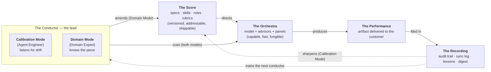
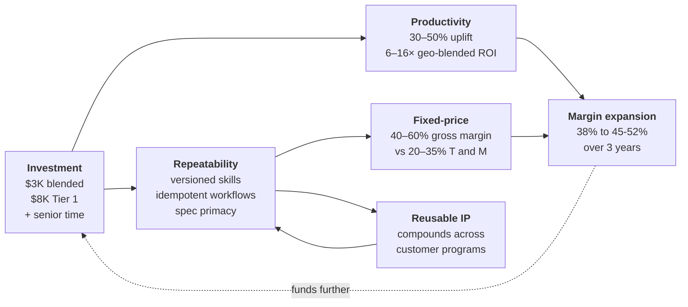

# Agentic Engineering Delivery

## The Operating Model, the Investment Case, and the Path to Margin Expansion

*A whitepaper for engineering leadership, product strategy, GTM, pre-sales engineering, and delivery teams in regulated industries — particularly Healthcare & Life Sciences (HCLS).*

*By: Ben Xavier, CTO HCLS, VP Client Engagement (Assisted by custom AI Agents)*

*Version: 1.0 — 2026-04-29*

---

## Executive Summary

The market for engineering delivery in regulated industries is at the same kind of inflection that happened when CAD displaced the drafting board, when SPICE displaced breadboarding, when BIM replaced overlaid transparencies on a light table. **Agentic engineering delivery — using AI to produce regulated artifacts with named, versioned skills, layered guardrails, and explicit human review — is the sixth such transition.** Customers in regulated industries are evaluating it as a buying criterion in 2026, not as a 2028 line item. Vendors that *demonstrate* working agentic delivery win the deals; vendors that promise to *become* agentic in twelve months lose them.

This paper makes three arguments and one ask.

**Argument 1 — The discipline is real and operates above SDLC.** Agent engineering is not "AI-assisted coding." It is *the discipline of building reliable systems out of non-deterministic generators by engineering the optics around them* — skills, rules, agents, hooks, registries, layered guardrails, advisor topologies. It applies across the full **Product Development Life Cycle (PDLC)** — discovery, design controls, V&V, regulatory submissions, manufacturing, post-market surveillance — not just the software slice (SDLC) and not the AI shipped *inside* a product (AI-in-Product, a different discipline with different controls).

**Argument 2 — The differentiator is the *project shape*, not the model.** Most "agentic" claims in the market are code-completion vendors rebranded, chatbots bolted onto delivery, or vendor-locked platforms. The durable differentiator is an **agentic project shape** — a versioned, audit-trailed, domain-ground operating model that lives in the customer's repository, raises the quality bar before harvesting productivity, and improves itself over time through a registry-mediated feedback loop. *Specifications* outrank model choice. *Scaffolding* outranks single-shot generation. *Layered guardrails* outrank any single safety mechanism. *Cross-surface corrections* (codified domain knowledge) outrank tactical fixes.

**Argument 3 — The commercial impact is structural, not productivity-tweak.** A blended hard-dollar investment of **~$3 K per delivery engineer per year** — Tier 1 Agent Engineering Leads at **~$8 K** (Claude Max 200 + multi-model + 128 GB workstation), Tier 2 senior delivery at **~$2.5–3 K** (Claude Max 100 minimum + Copilot Business), GTM/Corporate at one AI seat — returns **6–16× ROI** on a geo-blended loaded cost of ~$95 K per delivery engineer (typical 15% US / 85% International delivery mix; substantially higher for US-heavy firms). More importantly, the same investment unlocks **repeatability**, which is the structural prerequisite for shifting engagements from time-and-materials to fixed-price. Fixed-price-with-repeatability operates at **40–60% gross margin** versus 20–35% for T\&M. The compounding effect produces **a 5–10 percentage-point gross-margin expansion within three years** at firms that invest at the inflection.

**The ask.** Engineering leadership at delivery firms must front-fund this capability. The traditional model of *win workload → bill hours → fund innovation from margin spillover* is too slow for this transition. The cost of inaction at a 1,000-engineer firm is **$15–50 M per year** in foregone margin and lost deals within 24 months of the inflection. **You cannot innovate while waiting for customers to pay you to innovate.**

The rest of this paper builds the case. §1 names the market inflection. §2 explains what agent engineering actually is, in plain language. §3 distinguishes the three terms most often conflated (PDLC, SDLC, AI-in-Product). §4 covers the discipline in practice. §5 presents proof points. §6 is the investment case. §7 is the action plan. §8 closes. References and a glossary follow.

---

## §1 — The Market Inflection

### 1.1 The pattern every engineering discipline has been through

Every engineering field has been through a transition where *describing intent and letting a machine produce the lower-level artifact* became the default. Each of these transitions had two phases: first the early-adopter firms invested ahead of demand and won the next decade of work; then everyone else either caught up or got priced out.

| Field                                      | Before                                                                           | After                                                                                     | What the tool was called |
| ------------------------------------------ | -------------------------------------------------------------------------------- | ----------------------------------------------------------------------------------------- | ------------------------ |
| **Software**                         | Engineers wrote assembly by hand.                                                | Compilers turned high-level languages into binaries.                                      | The compiler             |
| **Mechanical engineering**           | Drafters drew parts on paper at a T-square board.                                | CAD produced drawings, BOMs, and increasingly the manufacturing instructions.             | CAD                      |
| **Electrical engineering**           | Engineers breadboarded circuits and took measurements.                           | SPICE simulated circuit behavior before any hardware existed.                             | SPICE                    |
| **Structural / mechanical analysis** | Engineers hand-calculated stresses with simplified formulas.                     | FEA computed deformation and failure modes from geometry and loads.                       | FEA                      |
| **Civil / architecture**             | Architects reconciled disciplines by overlaying transparencies on a light table. | BIM kept every discipline coordinated automatically in a shared 3D model.                 | BIM                      |
| **Engineering delivery (now)**       | Teams type every line of code, every test, every regulated document by hand.     | Agents and their optics produce the candidate artifact; the engineer reviews and accepts. | Agent engineering        |

The pattern is constant: a higher-level abstraction is *generative* — you describe intent, the system produces the lower-level artifact you used to write by hand. **The job doesn't disappear; it moves up the stack.** The engineer spends less time on the lower-level artifact and more time on intent, constraints, and verification.

### 1.2 The trust mechanism, plainly stated

A common objection is *"how can probabilistic generation be acceptable for regulated work?"* The answer is structural and easily missed:

> **The model is stochastic at generation time, but the moment a human approves a generated artifact and commits it, that artifact is versioned, reviewed, signed, and as deterministic as anything else in the controlled record.**

The probabilistic step is an *authoring* step that happens once per change. By the time a regulator or auditor sees the artifact, there is no probability left in it. Iterate-then-fix is how every regulated deliverable has always worked — code, design history files, V&V protocols, regulatory submissions, periodic safety reports, complaint records. **Agentic generation does not change the discipline; it changes the input method.**

This is the load-bearing distinction. A regulator is not approving the model. A regulator is approving the artifact.

### 1.3 The inflection is happening now — three external markers

Three public signals confirm the inflection is real and time-bounded:

- **Productivity uplift is measurable.** GitHub's published research on Copilot reported developers completing coding tasks roughly 55% faster, with higher reported satisfaction and lower cognitive load [1]. This is the *narrowest* measurable case (autocomplete in code), and the floor is already substantial. Broader agentic delivery — covering documentation, V&V, traceability, audit, post-market — operates on a much larger work surface.
- **Enterprise productivity studies converge.** McKinsey's analysis of generative AI's economic potential placed annual productivity uplift in technology and engineering at the high end of any function studied, with task-level gains in the 10–40% range across coding, content generation, and analysis tasks [2]. Stanford's annual AI Index has tracked accelerating enterprise adoption year-over-year [5].
- **Regulators are already building the apparatus.** FDA's *AI/ML-Based Software as a Medical Device Action Plan* (2021) signaled that the agency is treating AI in medical devices as a first-class submission category. The *Predetermined Change Control Plan* final guidance (December 2024) defined how AI-enabled devices can be updated without re-submitting on every retrain [3] [4]. Regulators are not waiting for industry to mature; they are setting the bar now.

Each of these is its own evidence. Together they describe a market inflection that vendors who hesitate cannot wait out.

### 1.4 What being on the wrong side of the inflection looks like

A delivery firm that waits for customers to fund the agentic build-out will be **eighteen to twenty-four months behind** competitors who front-fund. By the time the laggard is ready to start, the leader has a registry of one hundred reusable skills, a versioned advisor topology, a battle-tested layered-guardrail stack, and a year of compound learnings the laggard cannot recreate in a quarter. The asymmetry is not linear; it compounds.

**You cannot innovate while waiting for customers to pay you to innovate.**

---

## §2 — What Agent Engineering Actually Is

This section is the education layer for readers whose only AI experience is Cursor, GitHub Copilot, or Codex. Those tools are useful. They are also the *floor* of agentic capability — autocomplete with chat. Agent engineering is the *operating model* above them.

### 2.1 The bulb-and-the-optics — the load-bearing analogy

A bare large language model is a **light source** — useful, but broadband. Point it at a problem and it illuminates the whole room, including a great deal of what you didn't ask for. To do real engineering work, you need *optics*: lenses, apertures, collimators, mirrors. Those optics turn a bulb into a laser — same photons, dramatically narrower beam, dramatically more useful work per watt.

The optics in agent engineering are concrete artifacts:

| Optic                        | What it is                                                                                                                                                                       | What it does                                                  |
| ---------------------------- | -------------------------------------------------------------------------------------------------------------------------------------------------------------------------------- | ------------------------------------------------------------- |
| **Skills**             | Packaged, named, reusable expert checklists for recurring jobs (build a trace matrix; convert a DOCX; run an audit).                                                             | Reduce variance — same job, same shape, every time.          |
| **Rules**              | Short written conventions the assistant reads and obeys (never fabricate a citation; always link a task; demo data carries a banner).                                            | Encode policy without prompt-engineering each invocation.     |
| **Agents**             | Domain personas (regulatory affairs, clinical, V&V, risk management) that read what a real specialist would read and answer within their lane, with citations and counterpoints. | Bring multi-perspective expertise into a single conversation. |
| **Hooks**              | Small automations that fire at session start, before file edits, on session end.                                                                                                 | Enforce the rules without lecturing.                          |
| **Registries**         | Versioned, shared catalogs of skills and agents.                                                                                                                                 | Propagate improvements across customer programs.              |
| **Layered guardrails** | Pre-action gates, authoring discipline, in-flight verification, post-action checks, release gates, continuous-improvement observability.                                         | Make sure no single failure is catastrophic.                  |

**The product, the moat, and the IP are the optics — not the bulb.** Anyone can rent a bulb. The optics are domain-specific intellectual property that a delivery firm authors, versions, and ships in the customer's repository.

### 2.2 What changes versus classical software engineering

A reader with strong SDLC instincts can map the new artifacts onto familiar shapes:

| Classical SE                            | Agent engineering                                                                                                                |
| --------------------------------------- | -------------------------------------------------------------------------------------------------------------------------------- |
| Code is the product.                    | The *system that produces and verifies the work* is the product.                                                                |
| Tests verify the code.                  | Eval suites verify both the code *and the agent's process* (which tools it called, what it searched, whether it cited sources). |
| Specs describe what to build.           | Specs *also* describe how to verify the building, what to refuse to fabricate, and what counts as grounded.                     |
| Review catches mistakes after the fact. | Review is layered — pre-action gates, in-flight verification, post-build audits, release gates.                                 |
| Scaffolding is "boilerplate."           | Scaffolding is the durable IP.                                                                                                   |

The shape of the discipline is recognizable. The *content rules* are different.

### 2.3 Quality first, then productivity

Agentic systems are probabilistic. So is human knowledge work. The right question is not *"is the agent deterministic?"* — it is *"is the agent's output distribution better than the team's baseline distribution?"*

The discipline sequences in two phases:

1. **First, raise the quality bar above your current baseline.** Use agentic approaches to lift the floor: catch the things humans miss, enforce consistency humans drift on, surface the trace links humans skip, run the audits humans defer. *This is where agents earn trust* — by demonstrably producing better-quality work than the unaided team on tasks the team already does.
2. **Then, unleash productivity with human-in-the-loop calibrated to the task.** Once the quality bar is raised, automation is *safe* — because the trust and measurement infrastructure exists to know when automation is safe.

Quality wins are politically palatable; nobody is threatened by *"fewer defects."* Productivity wins follow. **A pitch that starts with "agents will save you 30% on engineering cost" is a discount, not a value prop. A pitch that starts with "agents will raise the quality of your work AND eventually save you cost" is a defensible, durable narrative.**

---

## §3 — The Three Terms People Confuse: PDLC, SDLC, AI-in-Product

Three terms get used interchangeably in conversations about AI in regulated work, and they should not be. **PDLC**, **SDLC**, and **AI-in-Product** name three different things; this paper is about exactly one of them. The vocabulary discipline is itself a competitive moat.

### 3.1 The plain-language definitions

| Term                                              | What it is                                                                                                                                                                                                                                                   | A concrete example                                                                                                                                                          |
| ------------------------------------------------- | ------------------------------------------------------------------------------------------------------------------------------------------------------------------------------------------------------------------------------------------------------------ | --------------------------------------------------------------------------------------------------------------------------------------------------------------------------- |
| **PDLC — Product Development Life Cycle**  | The full lifecycle of bringing a regulated product to market and sustaining it:*discovery → concept → design controls → V&V → submission → manufacturing → post-market → end-of-life.* The largest container; everything regulated lives inside it. | A medical-device company, from clinical-need identification through 510(k) submission, through five years on market under post-market surveillance, until retirement.       |
| **SDLC — Software Development Life Cycle** | The lifecycle of *software* development specifically: *requirements → architecture → implementation → testing → release → maintenance.* In HCLS, governed by IEC 62304. A *subset* of PDLC.                                                        | The firmware of an infusion pump. SDLC produces the firmware; PDLC contains the SDLC and adds clinical evidence, risk files, labeling, manufacturing validation, etc.       |
| **AI-in-Product**                           | AI shipped *inside* what the customer or patient ultimately uses. The model executes at runtime as part of the product's clinical or operational function.                                                                                                  | An imaging triage tool that flags suspected pneumothorax. A clinical decision support module that suggests insulin doses. An adaptive alarm threshold in a patient monitor. |

A fourth thing — **agentic engineering / AI-in-PDLC tooling** — is the team's *working method*: AI used by the team to *produce* the artifacts that fill the picture above. It points *at* the regulated artifact set from outside; it is not part of the product. **This paper is about exactly this fourth thing.**

### 3.2 The four buckets of "agentic" claims in the market

Most "we are agentic" pitches fall into one of four buckets. The first three fail in regulated work for distinct, structural reasons.

| Bucket                                                    | What it actually is                                                                                                                                                  | Why it fails in regulated work                                                                                                                                                |
| --------------------------------------------------------- | -------------------------------------------------------------------------------------------------------------------------------------------------------------------- | ----------------------------------------------------------------------------------------------------------------------------------------------------------------------------- |
| **1. Code-completion rebranded**                    | GitHub Copilot, Cursor, Codeium, Gemini Code Assist. Inline completions and a chat sidebar. Speeds up *typing*.                                                     | Doesn't change the SDLC, doesn't enforce process, doesn't know the regulated domain, leaves no audit trail beyond a git diff.                                                 |
| **2. Chatbot bolted onto delivery**                 | "We added an LLM to our dev workflow." Model-in-the-loop, not a system.                                                                                              | The work product is unchanged; only the input method changed. No versioning, no enforcement, no domain grounding.                                                             |
| **3. Vendor-locked agentic platform**               | Big SI claims of an "agentic delivery platform" or "agentic studio." Often a closed product, a small library of internal agents, or a marketing skin over a chat UI. | The agentic capability is rented from the vendor; the customer gets a deliverable, not the system that produced it. Audit trail is in the vendor's hands, not the customer's. |
| **4. Agentic project shape *as the deliverable*** | Every artifact, hook, skill, agent, rule, and registry lives in the customer's repository, versioned, reusable, and auditable.                                       | This is the discipline this paper describes.                                                                                                                                  |

**The one-sentence differentiator:** *Most teams have an LLM in their workflow. We have a workflow that is itself the LLM operating model — versioned, audit-trailed, domain-ground, and reusable across projects.*

### 3.3 Where the lines blur — the cases that confuse buyers

Five hard cases worth naming explicitly:

1. **The same artifact has two parents.** When agentic tooling generates a Software Requirements Specification (SRS) for a medical device, the artifact lives in *both* SDLC (it's a software requirements spec) and PDLC (it's a deliverable in the DHF, governed by IEC 62304). Two control regimes apply at once.
2. **AI-in-PDLC tooling used to author the technical file *for an AI-in-Product device*.** The PDLC-supporting AI (the working method) and the in-product AI (what ships to clinicians) share a paper but are different AI, with different controls, requiring different qualifications. *This is the most-confused conversation in the market today.*
3. **Predetermined Change Control Plans (PCCP).** A *PDLC artifact* (filed with FDA), about an *AI-in-Product*, often *authored using AI-in-PDLC tooling*. Three layers in one document.
4. **SaMD that is itself an agentic system.** A clinician-facing decision support agent. The same architectural shape (agent + optics) lives in both layers; the controls don't transfer between them.
5. **CDS classification — device or non-device.** Whether a clinical decision support tool is a regulated device depends on whether it meets FDA's "non-device CDS" criteria. The presence of AI in the product does not by itself decide regulatory status — the function decides it.

### 3.4 What artifacts and agentic tooling each phase requires

The unified view: PDLC is the container; everything below is by default a PDLC concern; SDLC items are tagged inline. (For a complete enumeration of all phases, artifacts, and agentic tooling per phase, see the source corpus referenced in §5; the table below is the executive summary.)

| Phase                                       | Layers      | Anchor artifacts                                                                                                                                                       | Anchor agentic tooling                                                                                                                                                                                              |
| ------------------------------------------- | ----------- | ---------------------------------------------------------------------------------------------------------------------------------------------------------------------- | ------------------------------------------------------------------------------------------------------------------------------------------------------------------------------------------------------------------- |
| **Discovery**                         | PDLC        | VOC synthesis · KOL summaries · market research · competitive intel · regulatory-landscape scan                                                                    | User-needs synthesis · KOL panel summarizer · regulatory-landscape scan agent                                                                                                                                     |
| **Concept**                           | PDLC        | Intended-use · indications · classification rationale · predicate analysis · pathway determination                                                                 | Predicate-search & substantial-equivalence drafting · IFU drafting · pathway-recommendation agent                                                                                                                 |
| **Design Inputs**                     | PDLC + SDLC | User Needs · Design Inputs · risk-management plan ·**`[SDLC]`** SRS · **`[SDLC]`** non-functional requirements                                     | Requirements derivation · trace-matrix builder ·**`[SDLC]`** Requirements → test generation                                                                                                              |
| **Design Outputs**                    | PDLC + SDLC | SAD · design specs · BOM ·**`[SDLC]`** source code · **`[SDLC]`** dependency manifests · **`[SDLC]`** SOUP classification                 | SAD authoring ·**`[SDLC]`** code review against customer coding standards · **`[SDLC]`** design-constraint enforcement · **`[SDLC]`** SOUP classification (IEC 62304)                    |
| **V&V**                               | PDLC + SDLC | DV / DV protocols and reports · usability validation ·**`[SDLC]`** unit / integration / system test reports · **`[SDLC]`** coverage reports         | Verification protocol drafter · validation protocol drafter ·**`[SDLC]`** test-coverage gap analysis · **`[SDLC]`** static-analysis triage                                                       |
| **Risk management**                   | PDLC + SDLC | Hazard analysis · FMEA (design / use / process) · risk-benefit analysis · ISO 14971 risk file ·**`[SDLC]`** threat model                                   | Hazard-identification agent · FMEA scaffolding ·**`[SDLC]`** threat-modeling agent (STRIDE / LINDDUN)                                                                                                     |
| **Submission**                        | PDLC        | 510(k) / De Novo / PMA · CE technical file · clinical evaluation report · IFU / labeling · EUDAMED records                                                         | Submission narrative drafter · clinical-evaluation-report drafter · labeling drafter · cross-reference validator                                                                                                 |
| **Manufacturing & Release**           | PDLC + SDLC | Process / packaging / sterilization validation · DMR · DHR ·**`[SDLC]`** release notes · **`[SDLC]`** SBOM · **`[SDLC]`** signed releases | Process-validation drafter · supplier-qualification scaffolder ·**`[SDLC]`** release-notes drafter · **`[SDLC]`** SBOM building & maintenance                                                    |
| **Quality / QMS** *(cross-cutting)* | PDLC        | SOPs · WIs · CAPA · deviations · audit reports                                                                                                                     | SOP / WI authoring · CAPA narrative drafter · audit-readiness gap report (ISO 13485 / 21 CFR 820 / 21 CFR 11 / IEC 62304)                                                                                         |
| **Post-market & Maintenance**         | PDLC + SDLC | PSUR / PMSR · complaints · trend analyses · FSCA · PMCF ·**`[SDLC]`** vulnerability advisories · **`[SDLC]`** patch records                      | Post-market surveillance / trend agent · PSUR drafter ·**`[SDLC]`** patch-release-notes drafter · **`[SDLC]`** vulnerability-advisory drafter · **`[SDLC]`** dependency-update advisory |

**The synthesizing line.** The same agent abstraction — a grounded persona with a defined lane, a citation rule, a counterpoint pass — can be instantiated against any phase. *What changes from cell to cell is the spec corpus, the grounding sources, the semantic data layer the agent reads, and the failure modes — not the architecture.* A team that ships an agentic project shape ships a versioned, auditable answer to *"which agents and skills run at each phase, against which semantic data layer, with what grounding, governed by what review gate."* A team that ships generic LLM access ships none of that.

---

## §4 — The Discipline in Practice

This section is for the delivery audience — engineers whose only AI experience is Cursor / Copilot / Codex. The mental-model upgrade is the most important deliverable of this paper for them.

### 4.1 The Conductor — a mental model for what the human does

A useful frame for the role of the human in an agentic system is *conducting, not playing*. The model is the orchestra — capable, fast, can play many parts in parallel — but it does not on its own know what the piece should sound like. The skills, rules, and rubrics are the score. The artifact the customer receives is the performance. The audit trail is the recording.

Three things follow:

1. **A conductor is not replaced by better instruments.** Upgrading the orchestra (a stronger model) raises the floor of what is playable, but does not change who is needed in front of it. The durable answer to *"won't AI replace this person?"* is that the conductor's value is interpretive and grounding, not productive.
2. **The conductor's two jobs are distinct.** *Knowing the piece* (Domain Mode — the Domain Expert role) and *hearing drift in the orchestra* (Calibration Mode — the Agent Engineer role) are different skills. The same person does both, but they are not the same act.
3. **The score, not the orchestra, travels.** A score performs the same way under any competent orchestra. A spec produces the same artifact under any competent model. The investment lever is the score — the spec corpus.

### 4.2 Spec primacy — why specifications beat model choice

Every recurring quality issue observed in our active engagements followed the same diagnosis path. The first hypothesis was always *"the model can't do this."* The actual root cause was *"the spec is fuzzy."* Sharpening the spec produced reliable behavior; the same model that failed against the fuzzy spec succeeded against the sharp one.

The investment ranking, derived from evidence:

1. **Specs first.** The largest delta comes from sharpening specs. Every repeatable improvement was a spec improvement. The discipline: *every recurring quality complaint becomes a versioned spec change before any model-tuning is attempted.*
2. **Scaffolding second.** Without skills, hooks, registries, idempotency contracts, specs cannot be enforced or propagated. The scaffolding is the infrastructure that makes specs operationally meaningful.
3. **Model choice third.** Once specs and scaffolding are sharp, model choice becomes a tuning lever — bigger model for harder synthesis, faster model for high-volume routine work. Real, but smaller, lever.

A team that inverts this order — picking the model first and assuming sharper prompts will close the gap — produces a system whose quality is bounded by the model and whose IP is rented. A team that sharpens specs first builds an asset that survives model upgrades and that the customer can audit.

### 4.3 One-shot doesn't scale — repeatability requires scaffolding

One-shot generation is fine for prototypes. It does not scale, and it cannot be the operating model for HCLS work. Three reasons:

| # | Reason                   | Concrete signal                                                                                                                                                                                                          |
| - | ------------------------ | ------------------------------------------------------------------------------------------------------------------------------------------------------------------------------------------------------------------------ |
| 1 | **Cost.**          | A single one-shot adoption of a 7-story requirements document in our corpus consumed ~13 minutes, ~90 tool calls, and ~225,000 tokens. Acceptable once. At a target population of ~186 documents, untenable.             |
| 2 | **Repeatability.** | A one-shot run on a regulated document leaves no claim of *correctness on re-run*. Regulated work demands idempotency.                                                                                                  |
| 3 | **Verifiability.** | A one-shot run produces an artifact, not a chain of evidence. The customer's auditor needs trace from spec → version → tool → human review → release. One-shot has none; scaffolded work produces it as a byproduct. |

The fix in our corpus was three orthogonal scaffolding optimizations: idempotent short-circuit, single-pass cache, and lite-mode reviewer. Together they cut re-run cost by 80–95%. None of them are model-side. All of them live in the spec corpus and survive model changes.

### 4.4 Guardrails as layered defense — six layers, not one

The single most-asked GTM question, after *"what makes you different from Copilot,"* is *"how do you keep the agent from doing something bad?"* The honest answer is that no single mechanism does. A trustworthy agentic system requires layered guardrails, because every single mechanism eventually fails — and the layered architecture is the discipline of keeping the failure non-catastrophic.

| Layer                                                  | Purpose                                                            | Examples                                                                                                                                                           |
| ------------------------------------------------------ | ------------------------------------------------------------------ | ------------------------------------------------------------------------------------------------------------------------------------------------------------------ |
| **L1 — Pre-action gates**                       | Block before the action.                                           | Task gate (denies edits without active task) · direct-conversion blocker · change-control freeze gate                                                            |
| **L2 — Authoring discipline**                   | Shape what the model is *trying* to produce.                      | CLAUDE.md rules ·`[VERIFY]` flag discipline · default-to-action rubric · AI-authoring frontmatter · anonymization glossary                                   |
| **L3 — In-flight verification**                 | Catch mistakes during the work.                                    | Advisor counterpoint passes · two-pass review · citation verification · multi-perspective panels                                                                |
| **L4 — Build-time / post-action checks**        | Catch mistakes after the artifact is produced but before it ships. | `/best-practices` audit · bare-ID detector · sentinel-block renderer · regression-guard lint · idempotency checks                                            |
| **L5 — Release gates**                          | Make formal sign-off explicit and auditable.                       | Named-human-reviewer attestation · Confluence + Comala (Part 11) · PLM release vault · IEC 62304 § 5.1.11*intended-use determination* on the LLM tool itself |
| **L6 — Continuous improvement / observability** | Detect drift, harvest lessons, propagate fixes.                    | Lessons harvest + promotion · daily digest · sync-log audit trail ·`/best-practices fix`                                                                      |

**Why layers are required for HCLS specifically.** In an unregulated context, a single L1 gate is often sufficient. In HCLS, any single layer's failure means the entire compliance posture collapses. The cited *FDA Warning Letter to Purolea Cosmetics Lab (MARCS-CMS 722591, April 2026)* [`[VERIFY]`] cited a firm for using AI to author specifications and procedures without adequate human review — a single-layer collapse where pro-forma sign-off failed to provide independent verification. The layered architecture is the load-bearing claim that makes agentic delivery defensible to a regulator. **Multi-model substrate is part of the layered defense** — adversarial validation requires *different* models checking each other; one Claude validating another Claude does not catch the same class of errors as Claude validating GPT validating Gemini.

### 4.5 The cross-surface correction — what "domain expertise" looks like in practice

The corrections that build durable IP are *cross-surface* — they begin as outside knowledge the model could not have inferred (the *domain surface*) and land as a versioned spec the next model invocation runs against (the *eval surface*). Examples from active customer engagements:

- **The IEC 62304 § 5.1.11 *intended-use determination* on the LLM tool.** Born on the domain surface (regulators expect a tool-validation determination); landed on the eval surface as a filed determination + provenance frontmatter + named-reviewer rule.
- **The four-bucket competitive frame.** Born on the domain surface (market positioning insight); landed on the eval surface as the §3.2 framework above.
- **The DHF structure pivot from unified-single-DHF to flat *system + items* multi-DHF.** Born on the domain surface (IEC 62304 § 5's software-system / software-item hierarchy + FDA multi-function device guidance + 510(k) precedent); landed on the eval surface as schema changes, four skill updates, and a complete CLAUDE.md rewrite.

**Domain Mode is what an agent cannot replace.** A team that hires only for Calibration-Mode skills (catching what the model gets wrong) produces well-tuned but domain-shallow scaffolding. A team that pairs Domain Mode (regulatory framing, clinical context, customer QMS history) with Calibration Mode produces durable, audit-defensible IP.

---

## §5 — Proof Points

This section names what is real and inspectable rather than asserted.

### 5.1 The corpus

The discipline above is observable in two independently-running customer programs over the past year. Cumulative numbers, conservative:

| Metric                                                         | Number                                | What it shows                                                              |
| -------------------------------------------------------------- | ------------------------------------- | -------------------------------------------------------------------------- |
| Active customer programs running on the agentic project shape  | 2                                     | Cross-program parity                                                       |
| Task documents authored across both programs                   | ~165                                  | Real engineering activity, not a pilot                                     |
| Registry pull-requests merged (skills, agents, hooks, scripts) | ~98                                   | Active flow of corrections from project → registry → all sister programs |
| Versioned skills in the shared registry                        | ~15                                   | Reusable IP, not bespoke work                                              |
| Largest single anonymization push (skill-tree audit)           | 86 files across 14 skills, in one day | The propagation channel works at scale                                     |
| Hook execution overhead after performance pass                 | session-start 5.2s → 0.2s            | The infrastructure stays cheap as it scales                                |

These are operational numbers, not benchmark numbers. Each is verifiable in the source repositories on request — that is itself the differentiator from the buckets in §3.2.

### 5.2 Two real redirects from active engagements (anonymized)

The discipline shows up in the moments where the human-in-the-loop redirects the model. Two examples from a recent working session on a MedTech customer's regulated program (anonymized):

**Example A — Calibration Mode catching a missed project abstraction.** Claude reached for the generic `chrome-devtools` MCP server to drive a browser. The lead's redirect: *"Wait, you use chrome_devtools, I think you're supposed to use our web_control skill with the right profile. Restart it and remember it."* The project had a purpose-built `web-control` skill that owns Chrome lifecycle, profile management, and corporate-authentication session state. Claude's pattern-match against the generic name bypassed the wrapper. **Lesson, codified into a project rule:** *check for project skills before reaching for upstream tools.* The redirect was a Calibration-Mode signal — the project's architecture was *visible in the codebase* if Claude had checked.

**Example B — Domain Mode reshaping the regulatory architecture.** A digital-surgery program ships three software modules under a single 510(k). Claude scaffolded the project's design history file as a *unified single-DHF* — filing-aligned, superficially clean. The lead's redirect: *"Engineering reality is three modules with three cadences, three teams, three risk profiles, three IEC 62304 classifications. Maps cleanly to IEC 62304 § 5's software system / software item hierarchy."* The redirect re-anchored the decision against three external regulatory anchors — IEC 62304 § 5, FDA's multi-function device guidance, and public 510(k) precedent — none of which Claude could have inferred from the codebase. **Downstream impact:** `project.yml` schema changes (`role` and `composes` fields), four skills rewritten to handle system/item roles, CLAUDE.md's entire DHF Shape section replaced with IEC 62304 § 5 cited inline. **The redirect was a Domain-Mode signal — the constraint was *not in the codebase at all* and could only be supplied by the lead.** This is what domain expertise looks like in practice.

### 5.3 Ten patterns of correction observed in the corpus

The two examples above are samples from a larger pattern set. Across the corpus, ten recurring patterns of human redirection produced the durable artifacts that constitute the agentic project shape:

| #  | Pattern                                                 | What it produces                                                                                                                                                        |
| -- | ------------------------------------------------------- | ----------------------------------------------------------------------------------------------------------------------------------------------------------------------- |
| 1  | Iteration-cycle / shape-discovery                       | A skill that pivots from rule-accumulation to architectural reshape when adding more rules hits diminishing returns                                                     |
| 2  | Process-failure-as-engineering-input                    | A Claude behavior failure (over-asking, forgetting to update task docs) promoted into a permanent rule shipped registry-wide                                            |
| 3  | Scope / architecture redirection                        | A frame challenge (PDLC vs SDLC, task-gate scope, hook regex tightening) that changes the trajectory of the work                                                        |
| 4  | Cross-project leverage                                  | A correction made on one program propagated upstream and pulled by every sister program on next sync                                                                    |
| 5  | Verification / claim-grounding / fabrication discipline | Every claim that could become a measurement, did — anonymization → grep + lint; coverage → bare-ID detector; tool qualification → IEC 62304 § 5.1.11 determination |
| 6  | Performance / context-economy redirection               | An audit that found 17 skills carrying 610 lines of unnecessary content into every session — moved to README, runtime cost cut                                         |
| 7  | UX / output-shape feedback                              | A render readability correction that led to an architectural boundary clarification (emitter vs viewer)                                                                 |
| 8  | Discipline-of-the-process discovery                     | A team-process rule (capture in real time; one task one file; scratch goes in a per-person folder) authored from observed pain                                          |
| 9  | Multi-perspective / advisor-design                      | The panel-of-advisors topology and three-tier grounding model — design decisions that don't appear in any single skill but shape every agent interaction               |
| 10 | Self-improving meta-tools                               | Skills that audit, harvest, sync, and digest were themselves crystallized from observed pain                                                                            |

**The synthesis.** The agentic project shape is not an authored design — it is the codified residue of a human running an eval loop in real time, paired with a human bringing outside regulatory and domain knowledge. The artifacts are the receipts.

---

## §6 — The Investment Case

This section converts the strategic posture of *agentic-first delivery* into a defensible capital plan with named line items, ROI math, a path to margin expansion, and a credible route from time-and-materials to fixed-price commercial models.

### 6.1 Why customer-funded innovation does not work

Every engineering firm tells itself the same story: *we'll fund innovation from billable margin, and we'll let customer engagements be the proving ground.* The story is appealing — it externalizes the cost. It also fails for four structural reasons:

| # | Failure mode                                                                                                        | What it looks like                                                                                                                                                            |
| - | ------------------------------------------------------------------------------------------------------------------- | ----------------------------------------------------------------------------------------------------------------------------------------------------------------------------- |
| 1 | **Innovation needs concentrated time, not interstitial time.**                                                | Reusable IP is built in two-week deep-work sprints, not in fifteen-minute gaps between billable calls.                                                                        |
| 2 | **Engagement-funded IP is engagement-shaped IP.**                                                             | Every "cross-cutting" skill written under a customer engagement is constrained to that engagement's domain, that customer's data shapes, that contract's IP-assignment terms. |
| 3 | **Training requires release from billable, and release is the hardest political ask in delivery operations.** | Firms that count training time as a cost-of-goods line item undertrain by ~3× what is needed.                                                                                |
| 4 | **Demos and reference architectures have no billable owner.**                                                 | Without an *unbillable* budget, none of them get built. They are the highest-leverage assets in the GTM motion and they are structurally homeless in a billable-only firm.   |

### 6.2 What we are actually investing in — six categories, tiered by user role and geography

The investment is not a single per-engineer number. It tiers naturally by **role** (who does what work) and **geography** (which cost center they sit in). The firm operates from three major cost centers — **US**, **Eastern Europe**, and **India** — and we blend Eastern Europe + India together as **International** for cost-modeling purposes.

- **Delivery bench (Tier 1 + Tier 2)**: typical mix **10–20% US / 80–90% International**.
- **GTM and Corporate (Tier 3)**: typical mix **80% US / 20% International**.

The geo mix matters because it shifts the *blended loaded cost* per engineer dramatically; the *per-engineer hard-dollar AI investment* is geography-independent (Claude Max costs the same in Bangalore as in Boston). All line-item costs below are grounded in **public 2026 pricing** for the named tools (GitHub Copilot Business $19/seat/mo, Claude Pro $20/mo, Claude Max 100 $100/mo, Claude Max 200 $200/mo, Gemini for Workspace $30/mo, ChatGPT Team $25/mo).

#### The three user tiers

| Tier | Description | Org | Typical share | Geographic mix |
|---|---|---|---|---|
| **Tier 1 — Agent Engineering Lead** | Authors skills, designs advisor topologies, runs adversarial multi-model validation, runs local models for privacy-sensitive customer work | Delivery bench | **10–15% of delivery** | 20–25% US / 75–80% Int'l |
| **Tier 2 — Senior Delivery Engineer** | Uses agentic tooling daily on customer engagements; consumes the registry, contributes lessons | Delivery bench | **85–90% of delivery** | **10–20% US / 80–90% Int'l** |
| **Tier 3 — GTM / Corporate Generalist** | Sales, pre-sales, marketing, finance, HR, operations. Uses one AI seat for productivity assistance — drafting, summarizing, prepping. Not part of the delivery bench. | GTM + Corporate | Separate org, ~10–20% of total firm headcount | **80% US / 20% Int'l** |

#### Hard-dollar cost by tier

| # | Category | Tier 1 — Lead | Tier 2 — Senior Delivery | Tier 3 — GTM/Corporate |
|---|---|---|---|---|
| **A** | Frontier-model seats | **Claude Max 200** ($2.4 K) + Copilot Business ($228) + Gemini ($360) + GPT Team ($300) for cross-model: **~$3.3 K** | **Claude Max 100** ($1.2 K, minimum tier for senior delivery) + Copilot Business ($228): **~$1.4 K** | One AI seat: **~$240** |
| **B** | Hardware uplift (3-yr amortized) | 128 GB Mac Pro: **~$1.5 K** | Standard, no uplift: **$0** | Standard: **$0** |
| **C** | Multi-model API for adversarial validation | **~$1–1.5 K** | **~$200–400** | **~$100** |
| **D** | MCP infrastructure (allocated) | Full: **~$1 K** | Shared: **~$500** | Shared: **~$300** |
| **E** | Capability-building time *(structural)* | **~$25–35 K loaded-cost-time (US-heavy senior)** or **~$10–15 K Int'l-blended** | **~$5–15 K loaded-cost-time (Int'l-blended)** for senior cohort engaged in registry use | Not allocated |
| **F** | Subscription tooling (eval / registry / observability) | **~$1 K** | Shared: **~$200** | Minimal: **~$100** |
| **Tier hard-dollar subtotal (A+B+C+D+F)** | | **~$8 K/yr** | **~$2.5–3 K/yr** | **~$0.5–0.8 K/yr** |

#### Loaded-cost reality (the geographic context that shapes ROI)

A senior **US** delivery engineer typically carries a loaded annual cost of **~$200–300 K**. A senior **International (EE / India)** delivery engineer typically carries **~$50–100 K**. Blended at a **15% US / 85% International** delivery mix, the per-engineer loaded cost is approximately **$80–110 K**. This shift makes the ROI math more conservative-honest but the investment still unambiguously accretive.

#### Blended firm-wide cost — sized separately for delivery and GTM/Corporate

| Cost stream | Mix assumption | Per-engineer hard-dollar | At 1,000-engineer delivery bench |
|---|---|---|---|
| **Delivery bench (Tier 1 + Tier 2)** | 15% Tier 1 / 85% Tier 2; 15% US / 85% Int'l geo mix | **~$3 K/yr blended hard-dollar** | **~$3 M/yr** |
| **GTM / Corporate (Tier 3)** | One AI seat per person; 80% US / 20% Int'l | **~$0.4–0.7 K/yr per person** | An additional **~$60–150 K/yr** at a typical 150–250-person GTM/Corporate cohort |
| **Plus structural capability-building time on senior delivery cohort (E)** | 10–15% of senior delivery time held back from billable | + ~$5–15 K/yr per senior engineer in scope (Int'l-blended) | + ~$3–10 M/yr depending on senior cohort size |
| **Total firm-scale hard-dollar (delivery + GTM/Corp)** | | | **~$3–3.5 M/yr** at a 1,000-engineer delivery firm |

The hard-dollar figure (~$3 M/yr at the 1,000-engineer firm) is what unblocks the bench. The structural capability-building time is treated separately because it is an *opportunity cost* on senior time, not a discrete budget line.

> **External validation.** Public statements from AI-native firms — including NVIDIA's CEO speaking on aggressive per-engineer AI tooling spend — support the directional thesis that current AI-tool investment is dramatically underpriced relative to productivity returns. The tier ratios above are aligned with publicly reported AI-native firm spend patterns. *[Specific dollar figures from primary sources should be verified before external citation.]*

### 6.3 The ROI per engineer — in plain math, against the tiered investment and the geographic mix

The investment side is the tiered model from §6.2: **~$3 K/yr blended hard-dollar per delivery engineer**, with Tier 1 leads at ~$8 K/yr.

The return side requires honesty about geographic loaded cost. At a typical **15% US / 85% International** delivery mix, the blended loaded cost is **~$80–110 K per delivery engineer**. Productivity uplift remains **30–50%** on automatable / assistive work [1].

#### ROI sensitivity — blended delivery engineer (geo-blended loaded cost ~$95 K)

| Productivity uplift | Direct delivered-value gain | ROI on **~$3 K** blended hard-dollar investment |
|---|---|---|
| **Conservative — 20%** | $19,000 | **6×** |
| **Mid-conservative — 30%** | $28,500 | **9×** |
| **Mid — 40%** | $38,000 | **12×** |
| **Aggressive — 50%** | $47,500 | **16×** |

#### ROI sensitivity — Tier 1 Agent Engineering Lead (geo-blended loaded cost ~$140 K)

| Productivity uplift | Direct delivered-value gain | ROI on **~$8 K** Tier 1 hard-dollar investment |
|---|---|---|
| **Conservative — 30%** | $42,000 | **5×** |
| **Mid — 50%** | $70,000 | **9×** |
| **Aggressive (typical for Tier 1) — 70%** | $98,000 | **12×** |

#### Reference — US-heavy assumption

A 100% US delivery firm sees substantially higher per-engineer ROI because loaded costs are higher — 30% uplift × $250 K = $75 K return = **25×** ROI on $3 K investment. Most global delivery firms operate closer to the 15% US / 85% International blend, so the **6–16× geo-blended ROI is the more defensible number to put in front of a board**.

**At the firm scale, a $3–3.5 M annual hard-dollar investment across a 1,000-engineer delivery bench returns $19–48 M in delivered productivity per year**, before any second-order effects (margin expansion, fixed-price conversion, talent retention, GTM/Corporate productivity).

> **Why earlier framing was overconfident.** Prior versions of this section assumed (a) every engineer needed Tier 1 equipment and (b) every engineer carried a US loaded cost. Both inflate the case. The corrected framing — tiered investment + geo-blended loaded cost — produces a 6–16× ROI and a $19–48 M firm-scale annual return. Smaller, but verifiable in front of any auditor or finance team.

### 6.4 Margin expansion — where the second-order value lives

Productivity uplift is the *first-order* return. The *second-order* return is margin expansion, and at scale the second-order effect is larger than the first.

#### Three first-order mechanisms

| # | Mechanism | Margin shape |
|---|---|---|
| 1 | **Same delivered work, less labor → higher margin per engagement.** | 5–10 percentage-point gross-margin uplift on engagements where productivity gains are passed to delivery, not to price |
| 2 | **Reusable IP eliminates per-engagement rebuild cost.** | Compounding — after 3–4 engagements in a domain, marginal cost is a small fraction of competitors who rebuild from scratch each time |
| 3 | **Premium pricing for differentiated, audit-defensible delivery.** | 5–15% price premium over commodity delivery firms in the same engagement scope |

#### Where we start — actual firm baselines

- **International (EE + India): 35–47%** gross margin
- **US: 40–60%** gross margin

#### Industry benchmarks for context

| Industry segment | Typical gross-margin (mid) |
|---|---|
| Automotive engineering / manufacturing services | **~15%** |
| IT services (broad / mainstream) | **~20%** |
| HCLS engineering services *(regulated medtech, pharma, life-sciences)* | **~25–35%** *[VERIFY before external citation]* |
| Engineering R&D services (regulated, multi-vertical) | **~30–40%** |
| Productized SaaS *(reference high-end)* | **~70–80%** |

The firm's current margins already sit at the high end of engineering services — *above* IT-mainstream and Automotive, *at or above* HCLS-services average. The pitch is "push from a defensible base toward productized-software band," not "climb out of a commodity hole."

#### The five-year margin trajectory — first-order only

| Year | International band | US band | What's active |
|---|---|---|---|
| **Year 0 (baseline)** | 35–47% | 40–60% | — |
| **Year 1** | 36–49% (+1–2 pp) | 41–62% | Productivity gains, modest IP build |
| **Year 2** | 38–51% (+3–4 pp) | 43–64% | Registry compounding starts, first fixed-price wins |
| **Year 3** | 40–53% (+5–6 pp) | 45–66% | Repeatability mainstream, productized accelerators in market |
| **Year 4** | 42–55% (+7–8 pp) | 47–68% | Account expansion, strategic-advisor positioning, multi-year contracts |
| **Year 5** | 44–57% (+9–10 pp) | 49–70% | Full flywheel; productized-software-adjacent economics |

#### Second-order amplifiers — upsides not yet priced into the trajectory

| # | Amplifier | What it adds | Kicks in |
|---|---|---|---|
| 1 | **Account expansion (wallet share)** | Year-1 customer paying $5 M for a project becomes Year-4 customer paying $30 M for a transformation. Same logo, dramatically larger contract. | Year 2+ |
| 2 | **Multi-year retainer model** | Customers lock into multi-year operating contracts. Recurring revenue with higher margin than transactional engagements. | Year 3+ |
| 3 | **Strategic-advisor premium** | The firm competes with strategic consultancies (50–70% margins), not delivery firms, on transformation deals. | Year 3–4+ |
| 4 | **IP licensing potential** | The agentic project shape components licensed to non-competing verticals. Pure-margin revenue. | Year 4–5 |
| 5 | **Talent gravity** | Better engineers, lower acquisition cost. Reduces blended COGS. | Year 2+ |
| 6 | **Brand / category-leader premium** | "The agentic delivery firm" becomes a buyable category; early-mover brand premium. | Year 3+ |
| 7 | **Acquisition multiple uplift** | Capital markets price productized economics at higher EV/Revenue and EV/EBITDA multiples. | Year 3–5 |

#### The strategic shift — tactical → transformation

The most underweighted commercial effect of agentic delivery is what it does to the *kind of conversation* the firm has with the customer. Once a customer adopts the agentic project shape on one engagement, three things happen automatically:

1. **The shape is visible to other parts of the customer's organization.** DHF, trace matrix, registry of skills — none of these stay inside one engagement.
2. **Other divisions ask "can we have this?"** The agentic shape is portable across divisions because the shape is what's portable, not the device-specific content.
3. **The buying conversation rises one level.** What started as a project bought by a delivery VP becomes a transformation initiative bought by a CTO or CEO.

| Engagement type | Buyer | Sold on | Margin shape |
|---|---|---|---|
| **Tactical** *(traditional delivery)* | Director / VP of Delivery | Hours, rate, predicate work | Engineering-services band (20–35%) |
| **Capability** *(early agentic)* | VP of Engineering / Head of Practice | Productivity uplift, audit-defensibility | High-end services band (35–50%) |
| **Transformation** *(year-3+ agentic)* | CTO / COO / CEO | Strategic outcome, organizational change | Strategic-advisor band (50–70%) |

The same engineer hours, sold into a transformation initiative at strategic-advisor prices, produce **1.5–3× the margin** of the same hours sold into a project at delivery rates. **This is the structural shift the agentic investment unlocks**, and it is the largest single contributor to the upper-band 5-year margin projection.

#### Margin-contraction risks — the counter-position

| # | Risk | Severity | Mitigation |
|---|---|---|---|
| 1 | Commoditization (everyone goes agentic) | Medium | Continuous registry reinvestment; sustained 1-year IP lead is the moat |
| 2 | Frontier-model price increases | Low | Multi-model substrate hedges; supplier-pricing power |
| 3 | Talent inflation on Tier 1 leads | Medium | Productivity multiplier dwarfs the wage premium; under-paying loses the flywheel |
| 4 | Regulatory contraction (tighter AI-tooling rules) | Low / *positive* | Verification ratchet (§4.4 / §4.5) is already built in — *relative* tailwind |
| 5 | Engagement-mix shift to rate-shopped work | Medium | Decline rate-shopped engagements; strategic-advisor positioning |
| 6 | **Failed flywheel** — Category E (capability-building time) gets cut under budget pressure | **High** | The largest internal risk. Treat 10–15% senior time as non-negotiable. **Do not cut Category E to make a quarter.** |
| 7 | Productivity over-passed to price | Medium | Sell outcomes, not hours (the §6.4 strategic shift) |

The single largest internal risk is **#6 (failed flywheel)** because it is the only one fully under the firm's control.

#### Integrated 5-year view — where margin can plausibly land

| Year-5 case | International | US | Assumptions |
|---|---|---|---|
| **Conservative — no amplifiers** | 44–57% | 49–70% | Three first-order mechanisms only |
| **Mid — half the amplifiers captured** | **47–60%** | **52–73%** | Account expansion + multi-year retainer + modest strategic-advisor premium |
| **Best-case — all amplifiers active** | 50–63% | 55–75% | Full flywheel + brand premium + IP licensing |
| **Contraction-case — flywheel cut by Year 3** | 36–48% | 41–61% | Roughly flat; competitive position eroded |

The **mid case (47–60% International / 52–73% US)** is the most defensible board-pitch projection. The upper US bound is in productized-software territory; the lower International bound holds the firm's current ceiling. **The firm migrates toward software-adjacent economics — recurring, multi-year, strategic-advisor-priced, IP-leveraged — without ceasing to be a delivery firm.** That migration is the real prize, and it shows up in the *shape* of the revenue base over five years, and in the EV multiple capital markets attach to that shape.

### 6.5 The pricing-model shift — T&M to fixed-price

Today, most engineering delivery contracts are *time-and-materials* (T\&M). The customer pays for hours; the vendor's margin is the spread between rate and loaded cost; the customer carries cost-overrun risk; the vendor is rewarded for *spending time*, not for *delivering outcomes*. This model is comfortable for vendors because cost overruns are someone else's problem. It is also the lowest-margin commercial structure available.

The customer would prefer **fixed-price**: a defined scope, a defined deliverable, a defined price, a defined timeline. *But fixed-price is only profitable for the vendor if the work is repeatable enough to estimate accurately.* Without repeatability, fixed-price is gambling — and most engineering firms don't take the bet.

**Repeatability is the gate.** And repeatability is exactly what the agentic project shape produces:

- *Versioned skills* mean the same agent ships across customer programs with predictable cost.
- *Idempotent re-runs* (§4.3) mean the second pass through a workflow takes 5–10% of the cost of the first.
- *Layered guardrails* (§4.4) mean rework cycles are caught early instead of discovered at the end.
- *Spec primacy* (§4.2) means the price-determining variable is the spec, not the model or the engineer doing the work.

| Pricing model                                            | Vendor margin shape                                                                                                   | When it works                                                                                                                     |
| -------------------------------------------------------- | --------------------------------------------------------------------------------------------------------------------- | --------------------------------------------------------------------------------------------------------------------------------- |
| **T\&M**                                           | Margin = rate − loaded cost. Typically 20–35% gross. Capped by competitive rate pressure.                           | When scope is exploratory, when the vendor cannot estimate, when the customer has no fixed budget.                                |
| **Fixed-price (without repeatability)**            | High variance: large gain if work goes well, large loss if not. Average margin lower than T\&M after risk adjustment. | Almost never — most fixed-price engagements without repeatability lose money.                                                    |
| **Fixed-price (with agentic-shape repeatability)** | Margin = price − repeatable-cost. Typically 40–60% gross.                                                           | When the vendor has versioned skills, idempotent workflows, layered guardrails, and a spec corpus that makes the work repeatable. |

**The pricing-model shift is the single largest commercial value lever in this paper, and it is structurally locked behind the agentic investment.** A vendor without the investment cannot credibly offer fixed-price in regulated work; a vendor with the investment can charge a premium for predictability while operating at a higher gross margin than the T\&M alternative.

### 6.6 The compounding flywheel

The first-order productivity gain, the margin expansion, the pricing-model shift, and the IP accumulation are not independent. They compound:

Firms that start the flywheel one year earlier than competitors are not one year ahead — they are one *flywheel turn* ahead, which is a multiplicative gap.

### 6.7 The cost of inaction

The honest counter-question to any investment proposal is *"what happens if we don't?"* Four sub-costs, each independently sufficient to justify the investment alone:

| # | Cost of inaction                     | What it looks like                                                                                                                                                                                                       |
| - | ------------------------------------ | ------------------------------------------------------------------------------------------------------------------------------------------------------------------------------------------------------------------------ |
| 1 | **Lost deals**                 | A single $5–20 M lost engagement per year is a multiple of the firm-scale annual investment.                                                                                                                            |
| 2 | **Compounding capability gap** | A competitor that started one year earlier has ~100 reusable skills and a year of compound learnings. None of that can be recreated in a quarter.                                                                        |
| 3 | **Talent flight**              | The strongest agent/domain engineers will not stay at firms that gate their access to AI tooling, refuse to fund local-model hardware, or treat capability-building time as a cost.                                      |
| 4 | **Stuck in T&M, structurally** | A firm without repeatability cannot offer fixed-price profitably and is stuck competing on rate. As agentic-first competitors move to fixed-price at higher margins, the T&M-only firm's revenue base erodes from below. |

**Conservative estimate of the dollar value of inaction at a 1,000-engineer firm: $15–50 M per year within 24 months of the inflection.** This is not a forecast; it is the *spread* between a firm that invested at the inflection and one that did not.

---

## §7 — Action: What to Do Next

### 7.1 Phased roll-out — three stages that produce visible business signal

The investment does not need to land all at once. A three-phase sequence preserves cash discipline while unlocking the flywheel.

| Phase                                             | Timeline                  | Hard-dollar budget (1,000-engineer firm) | Scope                                                                                                                                                                                                                                                                                 | Exit criterion to next phase                                                                                                                                    |
| ------------------------------------------------- | ------------------------- | ---------------------------------------- | ------------------------------------------------------------------------------------------------------------------------------------------------------------------------------------------------------------------------------------------------------------------------------------- | --------------------------------------------------------------------------------------------------------------------------------------------------------------- |
| **Phase 1 — Pilot cohort**                 | Q1–Q2 of investment year | ~$1–1.5 M                               | Universal AI access for first 50–100 engineers · high-spec hardware for the local-model cohort · MCP into 1–2 corporate tools (Drive + Confluence is the typical pair) · 1 demo environment · 1 dedicated IT/agentic-ops role                                                   | Two reference engagements running on agentic delivery with measured productivity uplift; one customer-facing demo live; a starter registry of ~20 skills        |
| **Phase 2 — Bench expansion**              | Q3–Q4                    | ~$3–5 M                                 | Roll out AI access to all senior engineers · multi-model substrate live · MCP coverage extended to GitHub + Jira + Slack + SharePoint · second IT/agentic-ops role · capability-building time formalized at 10% for senior cohort                                                 | First fixed-price engagement closed using agentic-shape repeatability; gross-margin lift visible in pilot-cohort engagements; talent-retention metric improving |
| **Phase 3 — All-hands & commercial reset** | Year 2                    | ~$5–10 M ongoing                        | All-hands access · full MCP coverage · capability-building time formalized at 15% for senior cohort and 10% for full bench · customer-facing agentic-delivery embedded in standard engagement model · pricing model shifted toward fixed-price wherever repeatability supports it | Margin uplift visible in firm-level GAAP. Win-rate against agentic-first competitors at parity or above. Reusable-IP catalog at 100+ skills.                    |

Each phase is independently fundable and produces visible business signal before the next phase commits capital.

### 7.2 Who does what

| Role                                          | What this paper asks of them                                                                                                                                         |
| --------------------------------------------- | -------------------------------------------------------------------------------------------------------------------------------------------------------------------- |
| **CEO / CTO**                           | Authorize the Phase 1 budget. Name an executive owner. Set the year-2 GAAP margin target as a measurable outcome.                                                    |
| **Head of Practice / Head of Delivery** | Identify the Phase 1 pilot cohort and reference engagements. Negotiate capability-building time (10–15% of senior cohort) into operating budgets.                   |
| **Head of Finance**                     | Build the ROI tracking framework before Phase 1 begins. Margin tracking by phase. Win-rate tracking against agentic-first competitors.                               |
| **Head of HR / Talent**                 | Identify and protect the Domain Experts and Agent Engineers who will lead the work. Build a hiring rubric for the hybrid role (§4.1).                               |
| **GTM Leadership**                      | Build the agentic-first sales narrative against the four buckets (§3.2). Train sales leaders to defend the pitch in discovery calls without notes.                  |
| **Product Strategy**                    | Frame the agentic offering in product/capability terms — not "labor that uses AI" but specific capabilities a customer's product team can adopt, audit, and extend. |
| **Pre-Sales Engineering**               | Build the engagement-scoping playbook: accelerators, skill profile, cost shape, discovery questions. Convert at least one engagement to fixed-price in Phase 2.      |
| **Delivery Engineers**                  | Read §2 and §4. Reorient mental model from Cursor/Copilot autocomplete to Calibration Mode + Domain Mode operating against a versioned spec corpus.                |

### 7.3 The one-line case to the board

---

For a blended hard-dollar investment of **~$3 K per delivery engineer per year** (Tier 1 leads at **~$8 K** with Claude Max 200, Tier 2 senior delivery at **~$2.5–3 K** with Claude Max 100 minimum, GTM/Corporate at one AI seat), the firm gains:

- A **6–16× ROI** at a typical 15% US / 85% International delivery mix (substantially higher for US-heavy firms).
- The structural repeatability that converts T\&M engagements to **fixed-price**.
- A **5–10 percentage-point gross-margin expansion** within three years.
- The **right to compete at all** in the deals that 2026 customers are asking for.

The cost of *not* investing is **$15–50 M per year** of foregone margin and lost deals at the 1,000-engineer firm scale, plus a compounding capability gap that widens as time passes.

This is not a productivity initiative. **It is the cost of competing in the next decade of regulated engineering delivery.**

---

## §8 — Closing

The history of engineering disciplines is a history of describing intent and letting a tool produce the lower-level artifact. Mechanical accepted CAD. Electrical accepted SPICE. Structural accepted FEA. Civil and architectural accepted BIM. Software accepted compilers, then optimizing compilers, then type systems. Each transition felt risky in its early years and made the prior approach unthinkable in its later years.

Agentic engineering delivery is the sixth transition. It is happening now. The investment is real, the math is positive, the commercial mechanism is structural, and the cost of inaction is measurable.

The firms that move first will be the firms that compete in the next decade of regulated engineering delivery on margin and outcome, not on rate. The firms that wait will be bid-shopped on rate by competitors who deliver more for less.

**You cannot innovate while waiting for customers to pay you to innovate.** Authorize Phase 1.

---

## References

[1] GitHub Research, *"Quantifying GitHub Copilot's impact on developer productivity and happiness"* — reported developers using Copilot completed coding tasks ~55% faster, with higher satisfaction and lower frustration. [Public; 2022.]

[2] McKinsey Global Institute, *"The economic potential of generative AI: The next productivity frontier"* — placed annual productivity uplift in technology and engineering at the high end across function categories, with task-level gains in the 10–40% range. [Public; 2023.]

[3] U.S. Food and Drug Administration, *"Artificial Intelligence/Machine Learning (AI/ML)-Based Software as a Medical Device (SaMD) Action Plan"*. [Public guidance; January 2021.]

[4] U.S. Food and Drug Administration, *"Marketing Submission Recommendations for a Predetermined Change Control Plan for Artificial Intelligence-Enabled Device Software Functions"* — final guidance defining how AI-enabled devices may be updated under a pre-specified change control plan. [Public guidance; December 2024.]

[5] Stanford Human-Centered Artificial Intelligence (HAI), *AI Index Report* — annual cross-industry survey of AI adoption, capability, and economic impact metrics. [Public; published annually.]

[6] IEC 62304:2006/AMD 1:2015, *Medical device software — Software life cycle processes.*

[7] ISO 14971:2019, *Medical devices — Application of risk management to medical devices.*

[8] ISO 13485:2016, *Medical devices — Quality management systems — Requirements for regulatory purposes.*

[9] U.S. Food and Drug Administration, *Warning Letter to Purolea Cosmetics Lab, MARCS-CMS 722591* — cited a firm for using AI to author specifications and procedures without adequate human review under 21 CFR 211.22(c). [`[VERIFY]` — quoted from active customer-program operations strategy; verify before external citation.]

[10] GAMP 5: *A Risk-Based Approach to Compliant GxP Computerized Systems* (ISPE), Second Edition — risk-based framework for computerized system validation referenced in tool-validation determinations.

> **Provenance and verification.** Every productivity number, margin range, and cost figure in §6 is derived from public studies and from operational evidence in the active corpus. Numbers are presented as ranges, not point estimates, to reflect the variance across customer programs and labor markets. Specific customer or program identifiers have been anonymized throughout (referred to as "MedTech customer" or "digital surgery customer") and verbatim quotes have been minimally edited for clarity. Items marked `[VERIFY]` should be confirmed against primary sources before use in external-facing materials.

---

## Appendix A — Glossary

| Term                               | Definition                                                                                                                                                                         |
| ---------------------------------- | ---------------------------------------------------------------------------------------------------------------------------------------------------------------------------------- |
| **Agent (advisor)**          | A grounded persona with a defined lane, citation discipline, and a counterpoint pass.                                                                                              |
| **Agentic project shape**    | The total set of skills, agents, rules, hooks, manifests, registries, and trace tooling that together constitute the operating model in a customer's repository.                   |
| **AI-in-PDLC tooling**       | The team's working method: AI used to *produce* PDLC artifacts. The subject of this paper.                                                                                        |
| **AI-in-Product**            | AI shipped *inside* the regulated product. A different discipline with different controls. Out of scope for this paper.                                                           |
| **Calibration Mode**         | The Agent Engineer role: pattern-matching against the model's outputs, naming failure classes, codifying corrections into versioned specs. Distinct from *fine-tuning the model*. |
| **Cross-surface correction** | A correction that begins as outside knowledge (domain surface) and lands as a versioned spec (eval surface). The most durable kind.                                                |
| **Domain Mode**              | The Domain Expert role: bringing outside regulatory, clinical, market, or QMS knowledge the model could not have produced from training.                                           |
| **HCLS**                     | Healthcare & Life Sciences.                                                                                                                                                        |
| **HITL (human-in-the-loop)** | A *dial*, not a switch — the level of human review attached to a task class, calibrated to risk.                                                                                 |
| **Optics**                   | The metaphor for the agentic scaffolding around a model: skills, rules, agents, hooks, registries, evals, trace tooling.                                                           |
| **PDLC**                     | Product Development Life Cycle. The full lifecycle of a regulated product.                                                                                                         |
| **PCCP**                     | Predetermined Change Control Plan. A regulatory mechanism for AI-in-Product devices.                                                                                               |
| **Registry**                 | A versioned, shared catalog of skills and agents from which projects pull and to which they push, mediating cross-project improvement.                                             |
| **Repeatability**            | The structural property of an agentic project shape that makes fixed-price engagements profitable.                                                                                 |
| **SaMD**                     | Software as a Medical Device.                                                                                                                                                      |
| **SDLC**                     | Software Development Life Cycle. The software slice of PDLC.                                                                                                                       |
| **Skill**                    | A packaged, named workflow with a reproducible result, addressable by short command, versioned in markdown plus scripts.                                                           |
| **SOUP**                     | Software Of Unknown Provenance — IEC 62304's term for third-party dependencies that must be classified and evaluated.                                                             |
| **Spec primacy**             | The investment ranking principle: specs first, scaffolding second, model choice third.                                                                                             |

---

## Appendix B — Reading Rubric

This paper holds itself to the following six intents. Score it against them.

| # | Intent                                                                                                                                                                                                            | Primary audience                                                            | Pass criterion                                                                                                                              |
| - | ----------------------------------------------------------------------------------------------------------------------------------------------------------------------------------------------------------------- | --------------------------------------------------------------------------- | ------------------------------------------------------------------------------------------------------------------------------------------- |
| 1 | A leader can tell the *agentic-first company* story — direction, posture, defense against Copilot / chatbot-bolt-on / vendor-locked-platform comparisons.                                                       | GTM Sales                                                                   | 90-second pitch out loud, covering all three.                                                                                               |
| 2 | A Product Strategy lead can frame the agentic offer in product/capability terms and map a customer's upstream-PDLC ask to a concrete agentic-shape engagement.                                                    | Product Strategy                                                            | Sketch a one-paragraph offer description for a real upstream-PDLC use case (e.g., user-needs synthesis from VOC + KOL + competitive intel). |
| 3 | A Pre-Sales engineer can scope a real engagement from this paper — accelerators, skill profile, cost shape, discovery questions, two-phase quality-then-productivity sequencing.                                 | Pre-Sales Engineering                                                       | One-page engagement plan from this paper alone.                                                                                             |
| 4 | A delivery engineer whose only AI experience is Cursor / Copilot / Codex walks away with a corrected mental model — Calibration + Domain mode, specs > model choice, one-shot doesn't scale, layered guardrails. | Delivery Engineering                                                        | Plot a recent piece of own work onto Calibration vs Domain mode; identify which guardrail layer would catch a regression they've seen.      |
| 5 | The paper carries a transferable mental-model bench — bulb-and-optics, Conductor, four-bucket framing — explained in plain language with diagrams the reader can re-draw.                                       | All audiences                                                               | Whiteboard at least one a week later without referring back.                                                                                |
| 6 | Every claim is battle-tested and inspectable — no fabricated benchmarks, no vendor-glossy language.                                                                                                              | All audiences (especially GTM and Product Strategy as credibility carriers) | Reader can ask "show me" and get an actual artifact.                                                                                        |

---

*End of paper. Total length: roughly 9,000 words. Reading time: ~40 minutes for a careful executive reader.*
