# PDLC_DEMO — Project Overview

**Program:** PainEase PCA Advanced (PP3500) — patient-controlled analgesia infusion pump, with a surrounding connectivity adapter and Cloud Suite
**Regulatory path:** 510(k) with a Predetermined Change Control Plan (PCCP)
**Last updated:** 2026-07-20

> _**Demo scope.**_ PDLC_DEMO is a **demonstration project** for agentic workflows across the Product Development Life Cycle in MedTech. The device identity (PP3500), predicate (PP3000 / K190567), clearance number (K210345), DHF artifacts, and clinical data are **illustrative** — not a real submission. Every fabricated datum in this repo carries a `_Demo sample data — not for clinical use._` banner.

This document is a guided tour of the demo — what we are "building," how we are "filing it," how the project is structured, and how we run day-to-day work inside an agentic Claude Code + local FastAPI console. A companion deck lives at [`assets/project-overview/index.html`](assets/project-overview/index.html), generated by the `/md-deck` skill from this file (with a rendered PDF alongside at `assets/project-overview/index.pdf`). Screenshots and URLs assume the local console is running on `http://127.0.0.1:8765`.

---

## 1. Project Overview & Strategy

### 1.1 What PP3500 is

PP3500 — **PainEase PCA Advanced** — is a patient-controlled analgesia infusion pump. The program as modeled in this repo is a **single composite system** of SaMD + SiMD + custom medical-electrical hardware, with adjacent infrastructure around it:

| DHF (architecture name) | Classification | Composition | What it does |
|---|---|---|---|
| **PCA Device** (`pca-device`) | Class II medical device | SiMD pump firmware + SaMD modules + hardware | On-pump delivery, dose-limit enforcement, alarms, UI, self-test |
| **Connectivity Adapter** (`connectivity-adapter`) | **MDDS** (non-device post-2015 FDA) | SaMD | On-prem bridge that carries PCA telemetry + drug-library pushes to/from the Cloud Suite |
| **Cloud Suite** (`cloud-suite`) | Mixed — see children | SaMD + non-device software | Platform DHF. Seven child DHFs carry the regulatory weight individually |

**Cloud Suite children (seven nested DHFs):**

| Child DHF | Classification | Role |
|---|---|---|
| `drug-library-manager` | **Class II SaMD** (PCA accessory — directly mutates the dose-limit table the pump enforces) | Drug library authoring, signing, and push |
| `fleet-management` | Non-device | Pump inventory, assignment, firmware-update distribution |
| `compliance-reports` | Non-device | Administrative reporting |
| `analytics-dashboard` | Non-device | Operational analytics |
| `inventory-tracker` | Non-device | Consumables and asset tracking |
| `alerts-engine` | TBD — see regulatory strategy | Threshold-based alarm escalation |
| `clinical-interface` | Non-device | Clinician-facing administrative UI |

The **portfolio context** — a broader 5-device infusion family (IP5000, PP3000, PP3500, SP6000, SP6500) — is retained as predicate and market-research reference under `docs/project/input-analysis/predicate-analysis/`. **PP3500 is the DHF anchor.**

### 1.2 Regulatory strategy at a glance

We are filing **one 510(k)** for the PCA device itself, **with an integrated PCCP** that pre-authorizes two classes of post-market change: drug-library updates and bounded firmware updates.

- **Filing scope = PCA device alone.** The Connectivity Adapter (MDDS) and all Cloud Suite components except the Drug Library Manager are **out of the PP3500 filing**. Each is analyzed and filed (or not filed) on its own regulatory merits. See `docs/project/strategies/regulatory-strategy.md` §1 *Filing Scope: PCA Device Alone*.
- **Critical-requirement carve-out (CtS / CtF / CtC / CtP).** Every user need and design input is tagged with one or more of **Critical to Safety / Function / Compliance / Performance**. Only Ct\*-tagged requirements are in scope for the 510(k) + PCCP; everything else ships post-clearance on the commercial track. This keeps the submission minimum and the V&V burden tractable. See regulatory-strategy.md §1 *Filing Strategy — Critical-Requirement Carve-out*.
- **PCCP envelope.** The PCCP pre-authorizes changes to Ct\*-tagged requirements that stay within pre-specified bounds — drug-library updates, firmware patches against a fixed risk profile, and predictive-alarm SaMD updates that meet the PCCP change-protocol acceptance criteria.
- **Predicate.** PP3000 (K190567) — a prior PainEase PCA pump in the same family. The PCCP envelope is the substantive delta vs. the predicate.
- **Drug Library Manager**, classified as Class II SaMD accessory, is either bundled into the PP3500 filing or filed separately (posture TBD in submission planning — see `docs/project/submissions/510k/composition-manifest.md`).

Full strategy: [`docs/project/strategies/regulatory-strategy.md`](docs/project/strategies/regulatory-strategy.md).

### 1.3 Key deliverables

1. **Q-Sub package** (`docs/project/submissions/qsub/`) — cover letter, device description, classification validation, PCCP scope questions.
2. **510(k) submission** (`docs/project/submissions/510k/`) — substantial-equivalence argument to PP3000, software docs, performance and validation data, risk analysis, labeling. Composition driven by `composition-manifest.md`.
3. **PCCP document** (`docs/project/submissions/pccp/`) — change categories, modification protocols, performance criteria, reporting plan.
4. **Trace matrix** per DHF (`docs/project/dhfs/<dhf>/design-controls/trace-matrix/`) — User Needs ↔ Design Inputs ↔ SW Requirements ↔ Architecture ↔ V&V ↔ Risk, with a **Filing Scope** column derived from Ct\* tags.
5. **Risk file** (`docs/project/dhfs/pca-device/risk-management/`) — ISO 14971 hazard analysis (16 hazards) plus design and process FMEAs, QMS-form-conformant and wired into the trace matrix as a live risk layer.

---

## 2. Agentic Approach — Project Shape, Structure & Capabilities

PDLC_DEMO is run as an **agentic project** from day one: Claude Code is a first-class collaborator, not a bolt-on. The project's on-disk shape, the `project.yml` manifest, and a set of custom skills together let Claude work with regulatory-grade discipline.

### 2.1 Project shape & structure

Flat multi-DHF layout mapped to IEC 62304 § 5 (one software system composed of software items), with Cloud Suite as a parent DHF whose children are independently classified:

```
PDLC_DEMO/
├── CLAUDE.md                # Project operating rules (always loaded)
├── project.yml              # Single source of truth: identity, DHFs, team, registries, secops policy
├── glossary.md
├── setup.md                 # New contributor onboarding (admin → installs → repo → security)
├── setup.sh                 # Idempotent installer for setup.md (mac / WSL / linux)
├── how-to-guide.md          # Day-to-day usage after setup (open VS Code, Claude Code, project tour)
├── new-project-bootstrap.md # How to stand up a brand-new MedTech project from scratch
├── project-overview.md      # ← this document
├── CHANGELOG.md             # Project changelog (produced by /digest)
├── tasks/<person>/          # Per-person task folders; every edit is task-gated
├── articles/                # Audience-facing explainers (derived retellings — never canonical)
├── docs/
│   ├── external/            # FDA guidance, ISO/IEC standards, industry frameworks, clinical literature
│   ├── internal/            # GlobalLogic QMS SOPs, forms, templates (source → source-md → distilled)
│   │   └── source-md/       # Manual + 25 SOPs + 6 WIs + 14 Templates + 9 Forms (ben/022)
│   └── project/
│       ├── input-analysis/  # Predicate, competitive, KOL feedback, market research
│       ├── strategies/      # Shared strategy docs (regulatory, architecture, development, testing,
│       │                    # risk, postmarket, commercial, operations) — assembled by /strategy
│       ├── dhfs/
│       │   ├── pca-device/              # Top DHF — PP3500 (lead product)
│       │   ├── connectivity-adapter/    # Top DHF — MDDS bridge
│       │   └── cloud-suite/             # Platform DHF
│       │       └── dhfs/                # Seven child DHFs
│       │           ├── drug-library-manager/
│       │           ├── fleet-management/
│       │           ├── compliance-reports/
│       │           ├── analytics-dashboard/
│       │           ├── inventory-tracker/
│       │           ├── alerts-engine/
│       │           └── clinical-interface/
│       └── submissions/
│           ├── qsub/   510k/   pccp/     # Each with composition-manifest.md + formal/
├── tools/project-console/   # Local FastAPI console (scaffolded from the project-console skill)
├── trace-matrix.yml         # Bidirectional trace config — read by /trace-matrix
└── .claude/                 # skills/, agents/, hooks/, rules/ (12 auto-loaded), settings.json
```

**Ten DHFs total** (three top-level, seven nested under Cloud Suite). A composition manifest per submission lists which DHF pieces roll into that filing — filings are not 1:1 with DHFs. The PP3500 510(k) uses only `pca-device` (lead) + `connectivity-adapter` (cybersecurity-only pull) + optionally `drug-library-manager` (bundled-vs-standalone TBD).

### 2.2 Operating rules baked into the project

- **Task-first workflow (hard gate).** A PreToolUse hook (`.claude/hooks/check-active-task.sh`) denies any Edit/Write/NotebookEdit unless the session has an active task. Every substantive change in the repo traces back to a task document under `tasks/<person>/NNN-*.md`.
- **One task, one file.** All design work, analysis, drafts, and phase deliverables produced under a task belong inside that task's numbered markdown file — never as sibling `NNN-task-p1.md` files. If a deliverable genuinely lives elsewhere (a new doc in `docs/`), the task still records what was produced and links to it.
- **Strategy / Lessons captured in real time.** Strategic decisions and lessons land in the active task doc as `<!-- STRATEGY CONTENT: domain, topics -->` / `<!-- LESSONS LEARNED: category -->` blocks in the same turn they happen (a CLAUDE.md hard rule). `/strategy` and `/lessons` harvest those blocks into the shared strategy docs and the team lessons ledger.
- **Session-start security check.** The `project-secops` agent runs `security-assert.sh` on every session against the `security.*` allowlists in `project.yml`. Results cached to `tasks/<person>/SECOPS.md` with a 7-day TTL. High-severity drift triggers guided remediation.
- **Checkpoint discipline with automatic recovery.** `/checkpoint` refreshes the active task doc to resume-ready state; a SessionEnd hook marks any session that ends without one, and a SessionStart hook offers retroactive recovery from git history in the next session — dropped sessions don't lose the project narrative.
- **Docflow entry enforcement.** A PreToolUse Bash hook (`block-direct-conversion.sh`) refuses direct `pandoc` / `unzip` / `soffice` / `pdftotext` calls so all PDF/DOCX/XLSX conversions round-trip through the audited `/docflow` pipeline.
- **Semantic file search, fully local.** A `file-locator` MCP server (fastembed + SQLite FTS5, no cloud calls) gives Claude and every advisor agent ranked semantic search over the whole docs corpus; its index is committed so the team shares one canonical artifact.
- **Usage telemetry built in.** SessionStart/SessionEnd hooks collect per-session token usage locally and publish it through git — feeding the console's Metrics section (cost, and modeled hours-saved per task).
- **`project.yml` as single source of truth.** Identity, device family, portfolio context, DHF topology (with `regulatory` + `filing` + `parent` per DHF), team roster, skill registries, secops allowlists, and `advisors.enabled` curation all live in one manifest.

### 2.3 Skills (project-level)

**35 skills** are installed under `.claude/skills/` and allow-listed in `project.yml` under `security.approved_skills` — 30 from the shared **hitachi** registry, four document-format skills (`docx`, `pptx`, `xlsx`, `pdf`) from the `anthropic` builtin registry, and one (`frontend-slides`) from a **pinned, pull-only community registry** (SHA-pinned, MIT-licensed) — every source registry is declared in `project.yml` so the supply chain is auditable. The project-specific and highest-leverage ones:

| Skill | What it does |
|---|---|
| `task` | Task lifecycle: create / find / update / checkpoint / summary (derives the console Tasks-tab activity JSON). Owns the task-first gate and the checkpoint-recovery hooks. |
| `medtech-docs` | Scaffolds `docs/` tree, manages DHFs, imports FDA guidance / ISO-IEC standards / industry frameworks, generates compliance dashboard. |
| `docflow` | Round-trip conversion between markdown and DOCX / DOC / PDF / XLSX with image fidelity, cross-reference resolution, and metadata tracking. Entry enforced by hook. |
| `strategy` | Harvests `<!-- STRATEGY CONTENT: domain -->` blocks from tasks into unified shared strategy docs across eight domains (regulatory, commercial, architecture, development, testing, risk, postmarket, operations). |
| `submissions` | Authors and scaffolds the FDA submission package itself — filing-type-aware document sets for Q-Sub / 510(k) / PCCP, composition manifests, provenance sidecars, and the console Submission section's data. |
| `tracker` | Builds the milestone-driven submission-package tracker from composition manifests + DHF evidence; renders the interactive HTML dashboard with live status editing. |
| `trace-matrix` | Bidirectional design-controls trace (UN ↔ DI ↔ SW Reqs ↔ Architecture ↔ V&V ↔ Risk) per DHF with project-adaptive parsers. Emits `.md` deliverable + `.json` sidecar consumed by the console. |
| `dhf-manifest` | Projects regulatory + QMS obligations through the project scope into per-DHF deliverable manifests with gap reports — "are the right documents present?" |
| `gap-analysis` | Substantive content-gap critiques of the project's own work product against standards, run by advisor fan-out; feeds the console Gap Analysis section. |
| `advisors` | Installs and curates the Core Team Assistant personas, advisory panels, and KOL personas. Same definitions feed Claude Code and the console chat. |
| `red-team` | A buyer-committee of 7 hostile skeptic personas (CEO, CFO, CTO, VP-Eng, QA-VP, RA-VP, PMO) that stress-test outward-facing documents before they ship. |
| `regulatory-authoring` | The writing-quality layer for regulator-facing documents: authoring standard, lint, and a substance-preserving copy-editor. |
| `reference-audit` | Independent verification of every citation in a document against byte-correct sources — broken links, stale clauses, mismatched anchors. |
| `usage-metrics` | Cross-team token/cost telemetry with git as the aggregation bus; models person-hours saved per task and powers the console's Value & ROI view. |
| `file-locator` | Local semantic file search MCP (fastembed + SQLite FTS5) over the whole docs corpus — no cloud calls, committed index. |
| `project-console` | Scaffolds and maintains the local FastAPI console (see §5). |
| `lessons` | Harvests `<!-- LESSONS LEARNED -->` blocks into the ledger; promotes mature lessons to their permanent home (skill / CLAUDE.md / agent / rule / glossary). |
| `best-practices` | Audits project setup against checks from the shared hitachi registry and each skill's `## Best Practices` table. |
| `secops` | Session-start security posture check, attestations, allowlists, trojan-horse artifact audit. |
| `change-control` | Bidirectional bridge to the regulated downstream systems — adopt/pull Confluence pages into the repo, publish frozen versions back out (Comala/SoftComply Part 11 review, Windchill vault, Jira ECRs). |
| `sync-skills` | Bidirectional sync with the shared **hitachi** registry — three-way merge analysis on every pull, local fixes pushed upstream as PRs. |
| `md-deck` | Builds single-file HTML slide decks (like this document's companion deck) from structured markdown, with full provenance metadata. |
| `digest` | Morning briefing + on-demand append to `CHANGELOG.md`. |

Also installed: `skill-creator` (authors new skills, runs evals), `writing-well` (Zinsser-grounded prose linting), `knowledge-pack-export` (curated doc bundles for external LLM platforms), `explain` (visual onboarding answers), `frontend-design` / `frontend-slides`, `jira-pull`, and `web-control`.

### 2.4 Agents (persona advisors)

**31 domain agents** are exposed as chat advisors — **Core Team Assistants**, **Key Opinion Leaders**, and a **Red Team** buyer-committee — plus `project-secops` on the security side. Counting the worker agents bundled inside skills (docflow converters, researchers, copy-editors), the project carries **49 agents total**, every one allow-listed or approval-inherited via `project.yml`. Each advisor is exposed identically to (a) Claude Code via `Agent(subagent_type=...)` and (b) the project console as chat advisors. `project.yml` under `advisors.enabled` curates which Core Team assistants are on for a given session (today: `regulatory-affairs`, `clinical-affairs`, `risk-management`).

**Core Team Assistants — 11 individuals + 2 panels:**

| Agent | Role focus |
|---|---|
| `regulatory-affairs` | 510(k) pathway, substantial-equivalence argument, predicate selection, PCCP scoping, standards mapping |
| `clinical-affairs` | Clinical evidence strategy, KOL engagement, user-needs validation |
| `systems-engineering` | Architecture, requirements decomposition, trace integrity across DHFs |
| `rd-lead` | Engineering execution, design-output quality, feasibility |
| `vnv-lead` | V&V strategy, test protocol authoring, evidence sufficiency |
| `risk-management` | ISO 14971 risk analysis, benefit-risk, risk controls |
| `human-factors` | IEC 62366 use-related risk, summative usability |
| `quality-engineering` | ISO 13485, design controls compliance, audit readiness (FDA + Notified Body) |
| `cybersecurity` | Threat model, SBOM, IEC 81001-5-1, FDA §524B pre/post-market controls |
| `post-market` | Surveillance, complaint handling, PSUR/PMSR, CAPA feedback loop |
| `program-manager` | Schedule, scope, stakeholder alignment |
| `core-team-panel` | PM + RA + Clinical + QE + R&D — program-level decisions |
| `design-review-panel` | Systems + R&D + V&V + HFE + Risk + QE — technical gate reviews |
| `project-secops` | Session-start security posture audit against `project.yml` |

**Key Opinion Leaders — 8 individuals + 2 panels** (project-specific, grounded in each KOL's profile + portfolio device registry):

| KOL | Focus |
|---|---|
| **James E. Paul** | PCA pump safety, acute pain management — **primary PP3500 anchor KOL** |
| **Kathleen K. Giuliano** | IV smart pump usability, medication administration safety, human factors |
| **Lisa Gorski** | Infusion nursing standards, vascular access |
| **Priyadarshini Pennathur** | Human factors engineering, medical device usability |
| **Evan Kirkendall** | Smart pump safety, pediatric medication errors, clinical informatics |
| **Parth Shah** | Smart pump alert fatigue, medication safety |
| **Sini Kuitunen** | Smart pump dosing limits, pediatric / neonatal medication safety |
| **Susan Braithwaite** | Insulin infusion protocols, ICU glucose management (portfolio context, not PCA-specific) |
| `kol-panel-pp3500` | Round-robin panel of the four most PCA-relevant KOLs |
| `kol-panel-pp3500-llm` | Same four KOLs with a silent LLM moderator picking the next speaker based on conversation |

**Red Team — 7 skeptics + 1 panel** (hostile buyer-committee personas that stress-test outward-facing documents; each grounds itself with for/against evidence before critiquing):

| Skeptic | Reads the document as… |
|---|---|
| `ceo-skeptic` | The strategic buyer — vision with no mechanism, upside asserted while downside hidden |
| `cfo-skeptic` | The economic buyer — benefit with no number, cost of adoption omitted |
| `cto-skeptic` | The technical buyer — mechanism, scale behavior, lock-in, failure modes |
| `vp-eng-skeptic` | The adoption owner — ramp cost, migration path, day-2 operations |
| `qa-vp-skeptic` | The quality buyer — validation, traceability, non-determinism under control |
| `ra-vp-skeptic` | The regulatory buyer — what a regulator could later hold the company to |
| `pmo-skeptic` | The governance buyer — does the productivity claim survive a real plan? |

Every advisor is grounded via a three-tier sourcing model: **universal** (FDA guidance + ISO/IEC standards in `docs/external/`), **shape-stable** (paths guaranteed by medtech-docs — DHFs, strategies, submissions), **project-specific overlay** (narrowing via `project.yml → advisors.overlays.<name>`).

---

## 3. Quality & Process — How the Guardrails Work

Medical-device programs are won or lost on **process discipline**: can you show, at any moment, that every decision is documented, every file has an owner, every change has a reason, and every rule the team agreed to is actually being followed? Traditionally, that discipline is delivered through training, checklists, and after-the-fact audits — which means gaps are found late, if ever.

PDLC_DEMO takes a different approach. The project ships with **automatic guardrails** built into the development environment itself, so compliance is not something a person has to remember — it's something the system refuses to let them skip.

### 3.1 Skills — reusable, expert-grade playbooks

A **skill** is a packaged, named way to do a recurring, complex job. Think of it as a senior-engineer checklist turned into a one-command action, so every team member does the job the same way every time. Instead of each person inventing their own approach to "create a new design history file" or "convert a QMS SOP from DOCX to markdown," they run `/medtech-docs add-dhf` or `/docflow import` and the skill handles the details — folder layout, naming conventions, image extraction, metadata capture.

**Why this improves quality:** regulated projects fail audits because of inconsistency — two engineers solved the same problem two different ways, and a reviewer can't tell whether either was correct. Skills remove the inconsistency at the source.

**Concrete examples on this program:**

| Skill | What it automates |
|---|---|
| `/task` | Every change the team makes must be tied to a named task document. This skill creates it, tracks it, closes it out. |
| `/medtech-docs` | Scaffolds the documentation tree per FDA and IEC 62304 expectations — so no one has to guess where a file goes. |
| `/docflow` | Converts formal documents (DOCX/PDF/XLSX) to markdown and back, preserving images, cross-references, and metadata. Round-trips are reproducible. |
| `/tracker` | Builds the 510(k) + PCCP submission checklist automatically from design files and strategy documents — eliminates the "lost spreadsheet" problem. |
| `/trace-matrix` | Rebuilds the User-Needs → Design-Inputs → Architecture → V&V → Risk trace on demand — the backbone of any design-controls audit. |
| `/best-practices` | Runs a standing audit of the project and raises flags when something drifts. |

### 3.2 Hooks — automatic tripwires you can't forget to run

A **hook** is a small automation that fires at a specific moment — when a session starts, when a file is about to be edited, when work is about to end — and either allows, blocks, or adds context to the action. Hooks are invisible until one trips. When one trips, it means the system caught an issue before it became a problem.

**Why this improves quality:** hooks turn "team rules everyone agreed to in a meeting six months ago" into *executed* rules. The team cannot accidentally drift, because the tool refuses to drift.

**Hooks running on this program** (12 registered; the highlights):

| Hook | When it fires | What it prevents |
|---|---|---|
| **Task-first gate** (`check-active-task.sh`) | Before any file edit | Refuses to edit a file unless there's an active task document that owns the change. No orphan edits, ever. |
| **Session security check** (`security-assert.sh`) | When a session opens | Runs the `project-secops` audit against `project.yml` allowlists. High-severity drift triggers guided remediation. |
| **Morning briefing** (`session-briefing.sh`) | When a session opens | Missing context — a 12h-throttled digest of what changed across the team since you last looked. |
| **Checkpoint recovery** (`checkpoint-recover.sh` + `session-cleanup.sh`) | Session start + end | Lost project narrative — a session that ends without a `/checkpoint` leaves a marker, and the next session offers recovery from git history. |
| **Docflow entry** (`block-direct-conversion.sh`) | Before raw `pandoc` / `unzip` / `soffice` / `pdftotext` Bash calls | Refuses direct conversion commands that would bypass the audited `/docflow` pipeline. |
| **Skill integrity watch** (`skill-creator-watch.py`) | Before edits under `.claude/skills/` | Uncontrolled changes to the shared skill surface — skill edits follow the skill-creator conventions. |
| **Taxonomy freshness** (`taxonomy-freshness.sh`) | When a session opens | Silently stale doctype-governance mappings — flags `.taxonomy.yml` files past their review cadence. |
| **Usage telemetry** (`usage-metrics-refresh.sh` + `usage-metrics-publish.sh`) | Session start + end | Unmeasured spend — collects per-session token usage locally and publishes it to the shared metrics branch. |

Think of them as the seatbelt interlock of the project: the car doesn't lecture you about seatbelts — it just won't start until yours is on.

### 3.3 Rules — project conventions the tool reads and obeys

A **rule** is a short written convention stored in `CLAUDE.md` or `.claude/rules/` that the AI assistant reads before acting. Rules are how we encode agreements like "every folder under `docs/` must have a README" or "every README has a `## Conventions` and a `## Changelog` section" — and then the assistant actually follows them, every time, without being reminded.

**Why this improves quality:** in any regulated project, most non-conformances come from perfectly reasonable people doing perfectly reasonable things that violate an obscure convention they didn't know about. Rules make the convention visible and binding.

**Rules on this program** (twelve auto-loaded rule files under `.claude/rules/`; the highlights):

- **One task, one file.** All design work, analysis, and drafts produced under a task live inside the task's numbered markdown file — never as ad-hoc sibling files. Keeps the trail auditable.
- **READMEs have `## Conventions` and `## Changelog` sections.** When Claude edits a README, it appends a changelog row explaining the rationale — AI sessions collapse many edits into one commit, and the changelog captures context git alone doesn't.
- **Capture strategy and lessons in real time.** Strategic decisions go into the active task as `<!-- STRATEGY CONTENT: domain -->` blocks in the same turn they were made — not as a deferred cleanup pass. Same rule for lessons.
- **Never fabricate standard, clinical, or regulatory content.** Anything not derivable from a distilled source under `docs/external/` or `docs/internal/source-md/` is flagged `[VERIFY]` inline.
- **Read the contract before reasoning about behavior.** Claims about how a skill, schema, or agent behaves must be grounded in its contract file (SKILL.md, schema, prompt) with line citations — never inferred from names or pattern memory.
- **Regulator-facing documents follow the authoring standard.** Any edit to a filed DHF or submission body runs the `regulatory-authoring` lint, a substance-preserving copy-edit, and a QA-conformance pass; citation-bearing edits get an independent reference audit.
- **Derived artifacts are never the source of truth.** Audience-facing retellings (articles, decks, knowledge packs) are re-derived from canonical documents, never worked from or "fixed" in place — the controlled source always wins.
- **Every change lands through a pull-request record.** Even with no human review gate, work merges to `main` via a PR — a durable, linkable audit trail of what changed, when, and why.
- **AI provenance without vendor lock.** AI-assisted edits to controlled documents are logged in a non-published metadata block, attributed only as "AI assistant(s)" — the controlled record stays human-authored and tool-agnostic.
- **Demo banner on every fabricated datum.** Every illustrative clinical figure, placeholder predicate, or sample analysis carries `_Demo sample data — not for clinical use._` near the top.

### 3.4 The regulated-document authoring pipeline

Self-review demonstrably misses structural contracts — so no regulator-facing document ships on one pass. Every substantive edit to a filed DHF or submission body runs a staged control chain:

- **Lint.** A deterministic pass catches mechanical defects — internal leaks (task IDs, repo paths), hedge words, undefined acronyms, tier violations. Necessary, never sufficient.
- **Copy-edit.** A substance-preserving redline improves clarity and register without touching claims, classifications, numbers, or citations.
- **QA-conformance.** An independent pass verifies the document against its governing QMS form and the three-tier structure — the checks a linter cannot make.
- **Independent reference audit.** For citation-bearing edits, a separate agent re-derives every citation from the byte-correct source — the control that catches a cited clause that does not exist.

**Why this improves quality:** the stages are independent controls, not one reviewer reading twice. The authoring reasoning never grades its own citations.

### 3.5 The lessons-learned loop

The methodology improves itself, with an evidence ledger. Corrections and insights are captured in the task doc **in the same turn they happen**; the `/lessons` skill harvests them into a team-shared staging ledger; mature lessons are promoted to their permanent home — a skill, a rule, an agent prompt, CLAUDE.md — where they bind every future session. The staging ledger currently holds **40+ lessons** with application evidence tracked per lesson, so "we learned that already" is a lookup, not a memory.

### 3.6 What this adds up to

Every substantive change in this repository is, by construction:

1. **Owned** by a named, dated task document (task gate).
2. **Located** in a folder whose rules were read before the write (README-before-write).
3. **Traced** to a design input, architecture node, V&V item, and risk control (trace matrix).
4. **Audited** against a standing best-practices registry (`/best-practices`).
5. **Security-checked** at session start (secops hook).
6. **Recoverable** — every session's narrative is checkpointed into the task doc, and an uncheckpointed session triggers automatic recovery from git history at the next start.
7. **Measured** — token spend and modeled hours-saved are collected per session and rolled up in the console's Metrics section.

None of those seven properties depend on a person remembering. That is the point. The cost of compliance stops being a tax on velocity and becomes a property of the toolchain.

---

## 4. Agentic Approach — Solving Complex Problems with Humans in Charge

The second pillar is the **agentic approach**: we don't use AI as a chatbot that answers questions. We use it as a **panel of specialists on call**, each grounded in the same documents and standards a real expert would open, and each answering only when asked — with the human always remaining the decision-maker of record.

### 4.1 What an "agent" actually is here

An agent (or "advisor") is a persona — Regulatory Affairs, Clinical Affairs, Systems Engineering, V&V Lead, Risk Management, Human Factors, Quality Engineering, Cybersecurity, Post-Market Surveillance, R&D Lead, Program Manager — configured to:

- **Read only the documents a real person in that role would read** — FDA guidance, ISO/IEC standards, the project's own design controls, the predicate analysis, the relevant DHF.
- **Answer within the scope of that role** and say "that's outside my lane — ask the XX advisor" when a question crosses a boundary.
- **Cite the sources** for every claim, so the human reviewer can verify.
- **Flag disagreement** with a draft rather than rubber-stamp it.

This is closer to running a mini cross-functional team than to running a search engine.

### 4.2 How it helps with complex problems

Regulated medical device work is not a single-discipline problem. A single design decision — say, "should the Connectivity Adapter push drug-library deltas over mTLS, or should the pump pull signed bundles on demand?" — simultaneously touches:

- **Cybersecurity** (IEC 81001-5-1, signing-trust model, FDA §524B)
- **Risk management** (what happens if the push fails mid-update? ISO 14971 hazard analysis)
- **Systems engineering** (where the SaMD / MDDS boundary sits; impact on composition manifest)
- **Regulatory** (does this change PCCP envelope scope? Does it alter the MDDS classification of the adapter?)
- **Clinical** (does it introduce dose-limit latency a clinician must account for?)
- **V&V** (what new test cases does it require? Do they belong in filing-scope or commercial V&V?)

On a traditional program, answering well means scheduling a cross-functional meeting — two weeks of calendar time and six people reading the same brief beforehand.

On PDLC_DEMO, the same question can be routed to the **core-team panel** (PM + RA + Clinical + QE + R&D) or the **design-review panel** (Systems + R&D + V&V + HFE + Risk + QE). Each panel member comments from its own grounding. The human gets a structured multi-perspective memo in minutes, with citations — and can see exactly where the perspectives agree, where they conflict, and what evidence each one cited.

### 4.3 Humans decide. Agents advise.

Every regulatory decision on this program — pathway choice, predicate selection, classification, risk acceptability, design-input approval, V&V sufficiency, release readiness — is made by a named human and recorded in a named task document. The agent's role is to:

1. **Brief the human** with a structured analysis grounded in specific sources.
2. **Surface counterpoints** (every advisor runs a "counterpoint pass" — what would the opposing argument be?).
3. **Refuse to fabricate** when evidence isn't there — advisors are instructed to say "the source doesn't support this" rather than invent.
4. **Leave a paper trail** of what it read, what it said, and when.

The human still:

- Reviews the analysis.
- Chooses the answer (the agent may have given three).
- Writes the decision into the task document.
- Signs off in the QMS of record when the decision moves to a controlled artifact.

**Concretely: no AI-generated content enters a controlled artifact without human review.** The guardrails from §3 enforce this — every edit is owned by a task, every task has a human owner, every strategic decision is captured for the record, and every formal document round-trips through `/docflow` under QMS change control.

### 4.4 Where the handoff happens

| Step | Who | What |
|---|---|---|
| 1. Draft analysis | Agent | Reads grounded sources, drafts structured answer with citations and counterpoints. |
| 2. Review & redirect | Human | Reviews the analysis, asks follow-ups, rejects or redirects. |
| 3. Decision | Human | Chooses the path forward and writes it into the task document. |
| 4. Implementation | Human + agent | Human directs; agent drafts changes; task-first gate ensures every edit is owned and traced. |
| 5. Verification | Human (or panel) | Independent panel agent reviews before the change is finalized. |
| 6. Sign-off in QMS of record | Human only | Controlled artifact is promoted; signatures applied by named humans in the system of record. |

The AI never occupies step 3 or step 6. That is not a limitation — that is the design.

### 4.5 Why this works for regulated work

Traditional AI skepticism in regulated environments boils down to: "I can't put an AI decision in front of a Notified Body or the FDA." Correct. We don't. What we put in front of the regulator is:

- A human-signed decision.
- In a task document owned by a named person.
- Backed by a trace matrix rebuilt from source.
- Supported by a structured analysis with cited sources.
- Vetted by multiple specialist perspectives.
- Produced inside a toolchain whose compliance properties are enforced by hooks, not hope.

The AI made the specialist briefings cheap enough that every decision can afford one. The human made the decision. The system of record has the signature. That is a defensible pipeline.

---

## 5. The Project Console

A local FastAPI app launched from `tools/project-console/` gives the team — and any stakeholder — a browser-native view into the same agents and artifacts Claude Code works with, without needing Claude Code installed. The console has grown into a full program workbench: **twelve sections** covering advisors, documents, task activity, dashboards, trace, strategy review, the FDA submission package, gap analyses, team metrics, and project settings.

**Start / restart:** `/project-console start` (idempotent) or `./tools/project-console/run.sh`.
**Local URL:** **[http://127.0.0.1:8765/](http://127.0.0.1:8765/)**

### 5.1 Landing page

[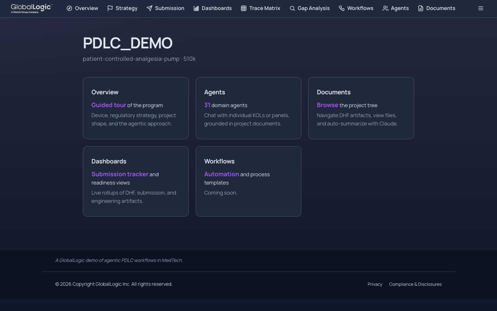](http://127.0.0.1:8765/)

Branded with the **GlobalLogic** theme pack (scraped and materialized by `/project-console theme`). A responsive priority-overflow topnav carries the section set — **Overview, Strategy, Submission, Dashboards, Trace Matrix, Gap Analysis, Workflows, Agents, Documents**, with **Tasks**, **Metrics**, and **Setup** in the overflow menu — over top-level tiles for the most-used sections.
**[http://127.0.0.1:8765/](http://127.0.0.1:8765/)**

### 5.2 Agents (persona advisors)

[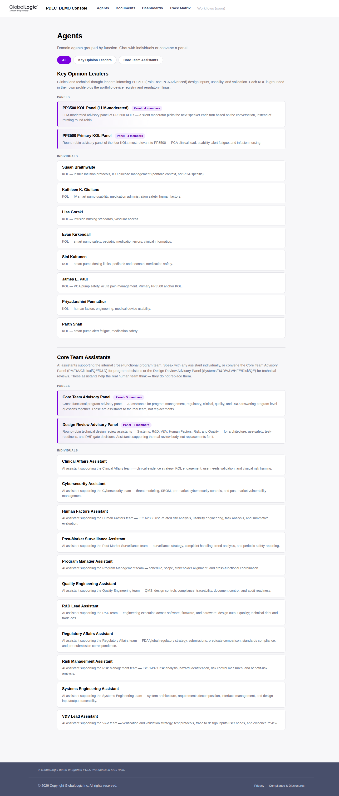](http://127.0.0.1:8765/agents)

- **31 agents total** — 11 Core Team Assistants + 8 KOLs + 7 Red Team skeptics + 5 panels. Filter toggles switch between **All**, **Key Opinion Leaders**, **Core Team Assistants**, and **Red Team**.
- Each card links to a full threaded chat UI with grounding sources visible.
- Core Team curation is driven by `project.yml → advisors.enabled`.
- **[http://127.0.0.1:8765/agents](http://127.0.0.1:8765/agents)**

#### 5.2.1 A single agent chat

[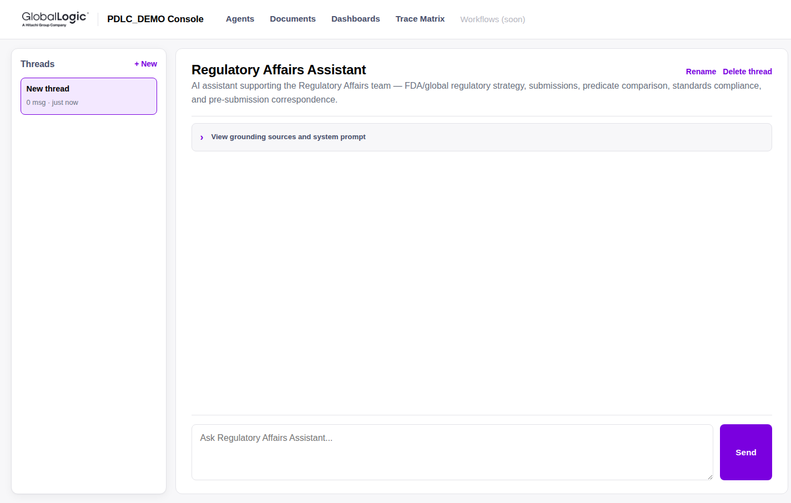](http://127.0.0.1:8765/agents/regulatory-affairs)

Threaded conversations per agent, per-thread rename/delete, and a collapsible **View grounding sources and system prompt** panel so the user can see exactly what the advisor is reading. Advisors carry the `file-locator` semantic-search tool, so their answers are grounded in ranked project sources, not just pre-listed files.
**[http://127.0.0.1:8765/agents/regulatory-affairs](http://127.0.0.1:8765/agents/regulatory-affairs)**

### 5.3 Documents explorer

[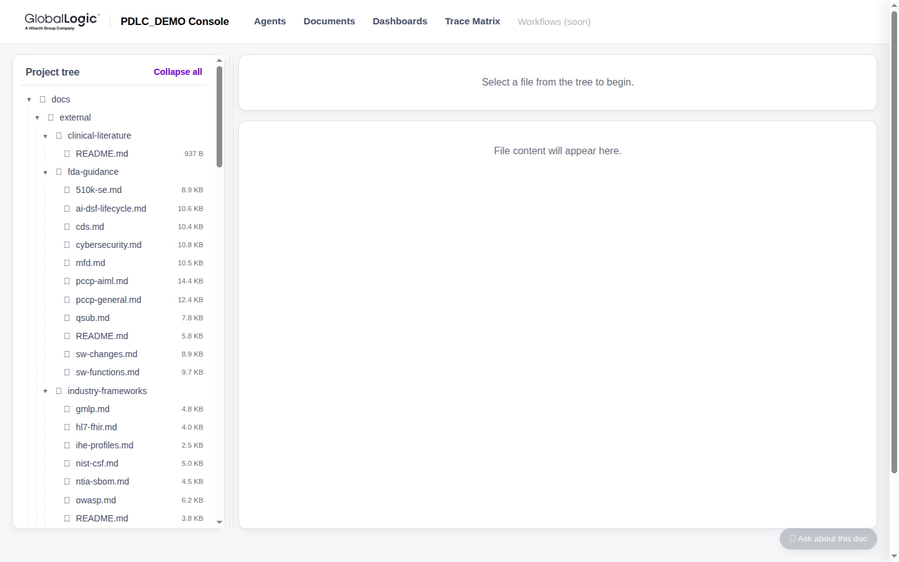](http://127.0.0.1:8765/documents)

- File tree over the entire project with markdown rendering in the right pane and a one-click **AI summary** per file.
- Surfaces DHFs, submissions, standards, FDA guidance, tasks, and strategies side by side.
- A **unified Assistant drawer** mounts on this page: the user picks an advisor, the drawer grounds on the document currently open, and thread history persists per-scope in browser localStorage.
- Junk-filtered (macOS `Icon\r`, `._*`, Windows `Thumbs.db` hidden).
- **[http://127.0.0.1:8765/documents](http://127.0.0.1:8765/documents)**

### 5.4 Tasks — activity summary

[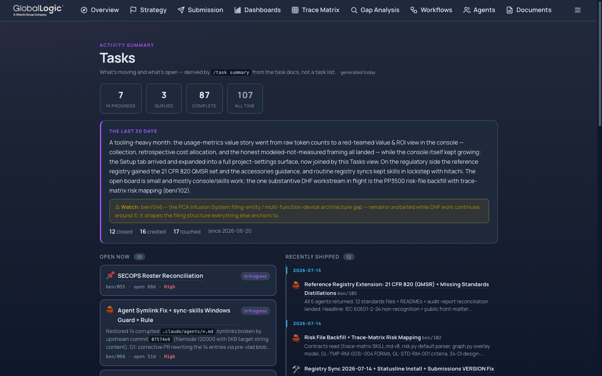](http://127.0.0.1:8765/tasks)

A program **activity summary — deliberately not a task list**: rollup stats (in progress / queued / complete / all-time), a composed window-in-review narrative with an optional ⚠ watch callout, categorized **Open now** cards, and a **Recently shipped** timeline. The console is a pure consumer of the task skill's derived `tasks/task-summary.json` (regenerated via `/task summary`); task docs and per-person indexes stay the source of truth. A freshness badge shows the summary's age, and the effort footnote links to the Value & ROI view for the economics behind the activity.
**[http://127.0.0.1:8765/tasks](http://127.0.0.1:8765/tasks)**

### 5.5 Dashboards

[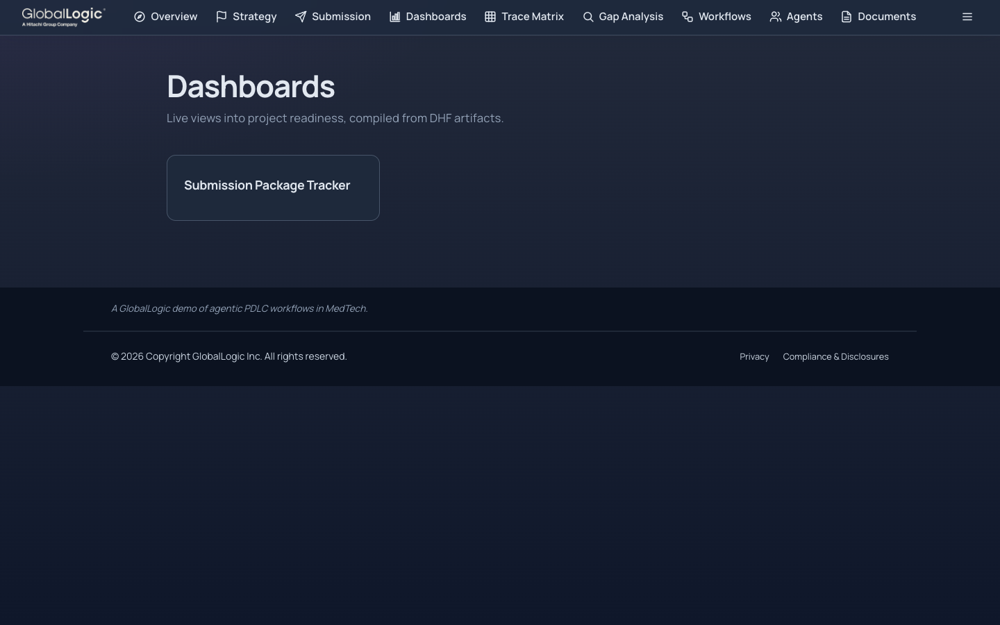](http://127.0.0.1:8765/dashboards)

Glob-discovered HTML dashboards rendered inline. Discovery patterns are defined in `tools/project-console/console.yaml` (e.g. `docs/**/*-tracker.html`, `docs/**/*-dashboard.html`). Today's headline dashboard is the **Submission Package Tracker**; additional rollups come online as their generators land.

**[http://127.0.0.1:8765/dashboards](http://127.0.0.1:8765/dashboards)**

#### 5.5.1 Submission tracker

[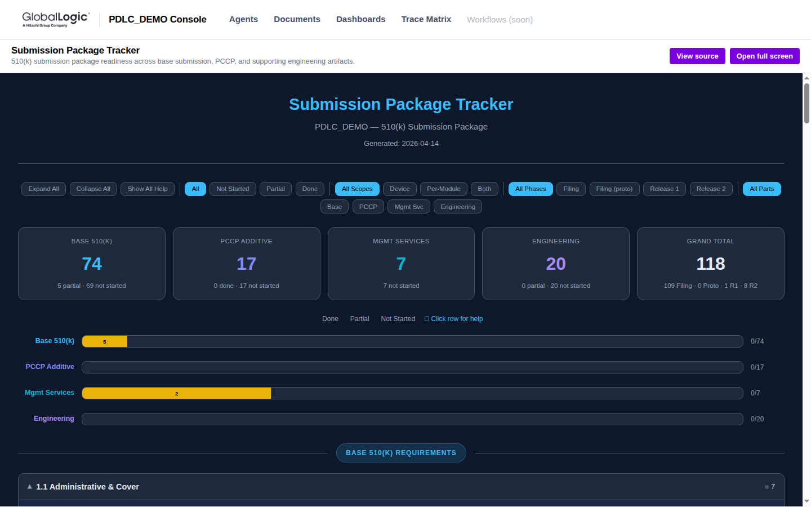](http://127.0.0.1:8765/dashboards/submission-tracker)

The tracker is built by `/tracker build` from milestone catalogs, composition manifests, and DHF evidence, then rendered to HTML. It catalogs **154 deliverables** across the Q-Sub, 510(k)+PCCP, and internal milestone-review scopes, with per-row status badges, filters, effort rollups, and inline help. Status changes are **editable in the browser** — pending changes accumulate in a session and **Save & Publish** writes them back to the tracked source and commits, closing the loop from dashboard to repository.
**[http://127.0.0.1:8765/dashboards/submission-tracker](http://127.0.0.1:8765/dashboards/submission-tracker)**

### 5.6 Trace Matrix

[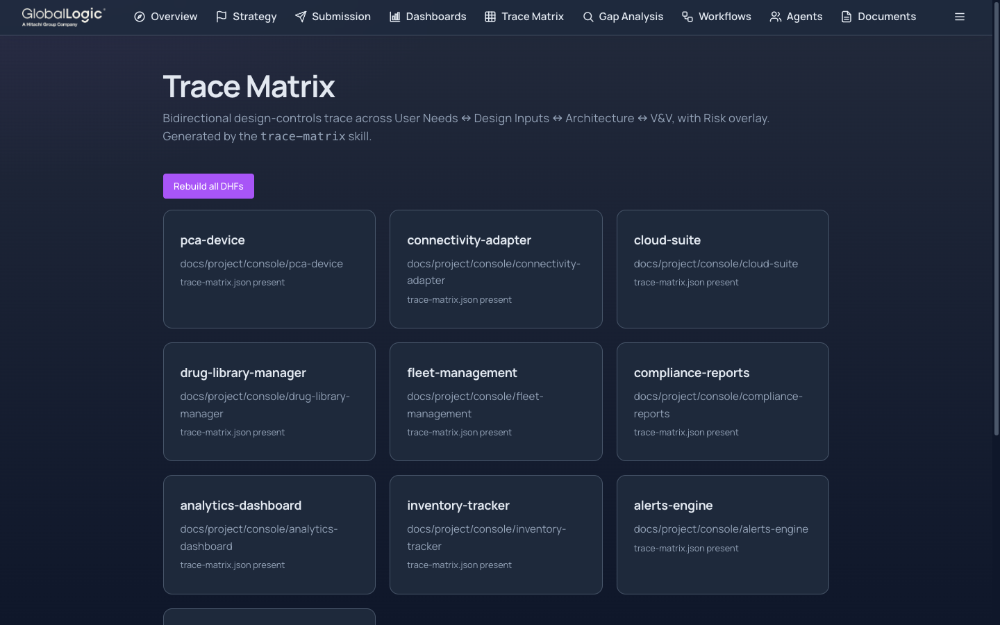](http://127.0.0.1:8765/trace-matrix)

Each DHF gets a bidirectional trace sidecar driven by `trace-matrix.yml` at repo root. **All ten DHFs now carry a built matrix**, with per-DHF **Rebuild** buttons (and a Rebuild-all): where project adapters exist the deterministic `build.py` runs; otherwise `/trace-matrix init` authors the adapters via the Claude Agent SDK.

**[http://127.0.0.1:8765/trace-matrix](http://127.0.0.1:8765/trace-matrix)**

#### 5.6.1 DHF detail view

[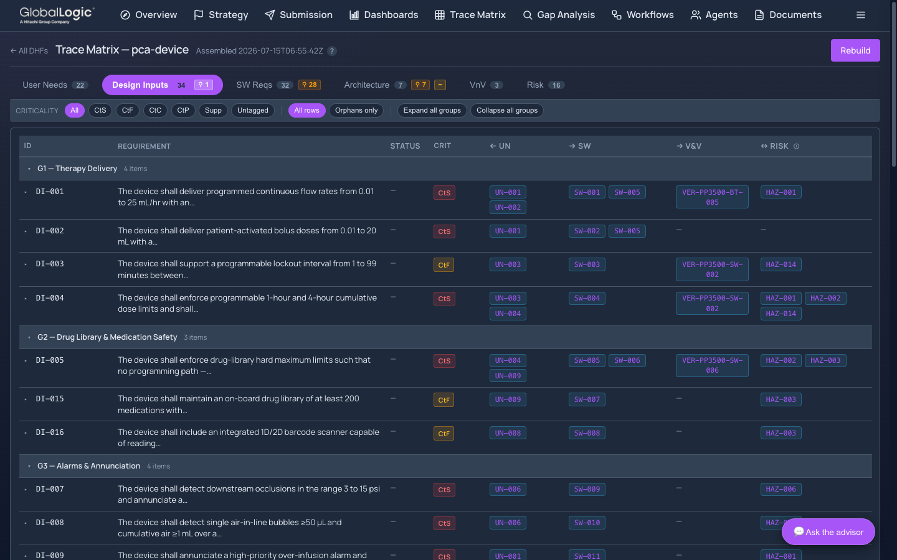](http://127.0.0.1:8765/trace-matrix/pca-device)

Per-DHF view across **six trace layers** — for PP3500: **User Needs (22) / Design Inputs (34) / SW Requirements (32) / Architecture (7) / V&V (3) / Risk (16)** — with criticality filters (CtS / CtF / CtC / CtP / Supp / Untagged), orphan badges per layer, group expand/collapse, and an Assistant drawer defaulted to `systems-engineering`. The **Risk column is live**: the ISO 14971 hazard analysis and FMEAs backfilled into the PP3500 risk file link every design input to its hazards, and the orphan badges (e.g. 28 SW requirements without verification) surface the open V&V work — exactly what the trace matrix is for.
**[http://127.0.0.1:8765/trace-matrix/pca-device](http://127.0.0.1:8765/trace-matrix/pca-device)**

### 5.7 Strategy review

[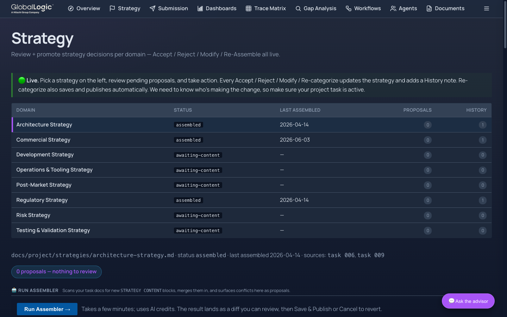](http://127.0.0.1:8765/strategy)

The eight strategy domains (regulatory, commercial, architecture, development, testing, risk, post-market, operations) as a **live review surface**: per-domain status, pending proposals harvested from task docs, and **Accept / Reject / Modify / Re-categorize** actions that update the strategy document and append a history note. A **Run Assembler** button scans task docs for new `STRATEGY CONTENT` blocks and surfaces merge conflicts as reviewable proposals.
**[http://127.0.0.1:8765/strategy](http://127.0.0.1:8765/strategy)**

### 5.8 Submission package

[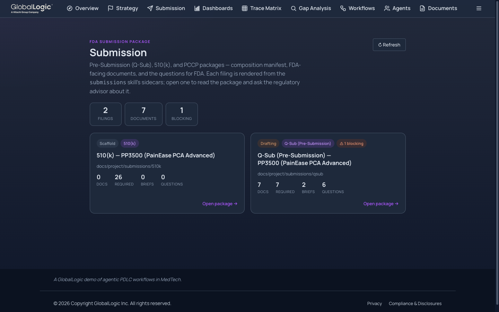](http://127.0.0.1:8765/submission)

The FDA-facing package, rendered from the `submissions` skill's sidecars: one card per filing — today the **Q-Sub (drafting: 7 documents, 2 strengthener briefs, 6 questions for FDA, 1 blocking gate)** and the **510(k) (scaffolded: 26 required documents)**. Opening a package shows the composition manifest, an inline tabbed document viewer, the FDA-questions panel, and an **Ask-the-regulatory-advisor** drawer grounded on the package.
**[http://127.0.0.1:8765/submission](http://127.0.0.1:8765/submission)**

### 5.9 Gap Analysis

[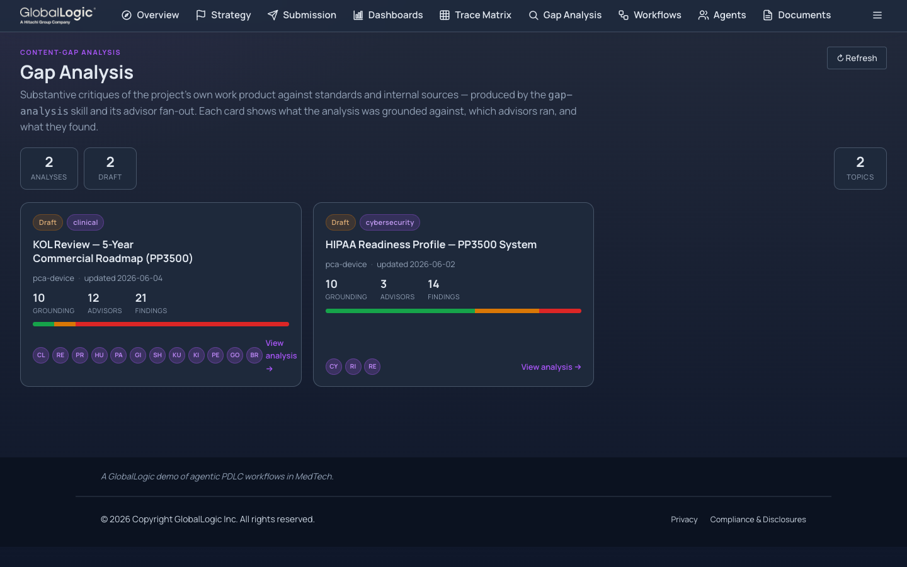](http://127.0.0.1:8765/gap-analysis)

Substantive critiques of the project's **own work product** against standards and internal sources, produced by the `gap-analysis` skill's advisor fan-out. Each card shows what the analysis was grounded against, which advisors ran, and a severity-banded findings bar — today: a **KOL review of the 5-year commercial roadmap** (12 advisors, 21 findings) and a **HIPAA readiness profile** for the PP3500 system (3 advisors, 14 findings). Detail views carry per-finding advisor panels and the Ask-an-advisor drawer.
**[http://127.0.0.1:8765/gap-analysis](http://127.0.0.1:8765/gap-analysis)**

### 5.10 Metrics — cost of the agentic approach

[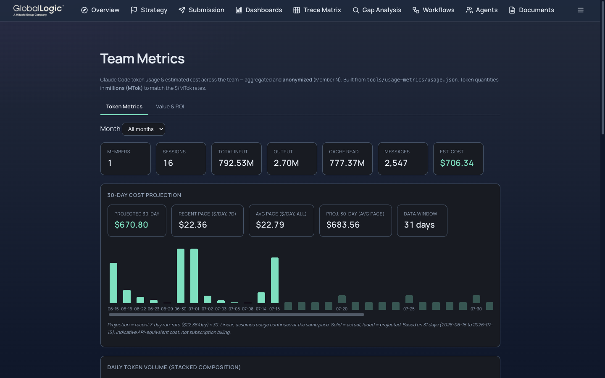](http://127.0.0.1:8765/metrics)

Claude Code token usage and estimated cost across the team, aggregated and anonymized from each member's locally-collected session telemetry (git is the aggregation bus — no shared server). Month filters, per-day volume and cost charts, and a **30-day cost projection** from the recent run-rate.
**[http://127.0.0.1:8765/metrics](http://127.0.0.1:8765/metrics)**

#### 5.10.1 Value & ROI

[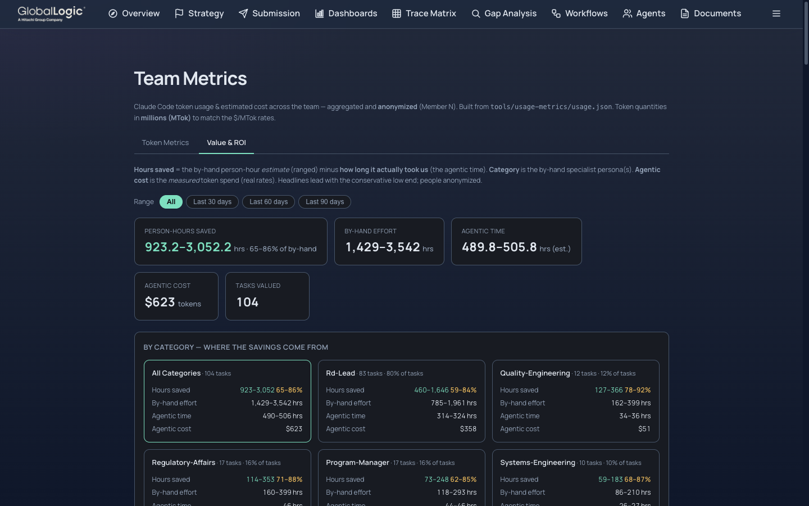](http://127.0.0.1:8765/metrics)

The other half of the ledger: for every task, the by-hand person-hour estimate (ranged, persona-tagged, rubric-based) is compared with the measured agentic time and token cost. The current retrospective across **104 valued tasks** models **920–3,050 person-hours saved** (65–86% of the by-hand effort) against roughly **$623 of measured token spend** — a *modeled, uncalibrated demo estimate*, presented with its methodology and ranges rather than as a certified saving. Category cards show where the savings concentrate (R&D, regulatory, quality, program management).
**[http://127.0.0.1:8765/metrics](http://127.0.0.1:8765/metrics)**

### 5.11 Setup — project settings surface

[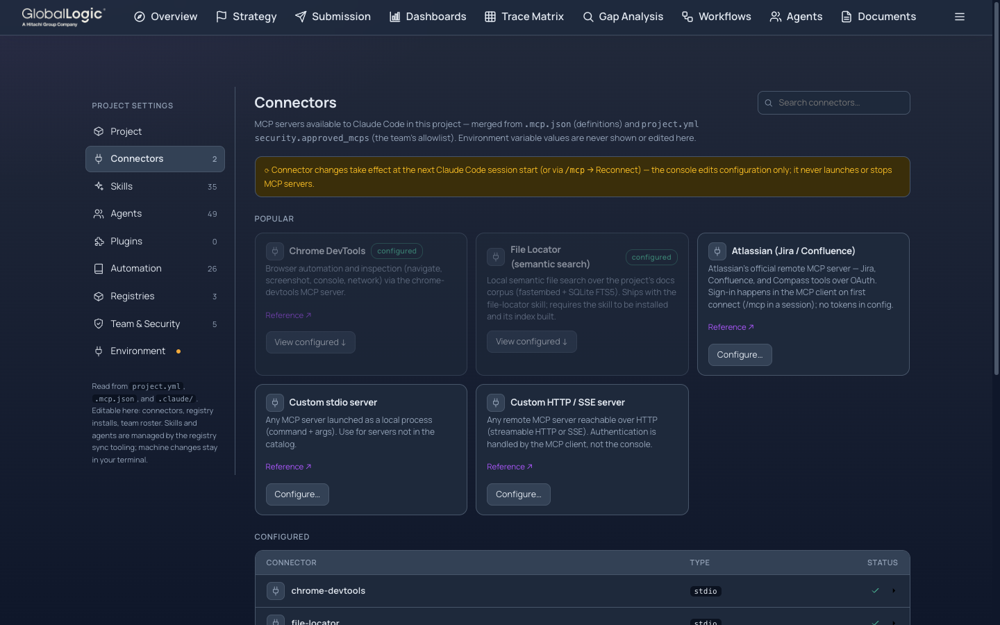](http://127.0.0.1:8765/setup)

A full settings shell over the project's tool surface, each section cross-checked against the `project.yml` allowlists: **Project** (manifest fields with inline edit), **Connectors** (MCP servers, add/edit with lockstep allowlist writes), **Skills (35)**, **Agents (49)**, **Plugins**, **Automation** (12 hooks + 26 automation entries incl. CI workflows), **Registries** (GitHub-direct catalog browse + one-click skill install), **Team & Security** (roster add/deactivate + a GitHub repo-access audit), and **Environment** (runs `setup.sh --check` from the browser). Configuration editing is deliberately narrow — connectors, roster, and project scalars; skills and agents stay owned by the registry sync tooling.
**[http://127.0.0.1:8765/setup](http://127.0.0.1:8765/setup)**

### 5.12 Workflows

[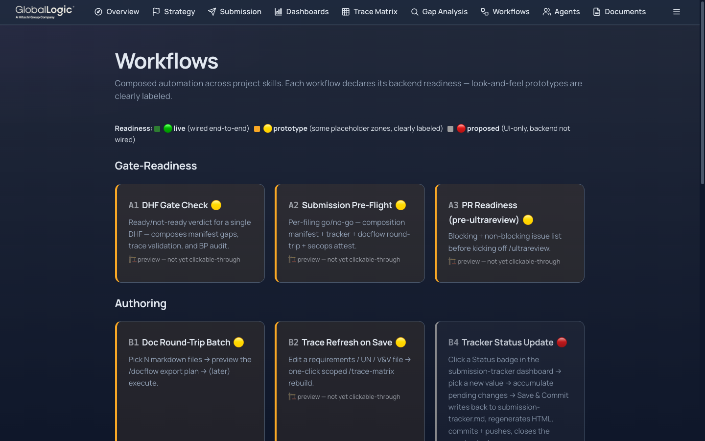](http://127.0.0.1:8765/workflows)

Composed automation across project skills — gate-readiness checks (DHF gate check, submission pre-flight, PR readiness), authoring flows (doc round-trip batch, trace refresh on save), and tracker status write-back. Each card declares its backend readiness honestly: **live**, **prototype**, or **proposed** — look-and-feel previews are clearly labeled, never passed off as wired.
**[http://127.0.0.1:8765/workflows](http://127.0.0.1:8765/workflows)**

### 5.13 How the console relates to Claude Code

| Surface | Runtime | Grounding | Auth |
|---|---|---|---|
| Claude Code main thread | CLI, developer workstation | Direct filesystem access | Local |
| project-console chat | Browser, FastAPI + Claude Agent SDK | Same agent files under `.claude/agents/` via shared `advisors_lib` symlink | OAuth to Claude CLI; domain-restricted per `project.yml → security.approved_email_domains` |

**Same agents. Same grounding. Two runtimes.** Updating an agent (`.claude/agents/regulatory-affairs.md`) updates both surfaces simultaneously — no drift between what Claude Code sees and what the console exposes.

---

## Appendix — Quick links

| Thing | Where |
|---|---|
| Project operating rules | [`CLAUDE.md`](CLAUDE.md) |
| Project manifest | [`project.yml`](project.yml) |
| Companion deck (HTML + PDF) | [`assets/project-overview/index.html`](assets/project-overview/index.html) · [`assets/project-overview/index.pdf`](assets/project-overview/index.pdf) |
| Glossary | [`glossary.md`](glossary.md) |
| Onboard a new contributor (machine setup) | [`setup.md`](setup.md) · [`setup.sh`](setup.sh) |
| Day-to-day usage after setup | [`how-to-guide.md`](how-to-guide.md) |
| Bootstrap a brand-new MedTech project from scratch | [`new-project-bootstrap.md`](new-project-bootstrap.md) |
| Quality & process guardrails | [§3](#3-quality--process--how-the-guardrails-work) in this document |
| Agentic approach — humans in charge | [§4](#4-agentic-approach--solving-complex-problems-with-humans-in-charge) in this document |
| Regulatory strategy | [`docs/project/strategies/regulatory-strategy.md`](docs/project/strategies/regulatory-strategy.md) |
| Architecture strategy | [`docs/project/strategies/architecture-strategy.md`](docs/project/strategies/architecture-strategy.md) |
| PCA device DHF | [`docs/project/dhfs/pca-device/`](docs/project/dhfs/pca-device/) |
| Cloud Suite DHF | [`docs/project/dhfs/cloud-suite/`](docs/project/dhfs/cloud-suite/) |
| 510(k) composition manifest | [`docs/project/submissions/510k/composition-manifest.md`](docs/project/submissions/510k/composition-manifest.md) |
| Submission tracker (markdown) | [`docs/project/submissions/submission-tracker.md`](docs/project/submissions/submission-tracker.md) |
| Project changelog | [`CHANGELOG.md`](CHANGELOG.md) |
| Console landing (local) | [http://127.0.0.1:8765/](http://127.0.0.1:8765/) |
| Console agents | [http://127.0.0.1:8765/agents](http://127.0.0.1:8765/agents) |
| Console documents | [http://127.0.0.1:8765/documents](http://127.0.0.1:8765/documents) |
| Console tasks (activity summary) | [http://127.0.0.1:8765/tasks](http://127.0.0.1:8765/tasks) |
| Console dashboards | [http://127.0.0.1:8765/dashboards](http://127.0.0.1:8765/dashboards) |
| Console trace matrix | [http://127.0.0.1:8765/trace-matrix](http://127.0.0.1:8765/trace-matrix) |
| Console strategy review | [http://127.0.0.1:8765/strategy](http://127.0.0.1:8765/strategy) |
| Console submission package | [http://127.0.0.1:8765/submission](http://127.0.0.1:8765/submission) |
| Console gap analysis | [http://127.0.0.1:8765/gap-analysis](http://127.0.0.1:8765/gap-analysis) |
| Console metrics (cost + Value & ROI) | [http://127.0.0.1:8765/metrics](http://127.0.0.1:8765/metrics) |
| Console setup (project settings) | [http://127.0.0.1:8765/setup](http://127.0.0.1:8765/setup) |
| Console workflows | [http://127.0.0.1:8765/workflows](http://127.0.0.1:8765/workflows) |
